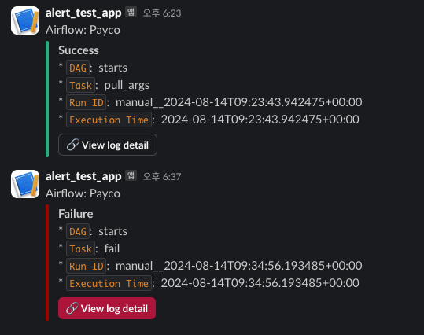

# Airflow-Tutorial

<details>

<summary>Properties</summary>

:pencil:2024.08.14

</details>

## Airflow를 활용 하기

### 외부 모듈 참조(Plugins)


- 에어플로우의 dags 디렉터리에 있는 파이프라인은 어떻게 외부 프로젝트의 모듈을 참조 할까?


아래와 같은 폴더 구조를 갖고 있는 에어플로우 프로젝트가 있다. 여기서 볼 수 있는 것은 `dags` 내부에 `starts.py`는 `plugins`에 모듈을 참조 하고 있다는 사실이다.

이 구조는 대부분의 에어플로우 프로젝트 폴더 구조와 비슷하다. Airflow는 시작 할 때 자동으로 `PYTHONPATH`에 `plugins` 디렉터리를 추가 하게 되고 이러한 행동은 Python이 모듈을 찾을 때 해당 디렉터리도 검사 하게되기 때문에 단순한 import문으로 호출 할 수 있다.

하지만, import시 주의 사항이 있다면 `plugins` 모듈명을 제외 한 이후 하위 폴더에 대한 경로로 지정해야한다.

```
├── config
├── dags
│   ├── __pycache__
│   └── starts.py
├── docker-compose.yaml
├── logs
└── plugins
    ├── __pycache__
    ├── common
    │   ├── __pycache__
    │   └── common_func.py
    └── utils
        ├── __pycache__
        └── slack_alert.py
```

> starts.py


```python
from airflow import DAG
from airflow.decorators import task
from airflow.operators.bash import BashOperator
from airflow.operators.python import PythonOperator
from pendulum import datetime
from datetime import timedelta
from common.common_func import target, date
from utils.slack_alert import send_fail_alert, send_success_alert


DAG_ID = "starts"

default_args = dict(
    retries=1,
    retry_delay=timedelta(minutes=2),
    on_failure_callback=send_fail_alert,
)


dag_args = dict(
    dag_id=DAG_ID,
    start_date=datetime(2024, 1, 1),
    catchup=False,
    default_args=default_args,
    on_success_callback=send_success_alert,
)


def get_args():
    return {
        "target": target,
        "date": date,
    }


@task
def pull_args(args_dict):
    print(f"args dict: {args_dict}")
    print(f"target: {args_dict.get('target')}")
    print(f"date: {args_dict.get('date')}")


def retry():
    exit(1)


with DAG(**dag_args) as dag:
    start = BashOperator(
        task_id="batch_start",
        bash_command=f"airflow tasks list {DAG_ID} --tree"
    )

    setup = PythonOperator(
        task_id="run_python",
        python_callable=get_args
    )

    running = pull_args(setup.output)

    fail = PythonOperator(
        task_id="fail",
        python_callable=retry
    )

    start >> setup >> running >> fail
```


### 파이프라인 실행 결과 알람 받기


- Dag의 실행이 끝났을 때 실패와 성공 유무를 슬랙으로 받아보자.


슬랙 알람을 보내기 위한 파일은 `plugins > utils > slack_alert.py`에 위치 해 있으며 dags` 내부에서 공통으로 사용하기 위해 구성 되었다.

테스트 용도이기 때문에 Airflow의 전역변수인 `Variables`를 이용 했는데 실제 각 Task가 실행 될 때 해당 데이터를 조회 하는 작업이 계속 실행 되기 때문에 운영 환경에서는 추천되지 않는다. 

```python
from datetime import datetime
from airflow.providers.slack.operators.slack_webhook import SlackWebhookOperator
from airflow.models.variable import Variable


class SlackAlert:
    def __init__(self, channel, token):
        self.slack_channel = channel
        self.slack_token = token

    @property
    def today(self):
        return datetime.today().strftime("%Y-%m-%d")

    def _make_message(self, context):
        return (
            f"* `DAG`:  {context.get('task_instance').dag_id}"
            f"\n* `Task`:  {context.get('task_instance').task_id}"
            f"\n* `Run ID`:  {context.get('run_id')}"
            f"\n* `Execution Time`:  {context.get('execution_date')}"
        )

    def _make_attachments(self, context, title="Failure", color="danger"):
        return [
            {
                "mrkdwn_in": ["text"],
                "title": title,
                "text": self._make_message(context),
                "actions": [
                    {
                        "type": "button",
                        "name": "view log",
                        "text": ":link: View log detail",
                        "url": context.get("task_instance").log_url,
                        "style": "danger" if color == "danger" else "default",
                    },
                ],
                "color": color,  # 'good', 'warning', 'danger', or hex ('#439FE0')
                "fallback": "details",  # Required plain-text summary of the attachment
            }
        ]

    def send_alert(self, context, task_id, text, title, color):
        if not self.slack_token:
            print("Error: send_alert - slack_token is null.")
            return

        try:
            SlackWebhookOperator(
                task_id=task_id,
                channel=self.slack_channel,
                username="Airflow",
                webhook_token=self.slack_token,
                message=text,
                icon_emoji=":green_circle:",
                attachments=self._make_attachments(context, title, color),
            ).execute(context=context)
        except Exception as e:
            print(f"Error: SlackWebhookOperator, {str(e)}")


def send_fail_alert(context, channel="#alert_test", token=None):
    token = token if token else Variable.get("slack_app_token", default_var=None)
    print(f"token: {token}")
    print(f"Variables: {Variable}")
    alert = SlackAlert(channel=channel, token=token)
    alert.send_alert(
        context,
        task_id="send_fail_alert",
        text="Airflow: Payco",
        title="Failure",
        color="danger",
    )


def send_success_alert(context, channel="#alert_test", token=None):
    token = token if token else Variable.get("slack_app_token", default_var=None)
    alert = SlackAlert(channel=channel, token=token)
    alert.send_alert(
        context,
        task_id="send_success_alert",
        text="Airflow: Payco",
        title="Success",
        color="good",
    )

```

> Callback 함수 위치 정하기

- default_args
    - 해당 위치에서 콜백을 선언 하게 되면 모든 태스크가 실행 결과에 대한 알람을 받을 수 있다.

- dag_args
    - 해당 위치에서의 콜백은 해당하는 Dag의 파이프라인이 종료 된 시점에서 실행 결과를 가져올 수 있다.


그 외에도 retry callback 등 다양한 실행 과정에서 콜백을 호출 받을 수 있다. -> [공식문서 보기](https://airflow.apache.org/docs/apache-airflow/stable/administration-and-deployment/logging-monitoring/callbacks.html)

```python
default_args = dict(
    retries=1,
    retry_delay=timedelta(minutes=2),
    on_failure_callback=send_fail_alert,
)


dag_args = dict(
    dag_id=DAG_ID,
    start_date=datetime(2024, 1, 1),
    catchup=False,
    default_args=default_args,
    on_success_callback=send_success_alert,
)
```

