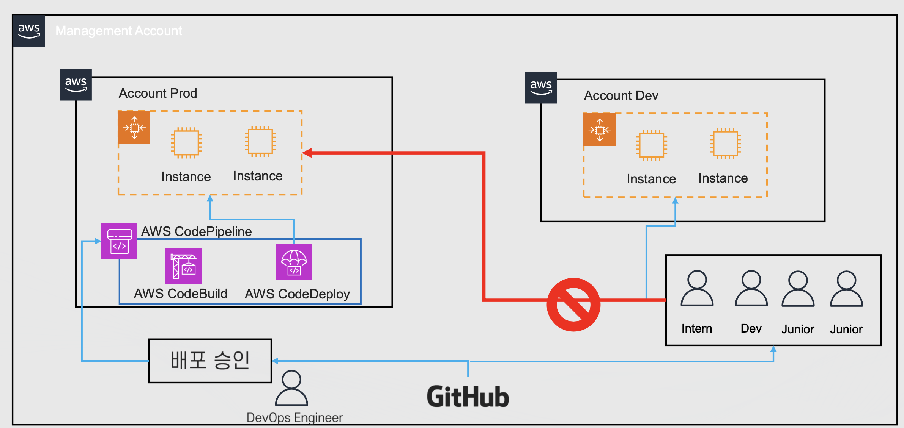
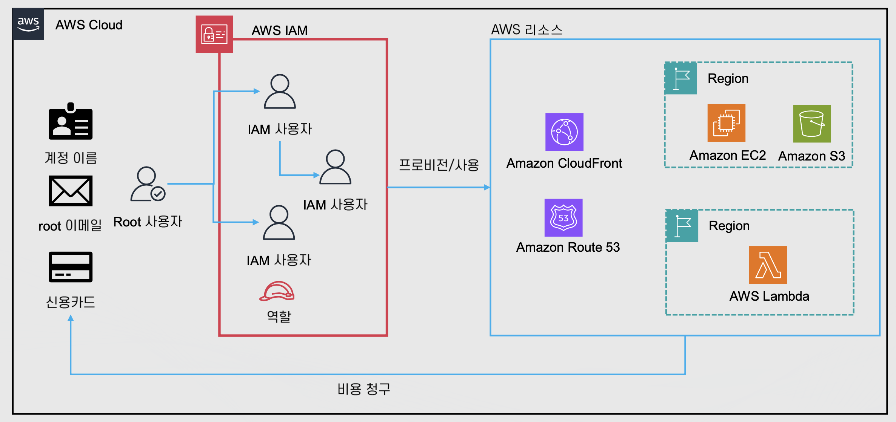
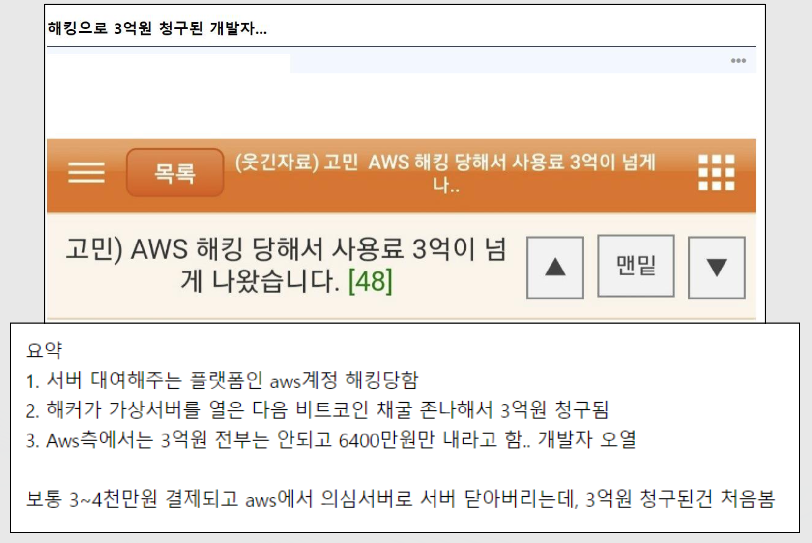

# 클라우드 기초 개념: 가상화와 클라우드 구조

Properties

:pencil:2024.08.29

:page_facing_up: - [AWS 강의실](https://www.inflearn.com/course/%EC%89%BD%EA%B2%8C-%EC%84%A4%EB%AA%85%ED%95%98%EB%8A%94-aws-%EA%B8%B0%EC%B4%88/dashboard)

:paperclip: [LCU 참고 공식문서](https://aws.amazon.com/ko/elasticloadbalancing/pricing/)

## AWS 계정 알아보기

:bust_in_silhouette: AWS 계정: Account



**AWS의 사용자와 리소스를 관리하는 단위**

- AWS 계정에 AWS 리소스를 생성

- 다양한 사용 주체(IAM 사용자, 역할 등)이 생성 된 리소스를 사용

- 계정과 사용자는 같은 의미가 아님, 엄연히 다르게 분류 됨

- 계정 생성 시 Root 사용자 자동으로 생성



> AWS 계정(Account)의 의미

- AWS 리소스 관리의 일반적인 최대 단위

    - 일반적으로 설정의 가장 큰 단위는 "계정"임

    - 예: 계정 별 최대 S3(스토리지 서비스) 최대 버킷 개수 제한 등

- 관리 / 피해 범위를 한정 할 수 있음

    - 권한 관리를 쉽게 할 수 있음

    - 해킹 등의 피해 발생 시 피해 범위 최소화 가능

- 비용 범위에 대한 확인을 쉽게 할 수 있음

### :bust_in_silhouette: Root 사용자

계정의 모든 권한을 보유 하고 있어 계정 권한을 제어 할 방법이 없다. 그렇기 때문에 탈취 당했을 때 복구가 매우 어려우며 이로 인해 "MFA" 설정이 필수이다.
- 복구가 힘든 이유는 IAM 사용자는 특정 권한으로 활동 하는 사용자이기 때문에 권한 외 리소스에 접근 할 수 없지만 루트 사용자는 모든 리소스에 접근이 가능하기 때문이다. 이로인해 발생 하는 비용 문제, 리소스 삭제 문제 등 파악 하기가 어렵다.

생성시 만든 "이메일 주소"로 로그인이 가능하며 탈취 당했을 때 복구가 매우 힘들다.
- 루트 사용자는 사용을 자제 하고 MFA 설정 필요

:heavy_exclamation_mark: ** 루트 사용자는 관리용으로만 이용 권장: 계정 설정 변경, 빌링 등**

> Root 사용자만 가능한 작업 범위

- AWS 계정 설정 변경(메인 이메일 주소, 계정 이름, 연락처 정보 등)

- 요금 관련 설정(IAM 유저에게 Billing 정보 위임 가능)

- AWS Support Plan(AWS가 구독 플랜에 따라 질의응답을 몇 시간 내 처리 해주거나 솔루션 아키텍처의 도움을 주는 등의 행위) 구독, 변경, 취소

- AWS 계정 삭제

### :bust_in_silhouette: IAM 사용자

- IAM(유저 권한 관리자)을 통해 생성한 사용자

- 생성 시 권한이 따로 부여되어 있지 않으며 정책 혹은 그룹을 통해 권한을 부여 받아 활동

만들 때 주어진 아이디로 로그인 하며 기본 권한이 없다.

- 따로 권한 부여: 관리자 IAM User, 개발자 IAM User, 회계팀 IAM User 등

- 권한 부여시 루트 사용자와 같이 모든 권한을 가질 수 있지만 "빌링" 관련 권한은 루트 사용자가 허용해야 사용이 가능함

**AWS의 관리를 제외한 모든 작업은 관리용 IAM User를 만들어 사용하는 것을 권장함**

### AWS 계정 생성

계정 생성시 알아 둘 점

- 처음 생성 할 때 본인 명의의 신용카드 필요

- AWS 계정을 처음 생성하면 루트 사용자와 기본 리소스(기본 VPC)등 이 생성 됨

- AWS 계정 아이디가 부여됨 (숫자 형식)
    - 로그인 할 때 해당 숫자를 기억 하기 어려우니 별명을 지정 할 수 있음(문자 형식)

## AWS에서 제공하는 프리티어 알아보기

### AWS 프리티어

- 서비스별로 지정된 한도 내에서 무료로 AWS 서비스를 살펴보고 사용 해 볼 수 있는 기능
    - 누구나 사용이 가능함(학생, 직장인, 기업 상관 없이)

- 총 세가지 종류의 프리티어 항목이 존재
    - 언제나 무료: 계정을 생성한 이후 부터 언제나 무료인 서비스

    - 무료 평가: 체험판 등 계정을 생성한 이후 서비스를 실행한 시점부터 발생

    - 12개월 무료: 계정을 생성한 시점 이후 부터 12개월간 무료

- Cost Explorer 또는 AWS Budgets 등으로 사용량 추적 및 비용에 대한 알림을 받을 수 있음

> 언제나 무료 서비스

기존 및 신규 고객 모두에게 일정 시간동안(보통 "월" 단위) 일정 사용량을 무료로 제공 하는 방식이며 **일정 시간동안, 일정 사용량 이상을 사용하면 그 이후 부터는 과금이 발생함**

- 예:
    - AWS Lambda(서버리스 컴퓨팅 서비스)는 매월 100만건을 무료로 제공

    - AWS의 CloudFront(CDN 서비스)는 월 1TB 데이터 송신, HTTP/HTTPS 천만건, CloudFront 함수 200만건을 무료로 제공

    - AWS DynamoDB는 월 25GB 저장공간, 월 별 2억개 처리 용량을 무료로 제공

> 12개월동안만 무료로 제공 하는 서비스

신규 고객에게 12개월동안 일정 사용량에 대해서 무료로 제공 하며 **12개월이 넘어 가거나, 월 일정 사용량을 넘어서면 과금이 발생함**

- 예:

    - AWS EC2: t2-micro/t3-micro 인스턴스는 월 750시간 무료(12개월 간)
        - t3-micro 한 대(월 750시간)는 12개월 내내 사용 하더라도 무료이지만 2대 이상(월 1440시간) 사용할 시 과금이 발생한다. -> 월 별 사용량에 의해 과금

    - AWS RDS: db.t2-micro, db.t3-micro, db.t4g-micro 타입은 월 750시간 무료 (12개월 간)

    - AWS ALB: 월 750시간, 15LCU 무료(12개월 간)
        - LCU는 Application Load Balancer가 트래픽을 처리하는 차원을 측정합니다(시간당 평균). 4가지 차원이 측정됩니다.

> 무료 평가: 체험판

사용을 시작한 후 일정 기간 혹은 일정 사용량 이후 부터 요금을 청구하는 방식이며 "12개월 간 무료"와 달리 계정을 생성한 이후 부터 발생하는 것이 아닌, **서비스를 시작한 시점** 부터 산출이 됨

즉, 서비스를 실행한 후 무료 사용기간을 초과 하거나, 무료 사용량을 초과 하면 요금이 발생함

- 예:
    - AWS QuickSight(AWS BI, 시각화 툴): 처음 30일 무료

    - AWS LightSail(쉽고 빠르게 프로비전하는 EC2): 처음 3개월, 월 750시간 무료

    - Amazon Chime(AWS 커뮤니케이션 툴(Google Meet)): 30일 동안 PRO 티어 무료



**그 외 기타**

AWS -> 사용자 인터넷으로 데이터 전달은 월 100GB 무료(EC2, S3, ELB)

**사용자 인터넷 -> AWS 트래픽은 언제나 무료**
- 즉, S3에 파일을 업로드 하는 것은 무료 이지만 사용자에게 보여줄 땐 과금 발생의 기준이 된다.



### AWS 프리티어 트랙 / 알람

- AWS Free Tier Usage Alert
    - 각 서비스별로 85% 정도에 도달 했을 때 이메일 알림
    - 이외, AWS Budget의 Zero Spend Budget 템플릿으로 좀 더 정확한 내용으로 알림 가능

- Billing and Cost Management에서 프리티어 현재 사용량에 대해서 확인이 가능함

## AWS 비용 관리 및 보안

### 비용 관리와 보안

아무리 프리티어라도 제한이 존재하며 다양한 이유로 요금이 청구 될 수 있다. 예를 들어, EC2 프로비전 후 정리 하지 않고 놔두는 경우는 12개월이 지난 시점 부터 과금이 발생 하거나 다양한 이유가 생길 수 있다.

이 외에 해킹 및 보안 사고 때문에 비용이 발생 할 수 있다. EC2/SageMaker 등을 해커가 탈취해서 비트코인을 채굴 한다거나 보안 사고가 발생 할 수 있으며 실제 커뮤니티에는 해당 사례로 인한 글이 돌아다니기도 했다.

### AWS 계정을 온전하게 지키는 방법

- 루트 사용자 및 IAM 사용자의 MFA 설정

- 비용 모니터링 설정

    - AWS Budget

- AWS의 리소스 모니터링 설정

    - AWS Config

    - AWS User Notifications

### 계정을 안전하게 생성하기 위한 실습 순서

1. AWS 계정(Account) 만들기

2. 루트 사용자로 로그인 하기

3. 루트 사용자 MFA 설정하기

4. 계정 별명 생성하기

5. 관리자권한 가진 IAM 사용자 생성하기

6. 관리자 권한을 갖고 있는 IAM 사용자 MFA 설정하기

7. 루트 사용자를 로그아웃 하고 IAM 사용자로 로그인 하기 (계정 별명을 활용 함)

8. 다시 루트 사용자로 로그인 해서 관리자 IAM 사용자의 빌링 활성화 하기

