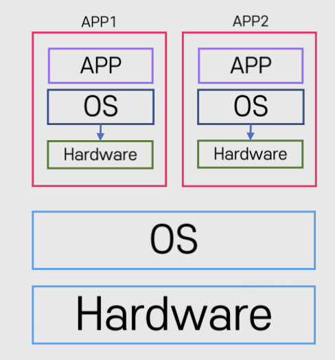
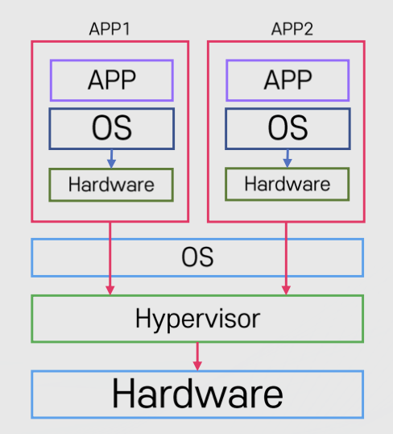
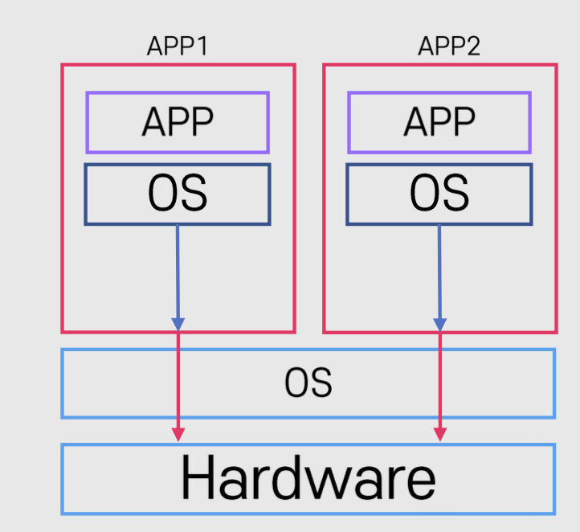
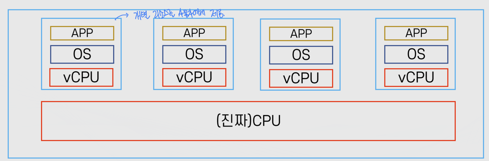
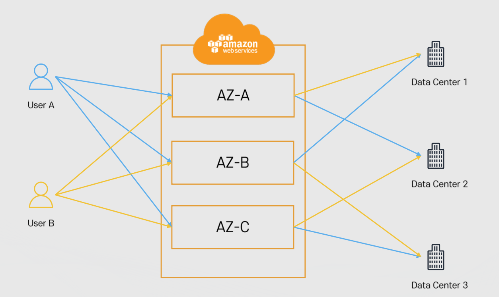
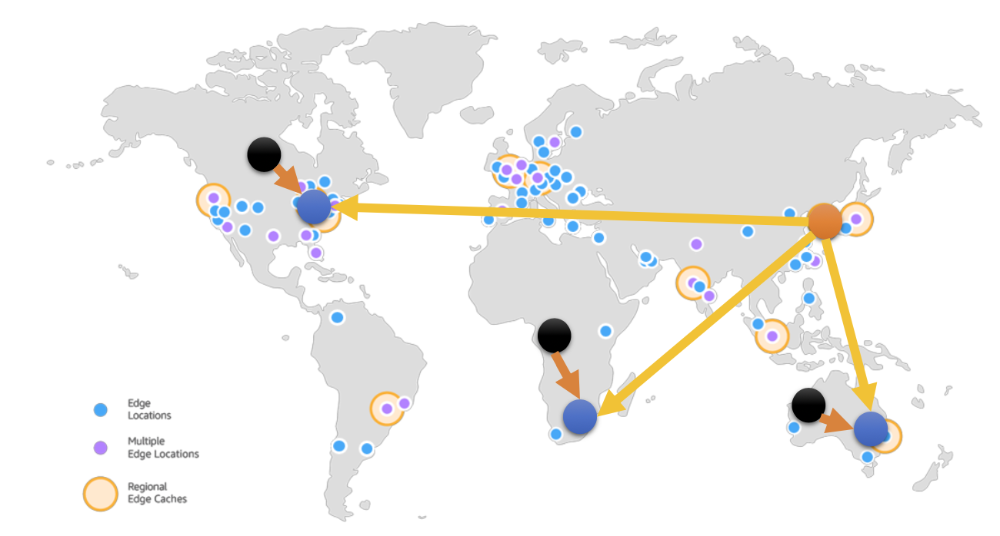

# 클라우드 기초 개념: 가상화와 클라우드 구조

Properties

:pencil:2024.08.28

:page_facing_up: [AWS 강의실](https://www.inflearn.com/course/%EC%89%BD%EA%B2%8C-%EC%84%A4%EB%AA%85%ED%95%98%EB%8A%94-aws-%EA%B8%B0%EC%B4%88/dashboard)

:paperclip: [가상화 참고 블로그](https://suyeon96.tistory.com/53#%EC%--%--%EC%-B%-C%EB%A-%-C%--Para%--Virtualization%--%EC%-D%B-%ED%--%B-%ED%--%--%EA%B-%B-)

:paperclip: [가용영역 참고 블로그](https://kangmin517.tistory.com/entry/AWS-1-%EC%9A%A9%EC%96%B4-%EB%B0%8F-%EA%B8%B0%EB%B3%B8-%EC%84%A4%EB%AA%85-%EB%A6%AC%EC%A0%84%EA%B3%BC-%EA%B0%80%EC%9A%A9-%EC%98%81%EC%97%AD-Region-and-Availability-Zone)

:paperclip: [글로벌 엑셀러레이터 참고 블로그](https://velog.io/@khyup0629/AWS-Global-Accelerator)

## 가상화



가상화는 단일 컴퓨터의 하드웨어 요소를 일반적으로 가상 머신이라고 하는 다수의 가상 컴퓨터로 분할 할 수 있도록 해주는 기술이다.

가상화가 나타나기 전 까지는 하나의 하드웨어 시스템은 하나의 OS만 실행이 가능 했음
- 일반적인 컴퓨터 처럼 직접 OS가 하드웨어에 설치 된 상태(Bare-Metal)로만 운영이 가능했었다



### 가상화 역사

> :bulb: 1세대 완전 가상화: Fully Emulated

말 그대로 하드웨어를 완전히 가상화하는 방식이다. 전부 가상화하기 때문에 Guest OS가 Host 시스템과 완전히 분리되어 실행된다. 따라서 완전 가상화 방식에서 Guest OS는 자신이 가상머신의 OS인지 인지하지 못한다.

모든 시스템 요소는 에뮬레티어 안에서 동작

- CPU, 하드디스크, 마더보드 등 모든 요소를 에뮬레이터로 구현 하여 Guest OS(가상화 환경의 OS)와 연동

    - 소프트웨어로 가상 하드웨어를 사용 하는 형태

- 속도가 매우 느린 단점이 존재

> :bulb: 2세대 반가상화: Paravirtualization

핵심은 Hyper Call이다. Para Virtualization에 사용되는 Guest OS는 Hyper Call이라는 인터페이스를 통해 하이퍼바이저에 직접 요청을 날린다. 방식은 사실 OS에서 Application이 커널에게 system call로 서비스를 요청하는 방식과 동일하다. 요청을 날리는 주체가 Guest OS이고, 받는 대상이 하이퍼바이저라는 점이 다를 뿐이다.

- Guest OS는 하이퍼바이저와 통신

    - 하이퍼바이저란 OS와 하드웨어 사이에 존재하는 일종의 가상화 매니저

- 1세대 보도 상대적으로 속도가 향상 됨

- 몇 몇 요소의 경우 여전히 에뮬레이터가 필요하여 1세대 보다는 속도가 향상 되었지만 아직은 느림

> :bulb: 3세대 Hardware Virtual Machine(HVM)

- 하드웨어에서 직접 가상화를 지원
- 직접 Guest-OS가 하드웨어와 통신 -> 빠른 통신(near bare-metal)

### 가상화와 클라우드의 연관성

AWS는 클라우드 환경에서 리소스를 작은 단위로 빠르게 구성 할 수 있는 원동력이 가상화 기술이다. 즉, AWS에서 사용자마자 컴퓨터를 할당 해 주는 것이 아닌 이미 구축된 **가상화 가능한 서버의 한 부분을 할당 해주는 것**

## AWS 구조

### 리전

- AWS의 서비스가 제공 되는 서버의 물리적 위치

- 전 세계에 흩어져 있으며 큰 구분(동남아, 유럽, 북아메리카 등)으로 묶여 있음

- 각 리전에는 고유의 코드가 부여 됨
    - 서울: ap-northeast-2 -> ap(Asia Pacific)-northeast(북동쪽)-2(2번째 리전), ap-northeast-1은 도쿄임
    
    - 미국 동부(버지니아 북부): us-east-1, AWS 서비스가 출시 되면 가장 먼저 사용이 가능한 리전

- 리전별 가능한 서비스가 각기 다름

> 리전을 선택 할 때 고려할 점

- 지연 속도

- 법률(데이터, 서비스 제공 관련)
    - 만약 글로벌 서비스를 제공 하는 입장에서 해당 국가의 법률 상 제공 하는 서비스는 해당 국가에 저장 되어있어야 한다고 했을 때 그 국가와 인접한 리전을 선택 해야 함

- 사용 가능한 AWS 서비스
    - 위에 있듯이 리전 별 서비스가 가능한 목록이 다르기 때문에 사용 가능한 서비스를 확인 한 후 리전을 선택 해야 함

**US-East-1 리전이 특별 한 이유**

- 모든 AWS의 서비스가 최초로 서비스 되는 리전이며 기타 글로벌 서비스의 메인 서비스 리전이다.
- 예: 빌링, Cloud Front 등

### 가용 영역(Avaliability Zone)

> 가용 영역 as AZ

- 리전의 하부 단위 -> 각 리전 내에 격된 위치 이며 개별 데이터 센터로 구성 되어있다.
    - 즉, 리전이 같더라도 다른 가용 영역에 AWS 서비스를 배치 했다면 물리적으로 복수의 데이터 센터를 이용중인 것

    - 하나의 리전은 (3)개 이상의 가용 영역으로 구성, 가끔씩 2개의 가용 영역으로 구성 될 때도 존재

> 가용 영역의 구성

- 하나 이상의 데이터 센터로 구성

- AZ간의 연결은 매우 빠른 **전용 네트워크로 연결**

- 반드시 물리적으로 일정 거리(n KM 이상) 떨어져 있음
    - 모든 AZ는 서로 100km 이내의 거리에 위치한다고 AWS에서 설명함

    - 일정 거리가 떨어져 있는 이유는 한 곳에 데이터센터가 몰려 있을 시 자연 재해, 화재 등 이상 상황 발생으로 운영이 중단되는 것을 방지 하기 위해 일정 거리를 떨어져서 데이터 센터를 구축 함

> 가용 영역의 위치

- 각 계정별로 AZ의 코드와 실제 위치는 다르다.
    - 예: 계정 Test1의 `AZ-A`는 계정 Test2의 `AZ-A`와 다른 데이터 센터를 가르킴(랜덤)

    - 이유는 특정 AZ에 위치를 안다면 의도적 공격 및 기본으로 설정되는 AZ 설정으로 한 곳에 몰리는 것을 방지 함

### 엣지 로케이션(Edge Location)

- AWS의 CloudFront(CDN)등의 여러 서비스들을 가장 빠른 속도로 제공(캐싱)하기 위한 거점

- Global Accelerator와 유저를 연결하는 거점
    - Global Accelerator(글로벌 액셀러레이터)는 AWS의 글로벌 네트워크 인프라를 통해 사용자 트래픽을 전송하여 인터넷 사용자 성능을 최대 60% 개선하는 네트워킹 서비스입니다.

- 전 세계에 여러 장소에 흩어져 있음

### AWS 글로벌 서비스와 리전 서비스

> 글로벌 서비스

- 데이터 및 서비스를 전 세계의 모든 인프라가 공유
    - 예: IAM(유저 정책), Route53(DNS), WAF(방화벽), Billing(청구서)

> 지역 서비스

- 특정 리전을 기반으로 데이터 및 서비스를 제공
    - 예: 대부분의 서비스가 이에 해당함
    - 리전 전체의 가용 영역에서 서비스 -> ex) S3
    - 리전의 하나의 가용 영역에서만 서비스 -> ex) EC2

### ARN

AWS의 리소스에 부여 되는 고유 아이디

**형식**

"arn:[partition]:[service]:[region]:[account_id]:[resource_type]/resource_name/(qualifier)

**예시**
- arn:aws:s3:::test_bucket/text.txt

### 정리

AWS는 여러 리전과 리전 안의 3개 이상의 가용영역, 엣지 로케이션으로 구성

- 리전: AWS가 제공하는 서버의 물리적 위치

- 가용영역: 하나의 리전 안에 세 개 이상의 가용영역이 있으며 하나 이상의 데이터 센터로 구성

- 엣지 로케이션: AWS의 여러 서비스를 빠르게 제공하기 위한 거점(캐싱)

- AWS의 서비스는 글로벌 서비스와 리전 서비스로 구분

- AWS의 모든 리소스는 ARN이 부여됨
