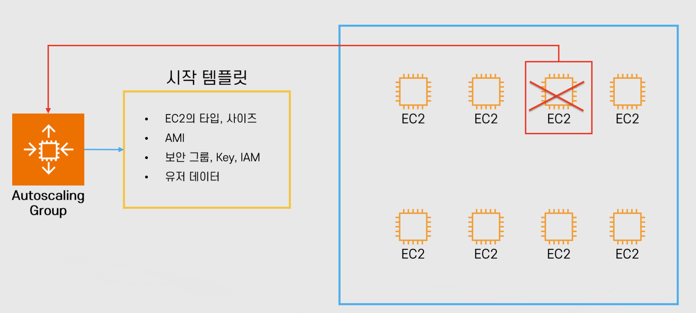

# 클라우드 기초 개념: EC2 기초

Properties

:pencil:2024.09.04

:page_facing_up: [AWS 강의실](https://www.inflearn.com/course/%EC%89%BD%EA%B2%8C-%EC%84%A4%EB%AA%85%ED%95%98%EB%8A%94-aws-%EA%B8%B0%EC%B4%88/dashboard)

## EC2 Auto Scaling



"AWS Auto Scaling은 애플리케이션을 모니터링하고 용량을 자동으로 조정하여, 최대한 저렴한 비용으로 안정적이고 예측 가능한 성능을 유지합니다. AWS Auto Scaling을 사용하면 몇 분만에 손쉽게 여러 서비스 전체에서 여러 리소스에 대해 애플리케이션 규모 조정을 설정 할 수 있습니다." - AWS



### EC2 Auto Scaling의 목적

> :point_right: **정확한 수의 EC2 인스턴스를 보유하도록 보장**

- 그룹의 최소 인스턴스 숫자 및 최대 인스턴스 숫자 설정 가능

    - 최소 숫자 이하로 내려가지 않도록 인스턴스 숫자를 유지(인스턴스 추가)

    - 최대 숫자 이상 늘어나지 않도록 인스턴스 숫자 유지(인스턴스 삭제)

:bulb: 만약, 최소 인스턴스가 3개가 필요하다면 위 처럼 최소 인스턴스를 설정 할 수 있음

> :point_right: **다양한 스케일링 정책 적용**

- 다양한 스케일링 정책 설정 가능

    - 예시 1. CPU의 부하에 따라 인스턴스 크기 늘리기
        - 유저가 많이 접속 하여 많은 트래픽이 발생 하는 경우 효과를 볼 수 있음

    - 예시 2. 특정 시간에 인스턴스 개수 늘리고 다른 시간에 줄이기
        - 정규 시간에 사용자가 많다면 인스턴스를 늘리고 새벽 시간은 줄일 수 있음
    
- 가용 영역에 인스턴스가 골고루 분산될 수 있도록 인스턴스를 분배
    - 하나의 가용 영역에 몰려있을 때 재해가 발생 할 시 대처하기 어렵기 때문에 분배가 가능함

### EC2 Auto Scaling의 구성

> **시작 템플릿: 인스턴스가 Scale Up이 필요할 때 어떤 인스턴스를 프로비저닝 할 것인가?**

- EC2의 유형, 크기

- AMI, 보안 그룹, Key, IAM 역할

- 유저 데이터(EC2 실행 시 실행할 자동 스크립트)

- 기타 설정

> **모니터링: 언제 Scale Up/Down을 실행 시킬 것인가? + 상태 확인**

- 예시 1. CPU 점유율이 일정 %를 넘어섰을 때 추가로 인스턴스 실행

- 예시 2. 최소 2개 이상이 필요한 스택에서 EC2 하나가 종료 되어 1개만 실행 되고 있을 때

:bulb: CloudWatch (and/or) ELB와 연계 해서 사용

> **설정: 얼마나 어떻게 실행 시킬 것인가?**

- 최대 인스턴스 갯 수, 최소 인스턴스 갯 수, 원하는 인스턴스 숫자 설정 가능

- ELB와 연동

:bulb: **기타 설정 사항**

- 종료 정책: 인스턴스 숫자를 줄일 경우(scale-in) 어떤 순서로 인스턴스를 종료시킬지에 관한 정책
    - 기본 설정:
        - 인스턴스가 2개 이상인 가용영역의 인스턴스에서 종료 정책이 발동함
        - 가장 오래된 시작 템플릿부터
            - 모두 같은 시작 템플릿이라면 다음 과금이 발생하는 시간에 가장 가까운 인스턴스 종료
    
    - 커스텀:
        - 가장 예전 시작 템플릿부터
        - 가장 오래된 인스턴스부터
        - 가장 최근 인스턴스부터 등
    
- Lambda를 활용해서 더욱 더 견고한 커스텀 정책 적용 가능

