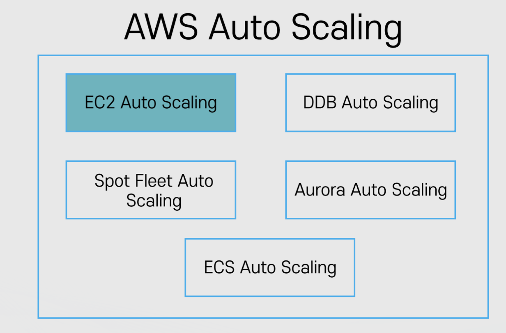

# 클라우드 기초 개념: EC2 기초

Properties

:pencil:2024.09.04

:page_facing_up: [AWS 강의실](https://www.inflearn.com/course/%EC%89%BD%EA%B2%8C-%EC%84%A4%EB%AA%85%ED%95%98%EB%8A%94-aws-%EA%B8%B0%EC%B4%88/dashboard)

## EC2 Auto Scaling



"AWS Auto Scaling은 애플리케이션을 모니터링하고 용량을 자동으로 조정하여, 최대한 저렴한 비용으로 안정적이고 예측 가능한 성능을 유지합니다. AWS Auto Scaling을 사용하면 몇 분만에 손쉽게 여러 서비스 전체에서 여러 리소스에 대해 애플리케이션 규모 조정을 설정 할 수 있습니다." - AWS



### EC2 Auto Scaling의 목적

> :point_right: **정확한 수의 EC2 인스턴스를 보유하도록 보장**

- 그룹의 최소 인스턴스 숫자 및 최대 인스턴스 숫자 설정 가능

    - 최소 숫자 이하로 내려가지 않도록 인스턴스 숫자를 유지(인스턴스 추가)

    - 최대 숫자 이상 늘어나지 않도록 인스턴스 숫자 유지(인스턴스 삭제)

:bulb: 만약, 최소 인스턴스가 3개가 필요하다면 위 처럼 최소 인스턴스를 설정 할 수 있음

> :point_right: **다양한 스케일링 정책 적용**

- 다양한 스케일링 정책 설정 가능

    - 예시 1. CPU의 부하에 따라 인스턴스 크기 늘리기
        - 유저가 많이 접속 하여 많은 트래픽이 발생 하는 경우 효과를 볼 수 있음

    - 예시 2. 특정 시간에 인스턴스 개수 늘리고 다른 시간에 줄이기
        - 정규 시간에 사용자가 많다면 인스턴스를 늘리고 새벽 시간은 줄일 수 있음
    
- 가용 영역에 인스턴스가 골고루 분산될 수 있도록 인스턴스를 분배
    - 하나의 가용 영역에 몰려있을 때 재해가 발생 할 시 대처하기 어렵기 때문에 분배가 가능함

### EC2 Auto Scaling의 구성

> **시작 템플릿: 인스턴스가 Scale Up이 필요할 때 어떤 인스턴스를 프로비저닝 할 것인가?**

- EC2의 유형, 크기

- AMI, 보안 그룹, Key, IAM 역할

- 유저 데이터(EC2 실행 시 실행할 자동 스크립트)

- 기타 설정

> **모니터링: 언제 Scale Up/Down을 실행 시킬 것인가? + 상태 확인**

- 예시 1. CPU 점유율이 일정 %를 넘어섰을 때 추가로 인스턴스 실행

- 예시 2. 최소 2개 이상이 필요한 스택에서 EC2 하나가 종료 되어 1개만 실행 되고 있을 때

:bulb: CloudWatch (and/or) ELB와 연계 해서 사용

> **설정: 얼마나 어떻게 실행 시킬 것인가?**

- 최대 인스턴스 갯 수, 최소 인스턴스 갯 수, 원하는 인스턴스 숫자 설정 가능

- ELB와 연동

:bulb: **기타 설정 사항**

- 종료 정책: 인스턴스 숫자를 줄일 경우(scale-in) 어떤 순서로 인스턴스를 종료시킬지에 관한 정책
    - 기본 설정:
        - 인스턴스가 2개 이상인 가용영역의 인스턴스에서 종료 정책이 발동함
        - 가장 오래된 시작 템플릿부터
            - 모두 같은 시작 템플릿이라면 다음 과금이 발생하는 시간에 가장 가까운 인스턴스 종료
    
    - 커스텀:
        - 가장 예전 시작 템플릿부터
        - 가장 오래된 인스턴스부터
        - 가장 최근 인스턴스부터 등
    
- Lambda를 활용해서 더욱 더 견고한 커스텀 정책 적용 가능

### AutoSclae Scaling 정책

AutoScale에서 관리하고 있는 인스턴스의 숫자를 조절 하는 방식으로 크게 4가지로 분류된다.

- 수동 스케일: 수동으로 직접 인스턴스 숫자를 증감 함

- 스케쥴기반 스케일: 특정 시점에 인스턴스 숫자를 증감 함 -> 주로 예측 가능한 시점의 부하 처리 목적으로 활용
    -  예: 09:00 ~ 18:00 정규시간은 사용자가 많을 것이라고 판단 하여 시간을 기준으로 정책을 적용 하고, 21:00 이후 줄어들 것을 예상 하여 감소 할 것을 적용함

- 동적 스케일: 특정 기준을 두고 기준치에 따라 인스턴스 숫자를 증감
    - 예: CPU 사용률이 80% 이상일 때, ALB의 요청 횟수가 n일 때, 판매량 기반 등 다양하게 가능

- 예측 기반 스케일: 과거의 기록 패턴을 기반으로 수요량을 예측해서 인스턴스 숫자를 증감 -> 14일 정도 데이터를 수집 한 후 해당 데이터의 패턴을 파악하여 분석함

> 1️⃣ **수동 스케일**

말 그대로 "수동"으로 인스턴스 숫자를 조절 하는 방법

- 주로 개발환경 혹은 다른 정책 적용하기 전 사전 테스트 용도로 활용 함

- 되도록이면 다른 스케일 정책을 **비활성화**시킨 후 적용하는 것을 추천 함
    - 만약 다른 동적 스케일이 호라성화 되어있다면 해당 수동 정책으로 인스턴스 숫자를 감소 시켰을지언정 동적 스케일에 의해 다시 인스턴스가 프리비저닝 되는 상황이 나타나는 것을 방지 하기 위함

> 2️⃣ **스케줄 기반 스케일링**

예측 가능한 "시점"의 변동사항에 대비해서 인스턴스 숫자를 조절 하는 방식

- 예시 1. 매주 수요일 마다 주간 이벤트가 있는 게임 서비스

- 예시 2. 매일 새벽 특정 시간에 하루동안 모인 데이터를 분석 하는 서비스

- 적용 방식
    - 특정 시점을 정해서 해당 시점 or Cron으로 표현하는 반복 시점

    - 범위 지정(Min(최소 용량), Max(최대 용량), Desired(원하는 용량) 셋 중 최소 한 가지는 필수 조건)
        - 지정한 범위보다 인스턴스가 작다면 Scale Out

        - 지정한 범위보다 인스턴스가 크다면 Scale In

> 동적 스케일

"지표에 반응"해서 인스턴스 숫자를 조절하는 방식이며 주로 CloudWatch의 지표를 활용 하거나 자신만의 기준으로 스케일링 정책을 조절 할 수 있다.

- 주로 AutoScale에서 지원하는 추적 조정 정책(Target Tracking Policy) 활용
    - 내부적으로 CloudWatch 경보(Alarm)을 생성해서 경보에 반응 하여 자동으로 증감 되는 방식

    - 경보는 CloudWatch에서 인스턴스를 증가 해야 할 때, 감소 해야 할 때 반응 하는 트리거 이벤트임

    - 지표 증감에 따라 얼마나 민감하게 반응 할 것인지 결정 가능

- 필요 시 커스텀 로직을 활용해서 Autoscale의 증감을 수동으로 조절 가능
    - 여기서 "수동"이 뜻 하는 의미는 증감에 대한 원하는 방식이란 뜻이다. 엔지니어의 관여가 없는 정책이기 때문에 그 수동의 개념과 헷갈릴 수 있다.

> 예측 기반 스케일

사용 패턴의 히스토리를 기반으로 인스턴스 수요량을 예측하여 인스턴스 숫자를 조절 하는 방식

- 주로 반복되는 패턴이 명확한 경우, 혹은 인스턴스 준비가 오래 걸리는 경우에 사용 됨
    - 예시: 매일 오후 2시에 레이드 이벤트 열리는 게임 서비스의 서버

- CloudWatch 지표를 14일간 분석하여 패턴을 만들고 다음 48시간의 사용 패턴을 분석

- ❗️**수요량에 따라 증가만 가능함**
    - 즉, 인스턴스 숫자를 감소 시키려면 동적 스케일링 정책을 같이 사용해야 함

- **주의사항**

    - AutoScale Group에 대한 다양한 인스턴스 종류가 효율성이 매우 떨어짐

- 다양한 스케일링 정책이 공존 할 경우 효율성이 떨어짐 -> 데이터를 분석 해야 하는데 다른 스케일링에 의해 너무 불균형한 패턴을 만들어 내게 되면 효율적이지 않은 패턴이 나오게 됨

- AutoScale Group에 **충분한 데이터가 쌓일 때 까지(2주)** 기다림이 필요함 -> 즉 바로 인스턴스 프로비저닝 해서 사용할 수 없는 정책
