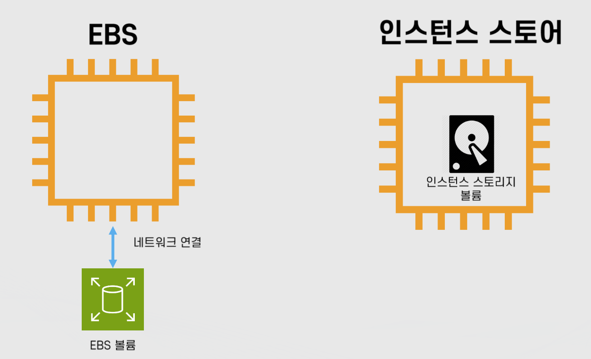
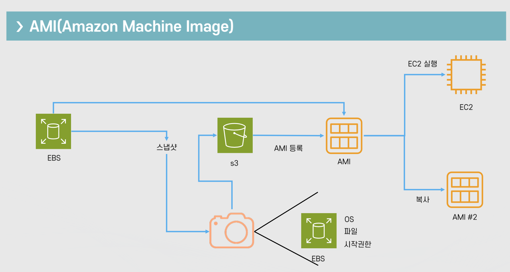

# 클라우드 기초 개념: EC2 기초

Properties

:pencil:2024.08.30

:page_facing_up: [AWS 강의실](https://www.inflearn.com/course/%EC%89%BD%EA%B2%8C-%EC%84%A4%EB%AA%85%ED%95%98%EB%8A%94-aws-%EA%B8%B0%EC%B4%88/dashboard)

## Amazon EBS



"Amazon Elastic Block Store(EBS)는 AWS 클라우드의 Amazon EC2 인스턴스에 사용 할 영구 블록 스토리지 볼륨을 제공합니다. 각 Amazon EBS 볼륨은 가용 영역 내에 자동으로 복제되어 구성 요소 장애로 부터 보호 해주고, 고가용성 및 내구성을 제공 합니다." - AWS 공식문서



### Amazon EBS(Elastic Block Store)란?

가상의 하드 드라이브이며 EC2 인스턴스가 종료 되어도 계속 유지가 가능함
- 루트 볼륨으로 사용 시 EC2가 종료되면 같이 삭제 됨
    - 단, 설정을 통해 EBS만 따로 존속 가능

- 용량을 범위에 따라 자유롭게 설정 가능

- 특수하게 하나의 EBS를 여러 EC2 장착 가능한 경우도 있으며 이를 `EBS Multi Attach` 라고 부른다. 하지만 이 방법은 "가능"만 하다고 알고 있으면 될 뿐 일반적으로 사용 되는 방법은 아님

- EC2 인스턴스와 같은 가용영역에 존재
    - 즉, EC2 인스턴스와 마찬가지로 하나의 가용영역 안에서만 존재

    - 인스턴스를 생성 했는데 다른 가용영역에 위치 해 있어 EBS를 연결 할 수 없다거나 하는 이유가 발생하면 안되기 때문

- 가용영역 안에 자동으로 분산 저장: 높은 가용성(99.999%)을 목표로 함

> :bulb: **EBS 저장 방식에 따른 특징**

앞서 배웠던 EBS 저장 방식은 두 가지가 존재한다.

- **EBS 연동**

    - EBS 연동 방식은 EBS와 네트워크가 연결 된 형태로 인스턴스와 "느슨한 결합"의 형태를 갖고 있음

❗️EBS와 인스턴스 스토어의 데이터 저장 방식 

만약 인스턴스의 사양을 올리기 위해 인스턴스를 종료 했다고 한다면 인스턴스 내 데이터가 삭제 되기 마련이지만 EBS를 네트워크로 연동 하는 형태는 별도로 저장 되어있다. 그렇기 때문에 사양을 올린 후 다시 인스턴스와 EBS를 연동 하면 기존 데이터 그대로 사용 할 수 있음

- **인스턴스 스토어**

    - EBS가 인스턴스 내부에 존재하며 임시적으로 데이터를 보존하고 있음 만약, 인스턴스가 종료 된다면 해당 데이터는 휘발됨

❗️EBS 연동 방식과 인스턴스 스토어의 특징 

인스턴스 스토어는 EBS 연동 방식에 비해 상대적으로 빠른 속도가 특징이다. **인스턴스 내부에서 스토리지에 바로 접근 하기 때문에 속도가 빠름**

반대로, EBS 연동 방식은 **네트워크와 연결 되어 있기 때문에 해당 네트워크의 대역폭에도 영향을 받을 수 있어 속도가 상대적으로 느리지만 외부 인스턴스와 자유롭게 연동이 가능함**

### EBS의 유형

- 범용(General Purpose or GP): SSD

- 프로비저닝 된 IOPS(Provisioned IOPS or io): SSD
    - 스토리지에 접근 하는 속도가 우세함

- 쓰루풋 최적화(Throughput Optimized HDD or st): HDD
    - 대용량에 적합함

- 그 외 성능이 좋지 않아 백업용으로 사용 될만한 유형
- 콜드 HDD(SC): HDD
- 마그네틱(Standard): HDD

### Snapshot

- 스냅샷: EBS의 특정 시점을 저장 한 이미지
    - 이후 EBS로 다시 복구 가능
    - EBS의 백업 용도로 활용 가능

- 증분식: 바뀐 부분만 저장
    - 100GB 볼륨의 스냅샷을 5번 찍으면 100GB * 5개의 스냅샷 이미지가 아닌 100GB 이미지 1개, 추가로 변경된 일부 부분 * 4개 -> 이전 스냅샷에서 변경 된 부분만 저장되어 비용 최적화에 특화 되어있음

- S3에 저장: 99.99999999% 내구성을 자랑함

- Data Lifecycle Manager / AWS Backup 등으로 자동화 하여 스냅샷을 저장 해둘 수 있음

> 그 외 알아두면 좋은 기능들

- 암호화

- 아카이브: 더 적은 비용으로 저장 할 수 있으나 해당 데이터에 대한 제약 사항이 존재함
    - 예시) 최소 90일 이상 저장 해야하는 제약사항

    - 예시) 복원 하는 데 최대 72시간이 소요 되는 제약사항

- 공유: 다른 계정에게 공유 가능 -> 관리자가 개별 조직에게 같은 스냅샷을 제공 할 때 처럼 공유가 가능함

- EBS Direct API를 통해 인스턴스에 복구한 스냅샷만 읽고 쓰는 것이 아닌, API를 활용 하여 직접 내용을 쓰거나 읽기가 가능함

### AMI

- EC2 인스턴스를 실행하기 위해 필요한 정보를 모아둔 템플릿

> AMI 구성 요소

- 1개 이상의 EBS 스냅샷

- 사용 권한(어떤 AWS 어카운트가 사용 할 수 있는지)

- 블록 디바이스 맵핑(EC2 인스턴스를 위한 볼륨 정보) -> 쉽게 말해 **EBS가 무슨 용량으로 몇 개 붙는지에 대한 정보**

- 필요에 따라 Private으로 가지고 있거나 Public으로 공개가 가능함
    - Public으로 사용 하는 경우는 만약 인스턴스를 생성 할 AMI를 모두가 같은 환경에서 사용 해야 한다면 이에 해당 할 수 있음 -> 예를 들어 AWS 실습을 위한 강의와 같은 경우

> 인스턴스 저장 유형에 따른 AMI의 생성 방법

- EBSS: 스냅샷을 기반으로 루트 디바이스 생성

- 인스턴스 저장: S3에 저장된 템플릿을 기반으로 생성

대부분 EBS를 AMI 단위로 등록 하여 공유하는 편이다.
