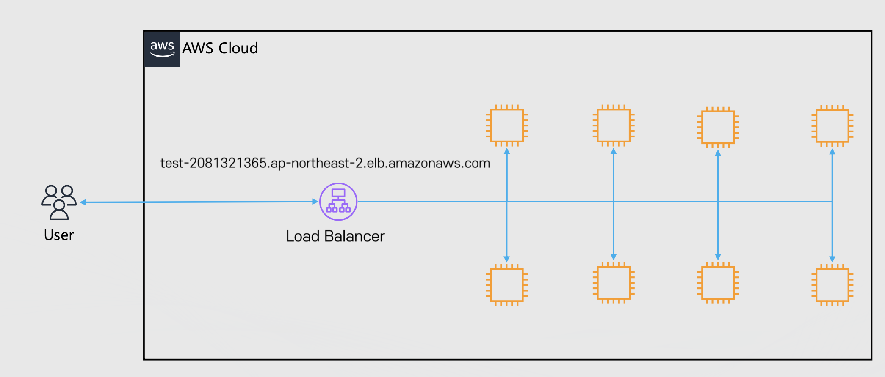
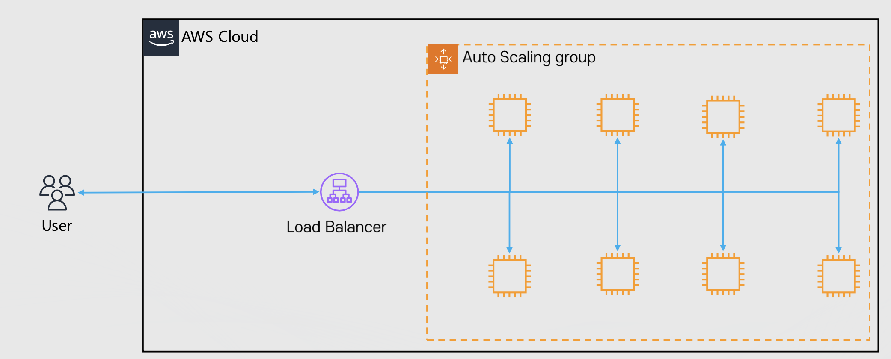
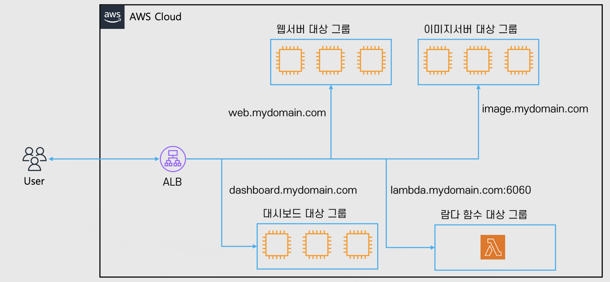
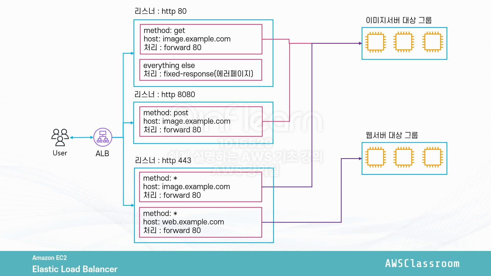

# 클라우드 기초 개념: EC2 기초

Properties

:pencil:2024.09.06

:page_facing_up: [AWS 강의실](https://www.inflearn.com/course/%EC%89%BD%EA%B2%8C-%EC%84%A4%EB%AA%85%ED%95%98%EB%8A%94-aws-%EA%B8%B0%EC%B4%88/dashboard)

## ELB(Elastic Load Balancer)



"Elastic Load Balancing은 둘 이상의 가용 영역에서 EC2인스턴스, 컨테이너, IP 주소 등 여러 대상에 걸쳐 수신되는 트래픽을 자동으로 분산합니다. 등록된 대상의 상태를 모니터링 하면서 상태가 양호한 대상으로만 트래픽을 라우팅합니다." - AWS



### Why use?

ELB는 주로 Auto Scaling과 자주 사용되며 고가용성에 대한 장애 내구성을 기르는 기본적인 아키텍처로 많이 선택된다.

일반적으로 다량의 트래픽 발생으로 인한 Auto Scaling으로 인스턴스가 여러 개 생성 되면 각자 Public IP가 다른 인스턴스들이 생기고, 지워지고를 반복하는데 클라이언트 사이드에서 이 모든 정보를 알고 있을 수 없다.

그래서, 클라이언트 사이드는 인스턴스와 직접적으로 통신을 이루는 것이 아닌 앞단에서 트래픽을 분산 처리 해줄 수 있는 ELB의 도메인을 기준으로 통신을 이루면서 ELB가 인스턴스들에게 통신을 분산 처리 해주는 구조가 나오게 된다.

### ELB란?

다수의 EC2에 트래픽을 분산 시켜주는 서비스이다.

- 총 4가지 종류가 존재 함
    - Application Load Balancer
    
    - Network Load Balancer

    - Classic Load Balancer

    - Gateway Load Balancer

- Health Check를 통해 인스턴스가 살아있는지 직접적으로 체크 하여 트래픽을 받을 수 있는(정상 상태) 인스턴스에게만 트래픽을 분산함

- 지속적으로 IP 주소가 바뀌며 IP 고정이 불가능 한 것이 일반적임으로 항상 도메인을 사용 하는 것이 Best Practice에 속함. 하지만, Network Load Balancer와 같이 연동하면 IP를 고정 시킬 수는 있지만 잘 사용되지 않는 아키텍처임

### ELB의 종류

> ALB(Application Load Balancer)

- OSI7 계층에서 가장 상위 계층에 존재 함으로 하위 계층들의 정보를 모두 얻을 수 있는 똑똑한 로드밸런서

- 트래픽을 모니터링 하여 라우팅이 가능함
    - 예시: 
        - `image.sample.com` -> 이미지 서버로 라우팅
        - `web.sample.com` -> 웹 서버로 트래픽 분산

> NLB(Network Load Balancer)

- OSI4 계층으로 처리할 수 있는 정보량이 ALB에 비해 적기 때문에 속도가 매우 빠른 로드밸런서

- TCP, UDP 기반으로 빠른 트래픽을 분산 처리 할 수 있으며 ALB에서 IP정보를 고정 하지 못하는 부분도 NLB에서 고정이 가능함

> Classic Load Balancer

예전에 사용되던 로드밸런서로 현재는 잘 사용하지 않음

> Gateway Load Balancer

OSI 3계층이며 트래픽을 가장 먼저 체크하는 로드밸런서로 가상 어프랑이언스 배포/확장 관리를 위한 서비스를 제공함

### EC2 + Auto Scaling + ELB architecture

**ELB + Auto Scaling**

- Auto Scaling을 통해 EC2 인스턴스 숫자를 관리

- ELB를 통해 분산 트래픽 처리

- Auto Scaling의 인스턴스 증감과 같이 ELB에 연결하여 사용

### 대상 그룹(Target Group)

**Target Group이란?**

- ELB가 라우팅 할 대상의 집합

> 구성

- 대상 종류
    - 인스턴스
    - IP
    - Lambda
    - ALB

- 프로토콜(HTTP, HTTPS, gRPC, TCP 등)

- 기타 설정
    - 트래픽 분산 알고리즘(라운드 로빈 방식 등), 고정 세션 
        - 고정 세션은 클라이언트가 접속 했던 인스턴스를 쿠키 값을 이용해 고정으로 해당 인스턴스에게 트래픽을 보내는 방식

### 리스너

- ALB로 들어오는 요청을 처리하는 주체
    - 들어오는 트래픽의 프로토콜 + 포트 단위

- 규칙(Rule)으로 ALB에서 어떤 요청을 받을지, 요청을 어떻게, 어디로 처리 할지 결정
    - 예시 1. HTTP: 8080 포트로 트래픽을 받아서 A 대상 그룹의 80번 포트로 배분

    - 예시 2. HTTPS: 443 포트로 트래픽을 받아서 B 대상 그룹의 80번 포트로 배분

    - 예시 3. HTTP: post 요청이 들어왔을 경우 지정된 응답 전달(에러 페이지 등)

- 규칙을 활용해 다양한 조건에 따라 트래픽 배분 가능
    - 활용 가능한 조건: Header, QueryString, source IP, Method 등

- 들어온 트래픽 처리 방식: Forward, Redirect, Fixed-Response, Cognito 인증 등

