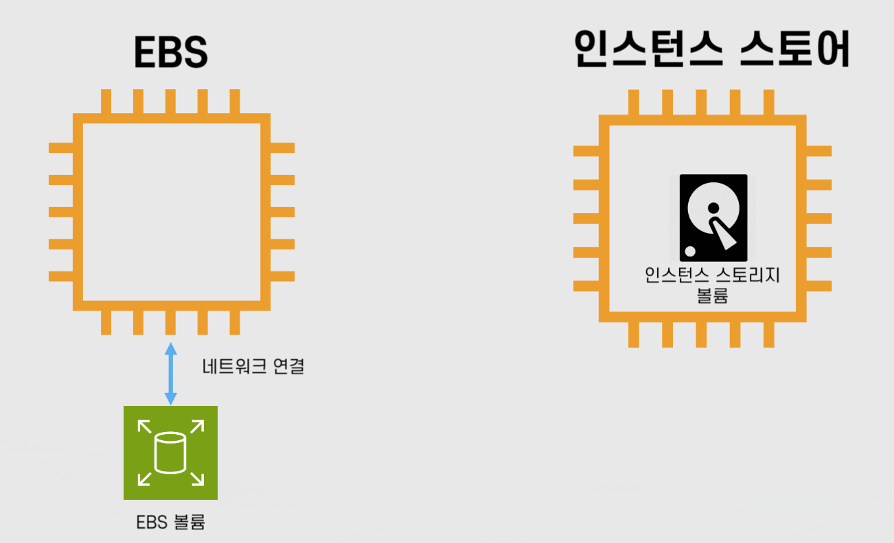
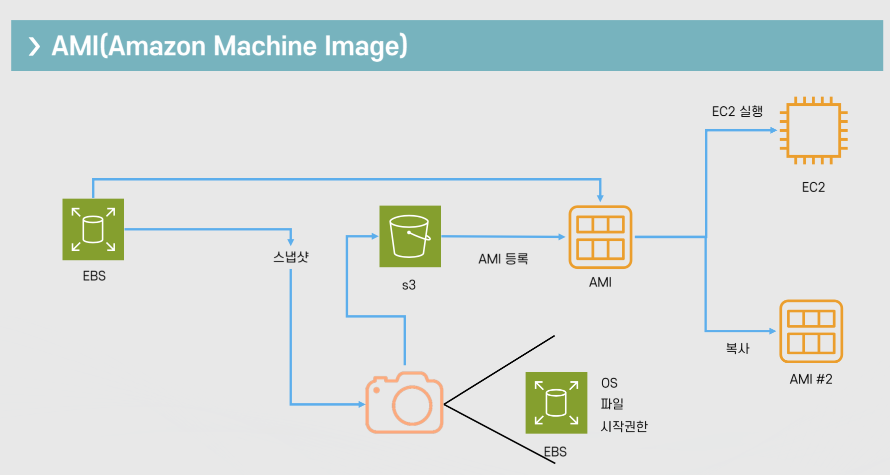

# 클라우드 기초 개념: EC2 기초

Properties

:pencil:2024.08.30

:page_facing_up: [AWS 강의실](https://www.inflearn.com/course/%EC%89%BD%EA%B2%8C-%EC%84%A4%EB%AA%85%ED%95%98%EB%8A%94-aws-%EA%B8%B0%EC%B4%88/dashboard)

## Amazon EC2

### EC2 인스턴스

EC2에서 컴퓨팅을 담당하며 다양한 유형과 크기로 구성 되어있고 저장을 담당하는 EBS와 네트워크로 연결 되어있다.

저장 방법에 따라 두 가지로 분류 할 수 있는데 "EBS 연동", "인스턴스 스토어"로 분류가 가능하다.

인스턴스는 갯 수와 상관 없이 **하나의 가용영역(AZ)에 존재** 한다. 

인스턴스를 사용 할 때 여러가지 유형을 미리 정의 해놓고 해당 유형에 최적화 된 컴퓨팅 자원을 빌릴 수 있도록 AWS에서 지원 하는데 만약, 10$로 EC2를 사용해본다고 가정 해보자.

- CPU가 중요한 알고리즘을 처리 하는 서비스
    - CPU: 7$
    - RAM: 2$
    - 그래픽카드: 1$

- 메모리가 중요한 서비스
    - CPU: 2$
    - RAM: 7$
    - 그래픽카드 :1$

이런식으로 서비스에 따라 필요한 리소스가 최적화 된 유형을 선택 할 수 있다.

> EC2 인스턴스의 유형(패밀리)

- 인스턴스의 역할에 따라 CPU, 메모리, 스토리지, 네트워크 등을 조합하여 구성 되어있다.

- 각 인스턴스 유형 별로 사용 목적에 따라 최적화 된 서비스를 지원한다.
    - 예: 메모리 위주, CPU 위주 등

- 유형 별로 이름이 존재한다.
    - 예: t유형, m유형, inf유형 등
    - 같은 유형의 인스턴스들을 "패밀리" 라고 부른다.

- 타입 별 세대별로 숫자가 부여된다.
    - 예: m5 -> m 인스턴스 유형의 5번째 세대를 가르킴

- 아키텍처 및 프로세서/추가 기술에 따라 접미사가 붙는다.
    - c7gn -> c 인스턴스 유형 중 AWS Graviton 프로세서를 사용(g)을 하고 네트워크가 최적화(n) 되어있는 인스턴스

**인스턴스 유형을 읽는 방법**

- `cg7n.xlarge`
    - c: 인스턴스 타입
    - 7: 세대
    - g: 프로세서
    - n: 추가 기능 -> 여기선 네트워크 최적화
    - xlarge: 사이즈

> 인스턴스의 크기

- 같은 인스턴스 패밀리에서도 다양한 크기가 존재함

- 인스턴스의 CPU 갯 수, 메모리 크기, 성능 등으로 크기가 결정됨

- 크기가 클 수록 더 많은 메모리, CPU, 네트워크 대역폭 EBS와의 통신 가능한 대역폭을 지원함

### EC2 요금 모델



"미리 내지 않고, 사용한 만큼 내고, 많이 쓸수록 적게 내개고, 예약할수록 더 적게 낸다." - AWS 비용 백서



> 요금 구성

- 인스턴스 요금

- 데이터 전송

- Public IPv4 IP

- 그 외 통합적으로 사용 될 수 있는 연동 서비스들
    - ELB, CloudWatch, EBS 등

> 요금 모델

- On-Demand: 사용한 시간 만큼
    - 수요 예측이 힘들거나 유연하게 EC2를 사용하고 싶을 때

- Spot Instances: 남는 인스턴스를 저렴하게
    - AWS에서 보유중인 남는 인스턴스를 저렴한 가격으로 제공
        - 가용영역 별, 인스턴스 유형 별 다른 풀로 관리
        - AWS도 컴퓨팅 서비스를 빌려주는 임대업자와 마찬가지이다. 만약 호텔에서 남는 방이 많다면 이 남는 방에 대한 자원이 매우 낭비가 될 것이다. 그렇기 때문에 남는 방에 한해서 일시적 할인을 적용 시켜 손님을 유치한 뒤 낭비 없이 자원이 모두 사용되도록 유도 하는게 탁월한 전략인데 이와 같은 방식을 적용한게 AWS의 Spot Instance이다.

    - **단!! 인스턴스가 언제 종료 될지 예측이 불가능함**

- Reserved Instances: 인스턴스의 사용 기간을 약정
    - 온디맨드 EC2 사용 요금을 할이 받는 방식
    - 할인 받고 싶은 EC2 인스턴스와 같은 리전, 유형 구매가 필요함
    - 약정 기간이 더 길수록 더 큰 할인율이 적용 됨 -> 1년 혹은 3년 선택 가능
    - 최대 72% 저렴

- Dedicated: 물리적인 전용 인스턴스 임대
    - 주로 라이선스 이슈/퍼포먼스 이슈를 해결 하기 위해 사용하며, 물리적으로 인스턴스/호스트 단위로 격리된 서버에서 EC2를 실행한다는 특징을 갖고 있음

    - 전용 인스턴스는 AWS에서 EC2와 같은 가상 서버를 빌릴 때 진짜 CPU 공간 1개에 가상 서버 여러개가 구성 되어있고 그 중 한 개의 가상 서버를 빌리는 것이다. 가상 서버와 가상 서버 사이에서 간섭이 이루어지지 않는 것이 이론적이나 실제로는 간섭이 발생 할 수도 있기 때문에 전용 인스턴스를 통째로 빌릴 수 있다.

- Savigs Plan: AWS의 컴퓨터 사용량을 약정
    - Compute Savings Plans: 다른 서비스(Lambda, Fargate 등 다른 서비스와 같이 사용)와 같이 약정
    - EC2 Instance Savings Plans: EC2 인스턴스 패밀리를 지정해서 약정

### EC2 생명 주기

EC2는 사용자에 의해 실행, 중지, 종료 등 다양한 액션을 제공하며 이에 따른 상태를 가진다.

- pending: EC2 프로비저닝 상태

- running: EC2가 정상적으로 프로비저닝 되어 실행중인 상태 

- rebooting: OS만 재시작 하는 상태, 이 때는 Public IP의 변동 없이 OS만 재실행 됨

- stopping: 중지를 위해 정리하는 상태

- stopped: 중지 된 상태이며 이 때 퍼블릭 IP를 회수하여 아무런 IP를 갖고 있지 않음

- Shutting down: 종료시 서버를 종료하기 위한 작업을 하는 상태

- terminated: 서버 리소스를 정리 완료 하여 종료 된 상태

**생명 주기 별 요금 표**

| 인스턴스 상태  | 설명  | 인스턴스 사용 요금 |
| :-: | :-: | :-: |
| pending  | 인스턴스가 running 상태로 될 준비 | 미청구 |
| running  | 인스턴스 사용 중 | 청구 |
| stopping  | 인스턴스가 중지 또는 최대 절전모드로 전환 중 | 미청구, 최대 절전모드 시 청구 |
| stopped  | 인스턴스 중지 상태: 재시작 가능 | 미청구 |
| shutting-down  | 인스턴스 종료 중 | 미청구 |
| terminated  | 인스턴스 영구 삭제 | 미청구 |

**생명 주기에서 알아 볼 키워드**

> "Stopped"

"Stopped" 상태에서는 요금이 청구 되지 않는다.
- 단, EBS 요금, EIP(Elastic IP) 요금 및 그 외 서비스들에 대한 요금은 계속 부과됨

- 중지 후 재시작 시 퍼블릭 아이피는 변경 됨

- EBS를 사용하는 인스턴스만 중지가 가능하며 인스턴스 스토어를 사용하면 불가능
    - EBS는 네트워크로 연결 되어 있어 중지 시 AWS에서 빌려주는 컴퓨팅 서버를 회수 해간다고 생각 하면 됨. 회수 되었을 때 사용자가 갖고 있던 데이터를 보존 할 수 있으면 중지가 가능하고, 인스턴스 스토어 처럼 데이터가 날아간다면 중지가 불가능함

> "rebooting"

재부팅은 운영체제 레벨에서만 재시작 하는 단계이다.
- 재부팅 시에는 퍼블릭 아이피의 변동이 없음

### ENI(Elastic Network Interface)와 EIP(Elastic IP)



"탄력적 네트워크 인터페이스는 VPC에서 가상 네트워크 카드를 나타내는 논리적 네트워킹 구성 요소입니다."
- AWS



> ENI

- EC2의 가상 랜카드이며 IP주소와 MAC주소를 보유 하고 있음

- 하나의 인스턴스에 "여러개의 ENI"를 연동 할 수 있음
    - 즉, 하나의 인스턴스가 한 개 이상의 아이피를 보유 할 수 있음

- 인스턴스 유형 및 사이즈에 따라 최대 보유 가능한 IP주소가 변동 -> 사용하는 리소스 자원이 비쌀수록 하나의 인스턴스에서 여러 개의 아이피를 보유하여 트래픽을 분산하는 방식 등 다양하게 이용이 가능함

- 내부적으로는 Security Group은 ENI에 부착 되어있음

- 기본적으로 Private IP와 Private 도메인을 보유 하고 있으며 선택적으로 퍼블릭 아이피와 퍼블릭 도메인을 보유 할 수 있음

> EIP: 탄력적 아이피

- EC2의 퍼블릭 아이피를 고정해주는 서비스
    - 인스턴스를 중지 후 재시작 시 퍼블릭 아이피가 변경 되었지만 탄력적 아이피를 사용하면 고정적인 아이피를 확보 할 수 있음

- EC2이외에도 다른 서비스에서 사용 가능, 예: ELB 등

- 내가 보유한 아이피 주소를 AWS에서 직접적으로 사용이 가능함

- 리전 단위이기 때문에 서울리전에서 생성한 탄력적 아이피의 주소가 버지니아 북부 리전에서 동일하게 존재 할 수 없음

- 연결하지 않아도 보유하기만 해도 비용 발생(IPv4 비용 발생)

## Amazon EBS



"Amazon Elastic Block Store(EBS)는 AWS 클라우드의 Amazon EC2 인스턴스에 사용 할 영구 블록 스토리지 볼륨을 제공합니다. 각 Amazon EBS 볼륨은 가용 영역 내에 자동으로 복제되어 구성 요소 장애로 부터 보호 해주고, 고가용성 및 내구성을 제공 합니다."

- AWS 공식문서



### Amazon EBS(Elastic Block Store)란?

가상의 하드 드라이브이며 EC2 인스턴스가 종료 되어도 계속 유지가 가능함
- 루트 볼륨으로 사용 시 EC2가 종료되면 같이 삭제 됨
    - 단, 설정을 통해 EBS만 따로 존속 가능

- 용량을 범위에 따라 자유롭게 설정 가능

- 특수하게 하나의 EBS를 여러 EC2 장착 가능한 경우도 있으며 이를 `EBS Multi Attach` 라고 부른다. 하지만 이 방법은 "가능"만 하다고 알고 있으면 될 뿐 일반적으로 사용 되는 방법은 아님

- EC2 인스턴스와 같은 가용영역에 존재
    - 즉, EC2 인스턴스와 마찬가지로 하나의 가용영역 안에서만 존재

    - 인스턴스를 생성 했는데 다른 가용영역에 위치 해 있어 EBS를 연결 할 수 없다거나 하는 이유가 발생하면 안되기 때문

- 가용영역 안에 자동으로 분산 저장: 높은 가용성(99.999%)을 목표로 함

> :bulb: **EBS 저장 방식에 따른 특징**

앞서 배웠던 EBS 저장 방식은 두 가지가 존재한다.

- **EBS 연동**

    - EBS 연동 방식은 EBS와 네트워크가 연결 된 형태로 인스턴스와 "느슨한 결합"의 형태를 갖고 있음

❗️EBS와 인스턴스 스토어의 데이터 저장 방식 

만약 인스턴스의 사양을 올리기 위해 인스턴스를 종료 했다고 한다면 인스턴스 내 데이터가 삭제 되기 마련이지만 EBS를 네트워크로 연동 하는 형태는 별도로 저장 되어있다. 그렇기 때문에 사양을 올린 후 다시 인스턴스와 EBS를 연동 하면 기존 데이터 그대로 사용 할 수 있음

- **인스턴스 스토어**

    - EBS가 인스턴스 내부에 존재하며 임시적으로 데이터를 보존하고 있음 만약, 인스턴스가 종료 된다면 해당 데이터는 휘발됨

❗️EBS 연동 방식과 인스턴스 스토어의 특징 

인스턴스 스토어는 EBS 연동 방식에 비해 상대적으로 빠른 속도가 특징이다. **인스턴스 내부에서 스토리지에 바로 접근 하기 때문에 속도가 빠름**

반대로, EBS 연동 방식은 **네트워크와 연결 되어 있기 때문에 해당 네트워크의 대역폭에도 영향을 받을 수 있어 속도가 상대적으로 느리지만 외부 인스턴스와 자유롭게 연동이 가능함**

### EBS의 유형

- 범용(General Purpose or GP): SSD

- 프로비저닝 된 IOPS(Provisioned IOPS or io): SSD
    - 스토리지에 접근 하는 속도가 우세함

- 쓰루풋 최적화(Throughput Optimized HDD or st): HDD
    - 대용량에 적합함

- 그 외 성능이 좋지 않아 백업용으로 사용 될만한 유형
- 콜드 HDD(SC): HDD
- 마그네틱(Standard): HDD

### Snapshot

- 스냅샷: EBS의 특정 시점을 저장 한 이미지
    - 이후 EBS로 다시 복구 가능
    - EBS의 백업 용도로 활용 가능

- 증분식: 바뀐 부분만 저장
    - 100GB 볼륨의 스냅샷을 5번 찍으면 100GB * 5개의 스냅샷 이미지가 아닌 100GB 이미지 1개, 추가로 변경된 일부 부분 * 4개 -> 이전 스냅샷에서 변경 된 부분만 저장되어 비용 최적화에 특화 되어있음

- S3에 저장: 99.99999999% 내구성을 자랑함

- Data Lifecycle Manager / AWS Backup 등으로 자동화 하여 스냅샷을 저장 해둘 수 있음

> 그 외 알아두면 좋은 기능들

- 암호화

- 아카이브: 더 적은 비용으로 저장 할 수 있으나 해당 데이터에 대한 제약 사항이 존재함
    - 예시) 최소 90일 이상 저장 해야하는 제약사항

    - 예시) 복원 하는 데 최대 72시간이 소요 되는 제약사항

- 공유: 다른 계정에게 공유 가능 -> 관리자가 개별 조직에게 같은 스냅샷을 제공 할 때 처럼 공유가 가능함

- EBS Direct API를 통해 인스턴스에 복구한 스냅샷만 읽고 쓰는 것이 아닌, API를 활용 하여 직접 내용을 쓰거나 읽기가 가능함

### AMI

- EC2 인스턴스를 실행하기 위해 필요한 정보를 모아둔 템플릿

> AMI 구성 요소

- 1개 이상의 EBS 스냅샷

- 사용 권한(어떤 AWS 어카운트가 사용 할 수 있는지)

- 블록 디바이스 맵핑(EC2 인스턴스를 위한 볼륨 정보) -> 쉽게 말해 **EBS가 무슨 용량으로 몇 개 붙는지에 대한 정보**

- 필요에 따라 Private으로 가지고 있거나 Public으로 공개가 가능함
    - Public으로 사용 하는 경우는 만약 인스턴스를 생성 할 AMI를 모두가 같은 환경에서 사용 해야 한다면 이에 해당 할 수 있음 -> 예를 들어 AWS 실습을 위한 강의와 같은 경우

> 인스턴스 저장 유형에 따른 AMI의 생성 방법

- EBSS: 스냅샷을 기반으로 루트 디바이스 생성

- 인스턴스 저장: S3에 저장된 템플릿을 기반으로 생성

대부분 EBS를 AMI 단위로 등록 하여 공유하는 편이다.
