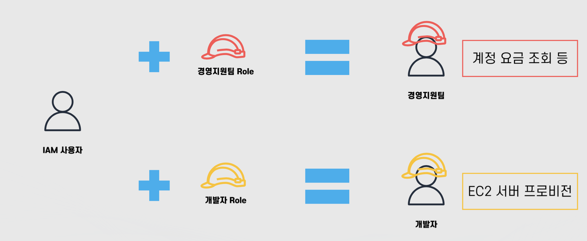
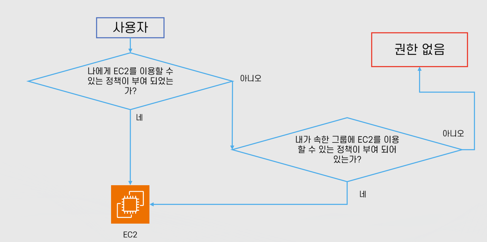

# 클라우드 기초 개념: IAM 기초

Properties

:pencil:2024.08.30

:page_facing_up: [AWS 강의실](https://www.inflearn.com/course/%EC%89%BD%EA%B2%8C-%EC%84%A4%EB%AA%85%ED%95%98%EB%8A%94-aws-%EA%B8%B0%EC%B4%88/dashboard)

:paperclip: 

## IAM 기초

### IAM 소개

"AWS Identity and Access Management 이하, IAM"을 사용하면 AWS 서비스와 리소스에 대한 액세스를 안전하게 관리할 수 있다. 또한, AWS 사용자 및 그룹을 만들고 관리하며 AWS 리소스에 대한 액세스를 허용 및 거부 할 수 있다.

AWS에서 **Root사용자만이 할 수 있는 행동(IAM에게 결제 정보 위임, 이메일 변경 등)이 아니라면 AWS를 이용 할 때 반드시 IAM 사용자로 관리 해야한다.**

이유는 IAM 사용자의 권한 또는 그룹은 언제든 빼앗아 행동을 무력화 할 수 있기 때문이다. 쉽게 예를 들어보자면 이렇다.

S3에 접근이 가능한 IAM 유저가 있다고 가정 하고, 이 IAM 유저가 불가피하게 해킹을 당했다. 우연치않게 이 것을 확인 한 관리자는 해당 IAM 유저의 권한을 지워버리면 이 IAM 유저는 아무런 행동도 할 수 없는 계정이 되는 것이다.

반면, 루트 사용자는 어떠한가? 루트 사용자에게 제한을 걸 수 있는가? 루트 사용자는 "super user do" 와 같은 절대 권력이다. 이 유저를 해킹 당하면 복구 하기가 굉장히 어렵다는 것을 간접적으로나마 이해할 수 있다.

:point_right: **AWS는 IAM으로 시작해서 IAM으로 끝난다.**

> 그래서, IAM이란?

- AWS의 보안 및 관리를 담당하는 **글로벌 서비스**
    - 글로벌 서비스는 "데이터 및 서비스를 전 세계의 모든 인프라가 공유" 하는 서비스이다.

- 주요 기능
    - AWS 어카툰으 관리 및 리소스/사용자/서비스의 권한 제어
        - 임시 권한 부여
        - 서빕스 사용을 위한 인증 정보 부여
    
    - 사용자의 생성, 관리, 계정의 보안
        - MFA 설정
        - 사용자의 패스워드 정책 관리
    
    - 다른 계정과의 리소스 공유

> IAM을 구성하는 4가지 요소

- **사용자**
    - 실제 AWS를 사용하는 사람 혹은 어플리케이션이 될 수도 있음

- **그룹**
    - "사용자의 집합"이며, 그룹에 속한 사용자는 **그룹에 부여된 권한을 행사** 할 수 있음

- **정책(Policy)**
    - 사용자와 그룹, 역할이 무엇을 할 수 있는지에 관한 문서이며 "JSON" 형식으로 정의함
    - 구성
        - Resource: 어떤 AWS 리소스에 대해서 적용 할 것인가
        - Action: 어떤 행동을 할 것인가
        - Effect: 허용 또는 거부 -> 권한
        - Condition: 정책이 적용 되는 조건(예: IP주소 접근, 시간, 태그 등)

- **역할(Role)**
    - AWS의 권한의 집합
    - 특정 사용자나 그룹에 연결 되어 있지 않음
    - 이러한 역할을 다양한 어플리케이션이나 서비스 또는 IAM 사용자가 부여 받아 사용함
    - AWS 공식문서에서 역할은 일종의 힘이 담겨 있는 "모자"로 비유하고 있음
        - IAM 사용자는 계정이 생성 될 때 아무런 권한, 그룹이 없기 때문에 힘이 없지만 해당 역할을 부여 받는 순간 그 힘을 행사 할 수 있게 된다.

    

### 권한 검증 과정

사용자가 서비스를 이용 하거나 서비스가 다른 서비스를 이용 하는 경우 모두 위와 같은 과정을 거쳐 현재 권한이 부여 되어있는지를 검증하게 된다.

## IAM 사용과 인증

### AWS를 이용하는 방법

> AWS 웹 콘솔(GUI)

- 웹 기반의 콘솔에 로그인 하여 AWS를 사용 하는 방법

- 콘솔 액세스 자격 증명을 사용하여 인증 -> 콘솔 로그인 여부 설정에 따라 적용

> 프로그래밍 액세스 방식(CLI)

- Command Line Interface(CLI): 명령줄 기반으로 AWS 서비스를 관리하는 도구

- Software Development Kit(SDK): 다양한 프로그래밍 언어(파이썬, 자바 등)로 만들어진 AWS 서비스를 관리하는 패키지

- 프로그래밍 방식 액세스 자격 증명을 사용하여 인증 -> Access Key Pair 인증

### 콘솔 액세스 자격 증명

콘솔 로그인을 위해 필요한 자격을 증명하는 과정으로 AWS 웹으로 접근 할 때 해당된다.

- Root Email/Password: 루트 사용자로 로그인 하는 경우

- IAM 사용자 이름/Password: IAM 사용자로 로그인 하는 경우

- 선택적인 사항이지만 권고 되는 사항으로 MFA(임시 비밀번호)를 사용 할 수 있음

### 프로그램 방식 액세스 자격 증명

웹 브라우저에서 AWS를 사용하는 것이 아닌 터미널과 같은 쉘이나 프로그래밍 언어를 통해 접근 할 때 해당된다.

- Access Key
    - Access Key ID: 유저 이름에 해당하는 키로 일반적으로 공개 되어도 무방함
    - Secret Access Key: 패스워드에 해당 하는 키로 **절대 공개 되면 안됨**

- 하나의 IAM 사용자는 2개의 Access Key Pair를 생성 할 수 있음
    - Key를 일정 주기마다가 Rotation 할 때 사용중인 키, 사용 예정인 키가 동시에 적용 되야 하기 때문에 1개가 아닌 2개로 제한됨

- IAM 유저를 활성화 또는 비활성화가 가능함
    - 해킹 의심이 있는 IAM 유저를 비활성화 한 뒤 분석 하고 다시 활성화가 가능하다

- Secret Access Key의 경우 최초 생성 이후에 다시 확인이 불가능 함

> 프로그램 방식 액세스 자격 증명을 활용 하는 방법

- IAM 사용자를 서버 / 프로그램 별로 생성하여 Access Key를 전달 한 뒤 CLI / SDK를 사용 하는 것
    - AWS CLI의 경우 서버의 별도 파일에 자격증명을 저장 하여 인증

    - AWS의 SDK의 경우 별도 파일에 자격증명을 저장하거나 런타임에 자격증명을 명시해서 인증

- 프로파일: 자격증명의 단위로 서로 다른 자격증명에 이름을 부여해서 필요할 때 마다 스위칭 가능