# Chapter 1. Logic Gates

<details>

<summary>Properties</summary>

:pencil:2023.08.28

</details>

### Boolean Logic

***

#### Boolean Functions

```c
f(x,y,z) = (x AND y) OR (NOT(x) AND z)
```

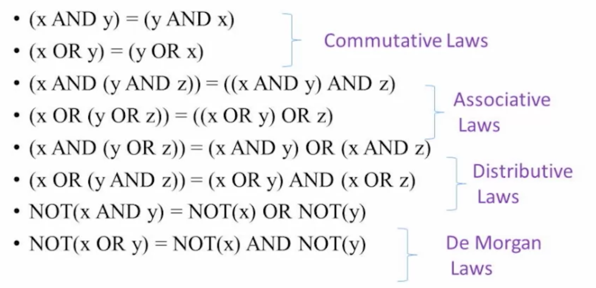

*   Commutative Laws : 교환 법칙

    👉 **x·y=y·x**

    **x+y=y+x**

    AND나 OR 연산에서 순서가 바뀌더라도 그 결과는 같다. 즉, 0·1=1·0이고, 0+1=1+0
*   Associative Laws : 결합 법칙

    👉 **x·(y·z)=(x·y)·z** **x+(y+z)=(x+y)+z**

    교환 법칙과 유사하게 일반 수학에서의 규칙과 같습니다. 앞부터 순서대로 연산하거나, 뒤부터 순서대로 연산한다고 해서 결과가 달라지지는 않겠죠.
*   Distributive Laws : 분배법칙

    👉 13 - **x·(y+z)=x·y+x·z** 14 - **x+y·z=(x+y)·(x+z)**

    분배 법칙도 일반 수학을 생각하면 쉽지만, 조금 다른 점이 있습니다. 일단 13번 법칙은 우리가 알던 분배 법칙이라 어려울 점이 없습니다. 문제는 14번인데요, 참 이상하게도 +에 분배 법칙을 사용했습니다. 이는 일반 대수에서는 성립하지 않지만 불 대수에서만 성립하는 내용입니다.

    아래에서 나올 듀얼 폼으로 증명하는 것이 가장 간단하지만, 우변의 식을 그대로 전개해보아도 성립한다는 것을 알 수 있습니다. (x+y)·(x+z)=xx+xy+xz+yz이고, 이는 다시 x(1+y+z)+yz로 정리할 수 있고, 1+y+z=1이므로 x+y·z가 되어 참임을 확인할 수 있습니다.
*   De Morgan Laws : 드모르간 법칙

    👉 **(x·y)'=x'+y' (x+y)'=x'·y'**

    드 모르간 법칙은 아마 집합을 공부하셨다면 다들 익숙하실 텐데요, 그것과 같습니다. 논리식 전체에 부정 연산을 할 경우, 각 변수에 NOT 연산을 하고, AND -> OR, OR -> AND 연산으로 바꿔주어야 합니다.

\\

#### 부울대수 (Boolean Algebra)

임의의 회로에서 일련의 기능을 수행 하기 위한 가장 최적의 방법을 결정하는 수식적 표현 방법

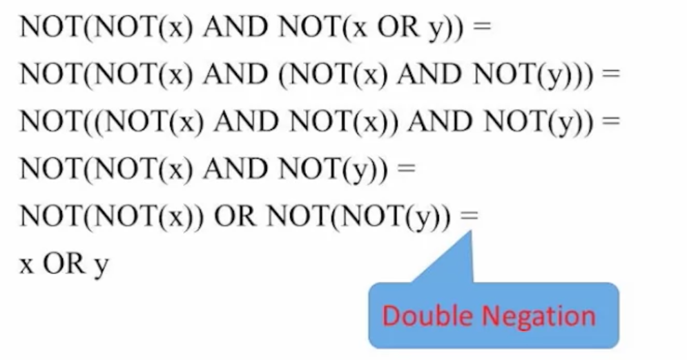

💡 NOT(NOT(x) AND NOT(x OR y))

1. NOT(NOT(x) AND (NOT(x) AND NOT(y)))
   * 분배 법칙 (Distributive Laws) 적용되어 `NOT(x OR y)` → `(NOT(x) AND NOT(y)`
2. NOT((NOT(x) AND NOT(x)) AND NOT(y))
   * 결합 법칙 (Associative Laws) 에 의해 `NOT(x) AND (NOT(x)` → `(NOT(x) AND NOT(x)`
3. NOT(NOT(X) AND NOT(y))
   * 멱등 법칙 (Idempotence) 에 의해 `NOT(x) AND NOT(x)` → `NOT(X)`
4. NOT(NOT(x)) OR NOT(NOT(y))
   * 이중 부정 법칙 (Double Negation Law) 에 의해 `x OR y` 로 값이 변하게된다.

[논리게이트 참고 자료](https://homubee.tistory.com/31)

\\

### Boolean Functions Synthesis


함수로 이루어진 논리 게이트를 통해 Truth Table을 만든다. 이 때, 각 경우의 수를 입력 하고 함수의 결과 값이 정해졌다면 당신은 논리게이트를 작성 할 수 있어야 한다.

\\

### Hardware Description Language

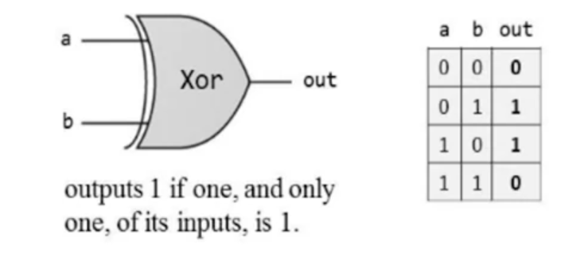

HDL로 프로그래밍을 하면 시뮬레이터로 구현 할 수 있다. 그렇게 하기 위해서는 당신의 논리 게이트 기능을 정의 하고, Truth table을 만들어 input과 output을 표현 해야한다.

당신이 만든 논리게이트의 다이어그램과 표를 만들면 이 칩이 어떤 일을 해야 하는지 이해할 수 있다.

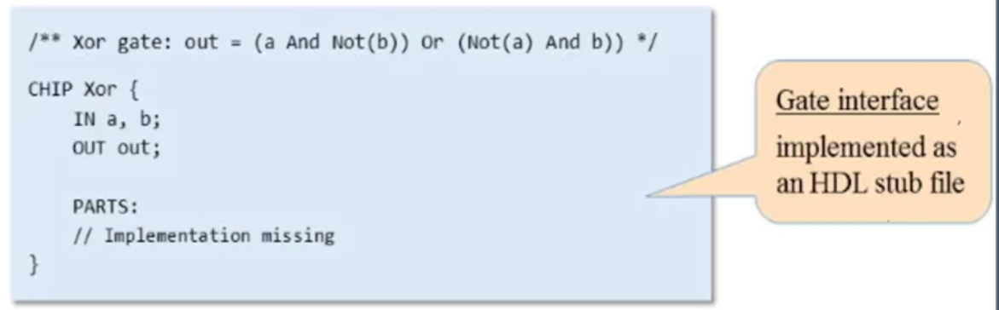

HDL로 프로그래밍을 할 때 논리 게이트에 대한 이름, input, output을 모두 설정 해줘야한다. 이 것을 게이트 인터페이스라고 한다.

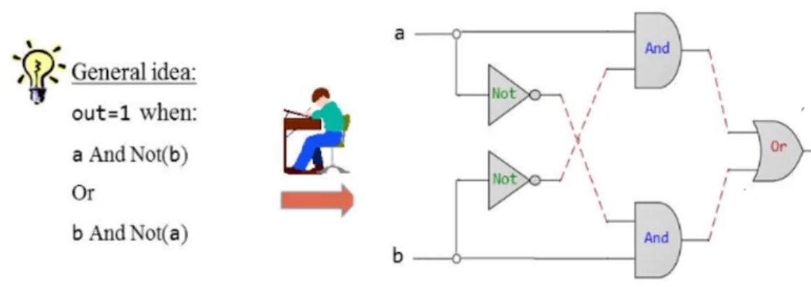

이렇게 만들어진 게이트 인터페이스가 만약 잘 구축 되었다고 하고, 남에게 주었다고 가정 해본다. 그러면 받는 사람이 사용 할 때는 output이 어떤 값인지만 알 수 있다. 지금까지 우리가 알던 테이블과는 다르며, 우리는 그 것을 보고 논리게이트를 어떻게 구현 했는지 유추 할 수 있다.

\\

### Hardware Simulation

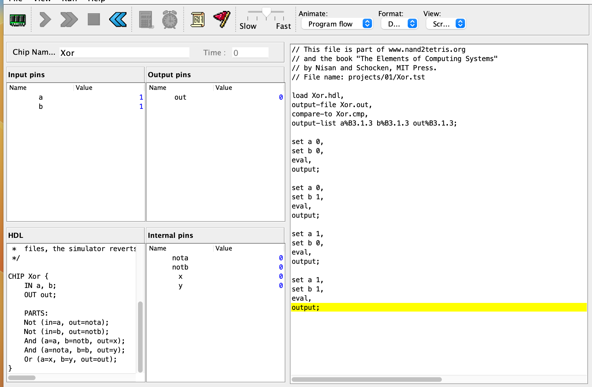

HDL 프로그램은 외부 텍스트 편집기에서 작성한 논리 게이트 코드를 불러오면 output의 값과 진행 상황 등 시뮬레이터를 통해 선언한 값을 볼 수 있고, 테스트 코드를 작성 함으로써 경우의 수를 모두 디버깅 하듯 테스트 할 수 있다.

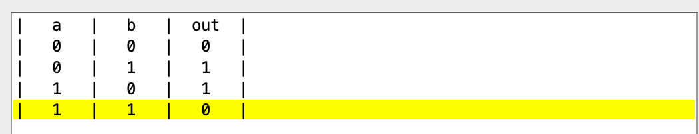

### Multi-bit Buses

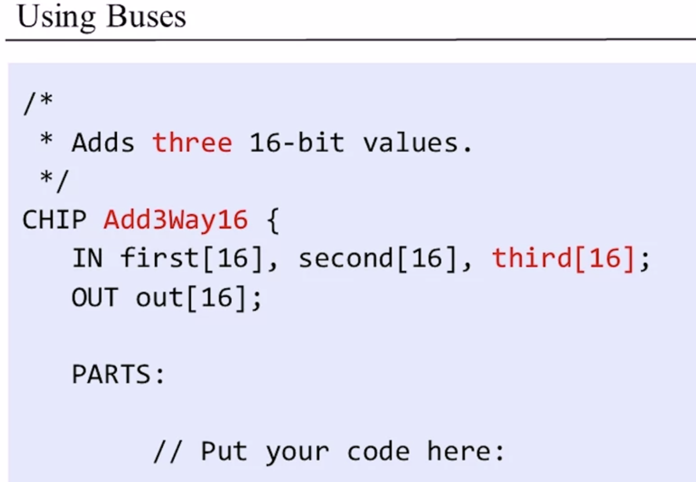

한 개의 비트가 아닌, 여러 개의 비트에 접근 하고 그 접근자는 인덱스를 통해 접근하게 된다. 이 때 인덱스는 오른쪽에서 왼쪽으로 접근한다. → 15, 14, 13, … 0

지금 까지 2개의 종류에 대해서 논리 회로를 구성 했지만 이렇게 비트를 이용 하여 세가지 인풋이 있다면 위와 같은 사진 처럼 처리 할 수 있다.

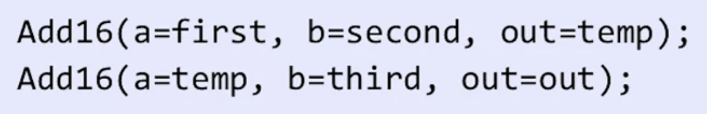

연산 과정은 a와 b에 대해 우선 연산을 처리 하고, 그 결과 값을 임시 변수에 저장한다.

임시 변수에 저장 된 값을 마지막 c(third) 값과 연산을 하며 최종 out 값을 리턴한다.

> 서브 버스로 멀티 비트 버스 관리하기

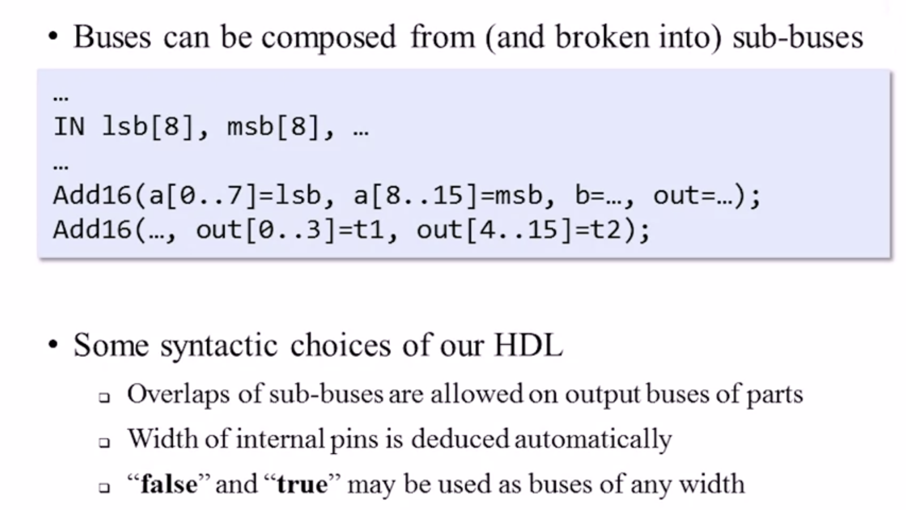

1. 부품의 출력 버스에 서브 버스 오버랩 허용됨
2. 내부 핀의 너비가 자동으로 추론됨
3. "False" 및 "True"는 모든 폭의 버스로 사용할 수 있음

### Project 1 Overview

지금까지 배운 개념으로 논리 회로를 구현 하는 프로젝트를 진행 하는 데 있어 추가적으로 필요한 개념을 학습한다.

* 멀티플렉서
* 디멀티플렉서

\\

#### Multiplexor

멀티플렉서는 게이트이며 아래와 같이 작동한다.

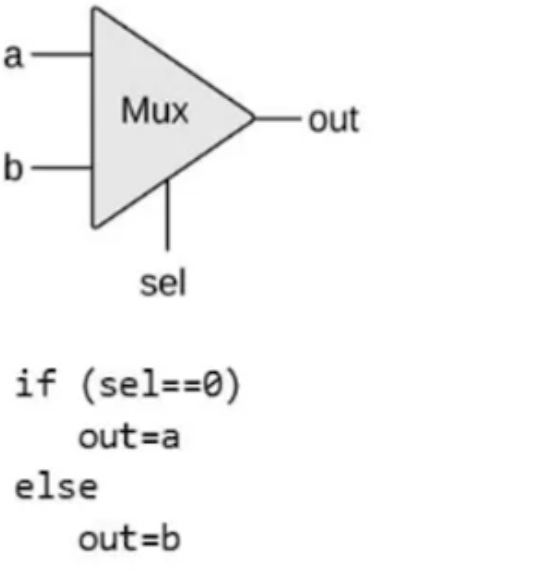

name: Mux

input: a, b, sel

output: out

→ sel의 값에 의해 출력 값이 변하는 형태로, sel이 false 일 때는 a의 값, true 일 때 b의 값으로 출력

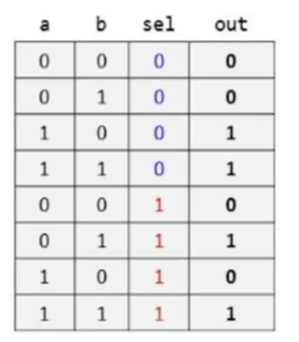

#### Demultiplexor

***

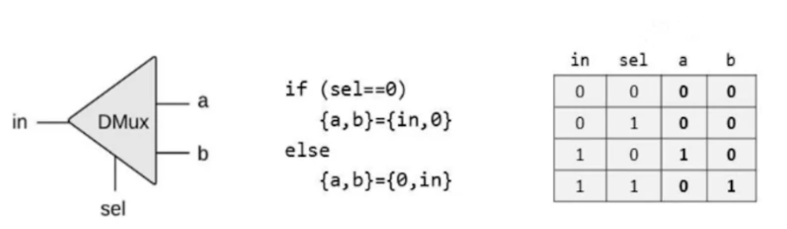

앞서 mux의 역순이며, 단방향 output이 아닌 두 개의 값이 리턴되는 형태이다.

mux와 동작은 비슷하게 sel의 값에 의해 출력 값을 결정하는 형태로, 0일 때 in의 값, 0이 리턴 되고 1일 때 0, in의 값으로 리턴 되어 a, b로 값을 할당한다.

\\

#### AND 16 - bit buses

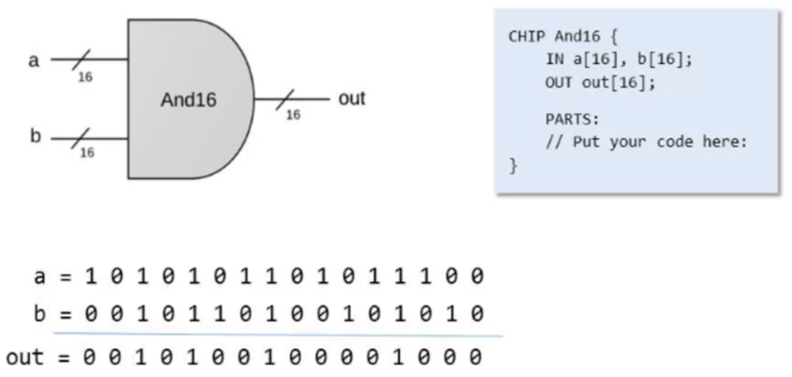

입력 받은 16비트의 값을 서로 AND gate logic에 의해 결과 값을 도출 하는 방식이다.

\\

#### 16-bit, Multiplexor 4-way

***

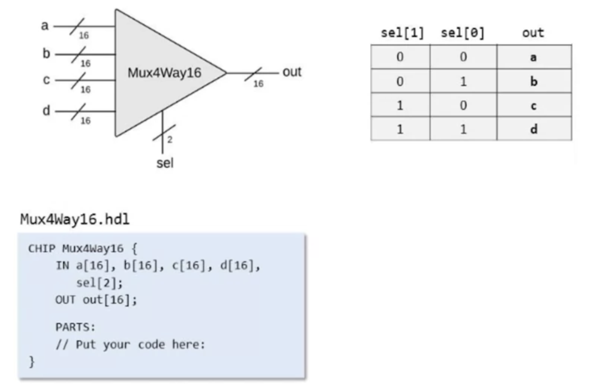

> Input

* a\[16]
* b\[16]
* c\[16]
* d\[16]
* 2개의 select
