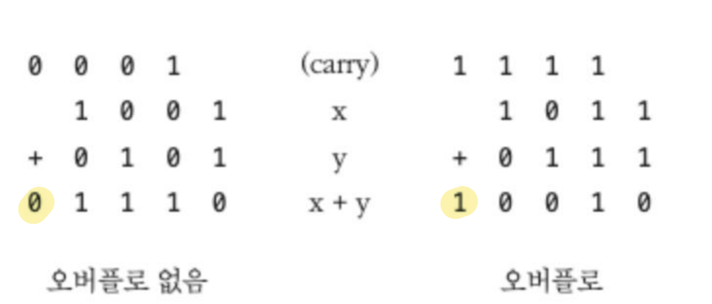
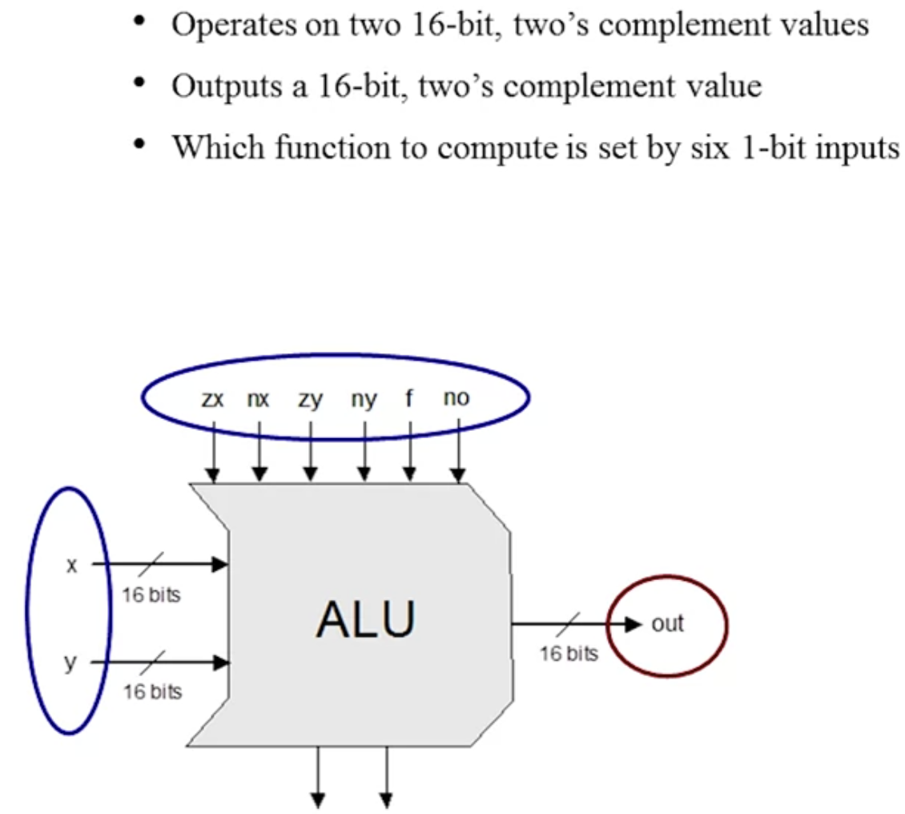
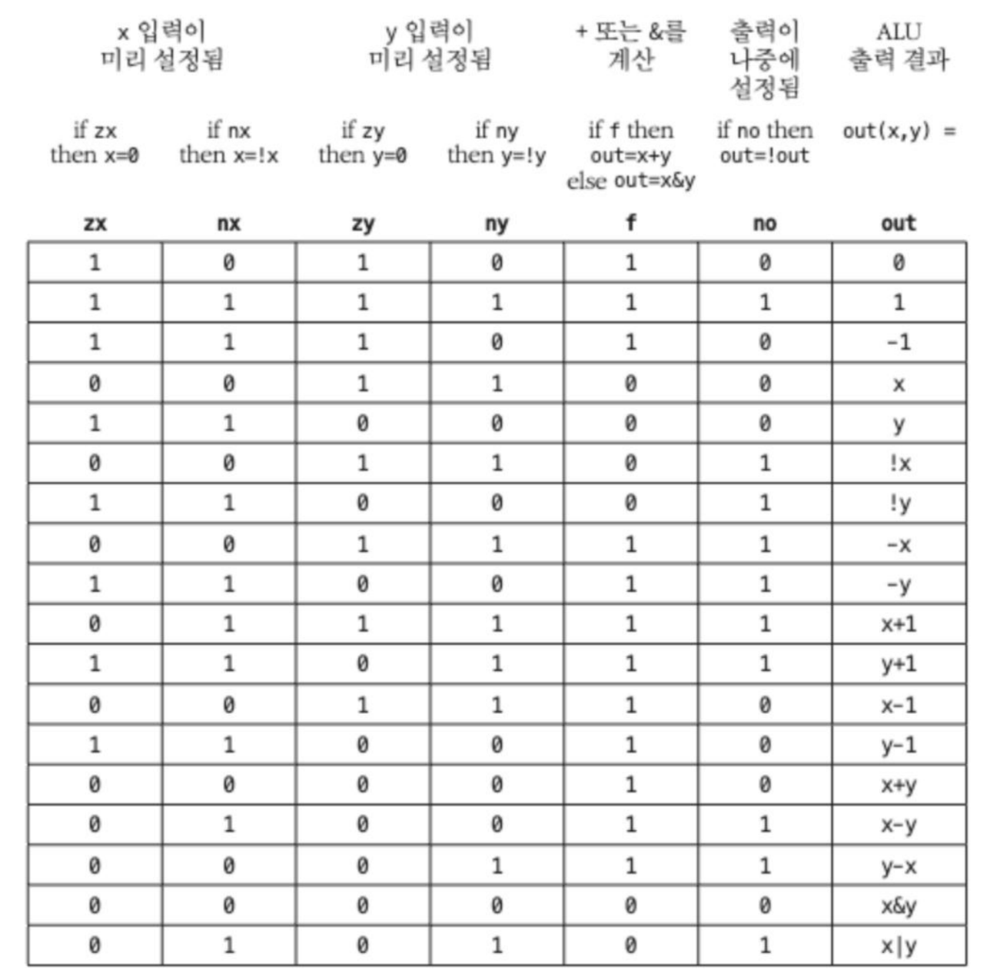
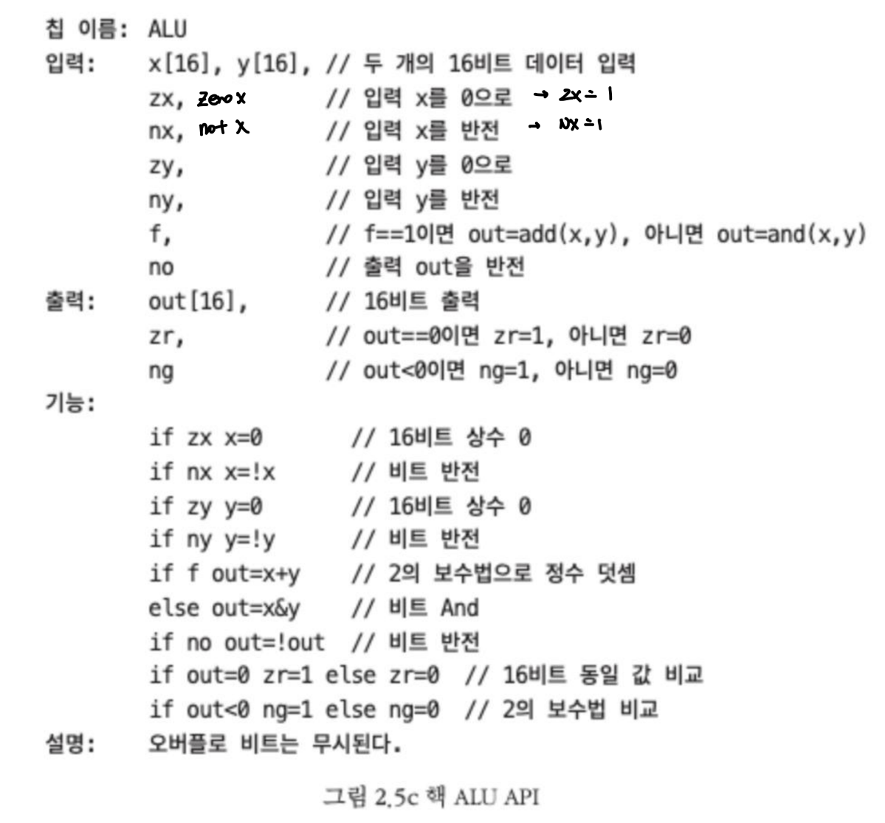
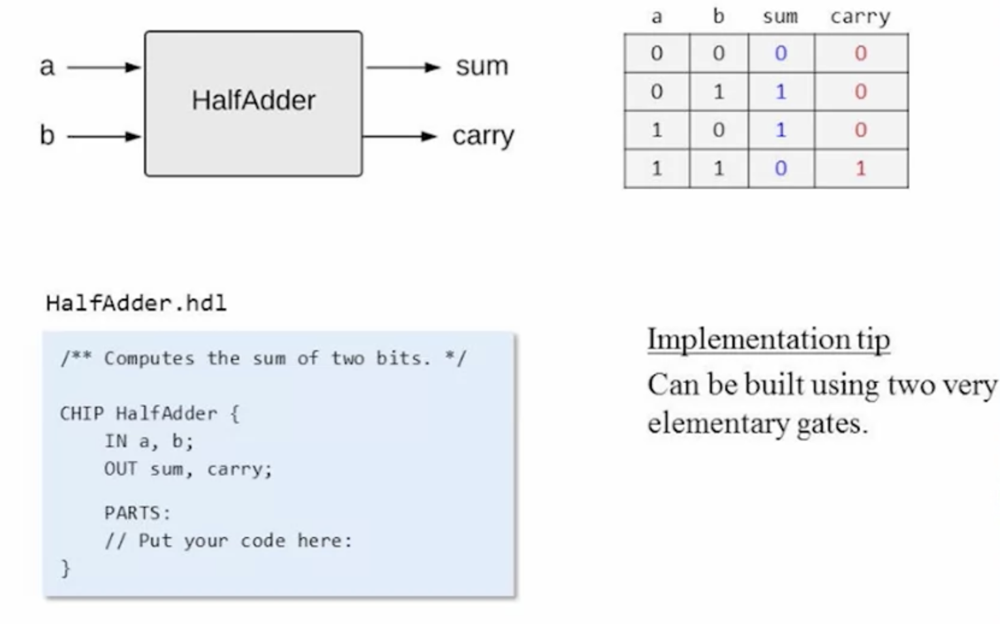
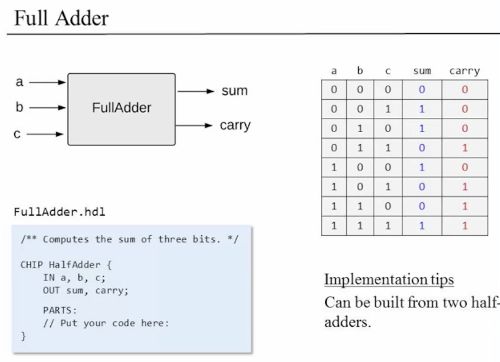
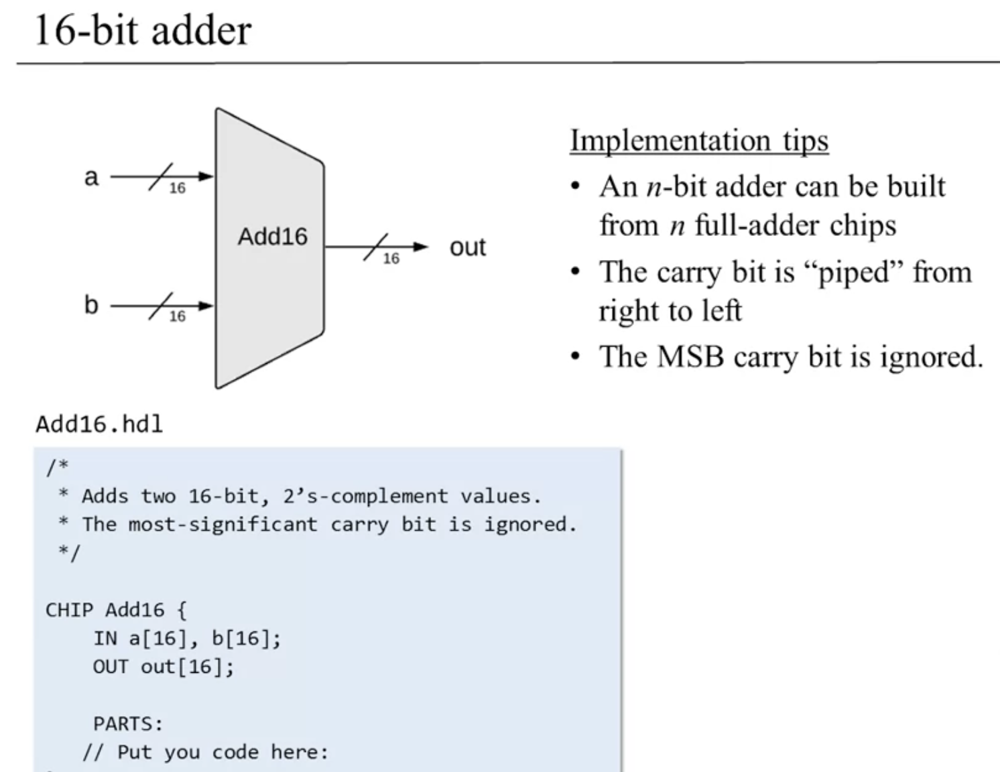
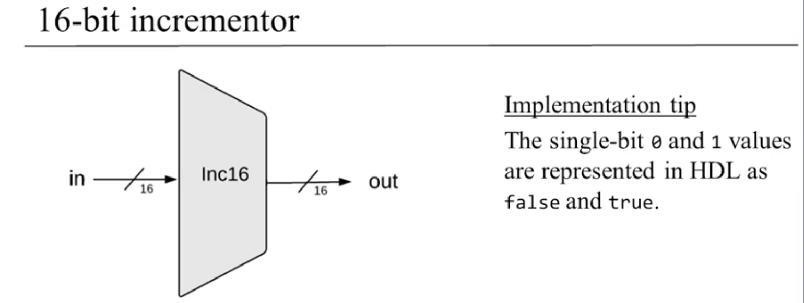

Properties

:pencil:2023.09.04

주요 개념: 이진수, 이진 덧셈, 2의 보수법, 반 덧셈, 완전 덧셈, n비트 덧셈, 카운터, 산술 논리 유닛(ALU), 조합 논리.

### Unit2.1 : Binary Numbers

---

0과 1로 무엇을 할 수 있을까?

> Binary

- 0
- 1
- 10
- 11
- 100
- 101

> Decimal

- 0
- 1
- 2
- 3
- 4
- 5

**Decimal → Binary**

- 87을 입력 받았다면 이것을 이진수로 변환 할 수 있어야한다.
- 87 = 64 + 16 + 4 + 2 + 1
    
    → 1010111

이렇게 사용자가 입력한 10진수의 숫자는 컴퓨터 메모리에 최종적으로 저장 될 때 2진 코드로 변환되어 저장된다. 이 값을 화면에 표시 하라고 컴퓨터에 명령 하면, 이런 과정을 거치게 된다.

1. 컴퓨터 운영체제는 10011이 나타내는 10진수를 계산한다.  → 19
2. 운영체제는 이 정수 값을 두 개의 문자 1과 9로 변환한다.
3. 현재 글꼴을 조회 하여 화면에 렌더링 하기 위한 두 개의 비트맵 이미지를 만든다.
4. 운영체제는 스크린 드라이버를 통해 픽셀을 끄거나 켜고, 화면에 19라는 이미지가 나타난다.
    - 여기까지 몇 백분의 1초도 안걸린다.

> 고정 단어 크기

컴퓨터는 숫자를 표현하는 데 고정 단어 크기를 사용해야 하는 유한한 기계다.

단어크기(word size)란

컴퓨터가 기본 정보 단위(이 경우에는 정수 값)를 표현하는 데 사용 하는 비트 수를 가리킨다.

- 보통 정수를 표현 하는 데 8, 16, 32, 64 비트 레지스터가 사용 됨.

음수가 아닌 정수만을 표현 하려고 했을 때 일반적으로 n비트가 있으면 2^n - 1 까지 표현 할 수 있다.

- 8bit) 2^8 - 1 = 256 -1 = 255

그렇다면 고정된 레지스터 크기가 허용 하는 최대 최소 값 보다 더 크거나 작은 값은 어떻게 표현할까?

→ 모든 고수준 언어는 실제 우리가 원하는 만큼 크거나 작은 숫자를 처리 하는 추상화 기법을 지원한다.

- 숫자를 표현 하는 데 필요한 만큼 n비트 레지스터를 묶는 방식으로 구현 됨
- 여러 단어로 구성된 숫자에 산술 및 논리 연산을 실행하는 것은 느린 작업이다.

→ **그렇기 때문에, 매우 크거나 매우 작은 숫자를 처리 할 때 만 이 기법을 사용 하는 것이 좋음**

 

### Unit2.2: Binary Addition

---

이진 덧셈은 십진수의 덧셈과 같은 방법을 사용한다.  0과 1만 존재 하는 이진수에서 더하여 1을 초과 하게 되면 오름수를 발생 시키고, 다음 자리에서 오름 수를 이어 받아 연산을 하게된다.

- 가장 오른쪽 숫자 = 최하위 비트(LSB)
- 올림 숫자 = 자리 올림 비트(carry bit)
- 가장 왼쪽에 위치한 숫자 = 최상위 비트 (MSB)

<aside>
💡 각각 일반적인 고수준 데이터 타입인 Byte, Short, Int, Long에 해당한다. 예를 들어 기계 수준의 명령어로 내려가면 Short 변수는 **16비트 레지스터**로 처리된다. 16비트 산술 연산이 64비트 산술 연산보다 4배 빠르기 때문에 프로그래머는 늘 응용프로그램의 요구사항에 맞는 가장 간결한 데이터 타입을 사용 하는 것이 좋다.

</aside>

→ 오버플로를 어떻게 처리 할지는 결정에 따른 문제로, 이 강의와 참고 교재에서는 오버플로를 무시한다.

### Unit2.3: Negative Numbers

---

음수를 나타낼 땐 2^n - X 이며 이 때 X는 음의 정수이다.

Idea : $2^n - x = 1 + (2^n - 1) - x$

이렇게 수학적 공식을 이용 하여 계산 하는 것 보다 더 편리하고, 빠른 규칙이 존재한다.

이진수로 표현 된 음의 정수를 전부 뒤집고 1을 더하는 방식으로 현대 음수 표현방법에 많이 적용된다.

<aside>
💡 수년 간 부호가 있는 숫자를 2진 코드로 표현하기 위한 코딩 체계가 여럿 개발 되었다. 그 중에서 오늘 날 거의 모든 컴퓨터에서 사용 되는 방식은 2의 보수법(two’s complement)으로 기수의 보수법(radix complement)이라고도 한다.

</aside>

> 규칙 적용의 예시

- Input: 4
    - 4 → 0100 = 1011
    - 1011 + 1 = 1100
    

> 수학적 공식을 이용한 풀이

- Input: 4
- 1 + (15 - 1) - 4 = 12 = 1100

> 2의 보수법이 갖은 매력적인 성질

- 이 체계는 -(2^n-1) 부터 2^n-1 -1 까지 2^n 개의 부호 있는 숫자를 표기 할 수 있다.
- 음수 아닌 수의 코드는 모두 0으로 시작한다.
- 음수의 코드는 1로 시작한다.
- x의 코드에서 -x의 코드를 구하려면, x의 최하위 0비트들과 처음으로 나타나는 최하위 1비트는 그대로 두고, 나머지 비트를 모두 뒤집으면 된다 → 0은 1, 1은 0으로 바꾼다)
    - 또는, x의 모든 비트를 뒤집고 그 결과에 1을 더해주면 된다.

<aside>
💡 곱셈부터 나눗셈, 제곱근까지 모든 산술 연산은 2진수 덧셈으로 구현된다. 따라서, 2진 덧셈 위에서 광범위한 컴퓨터 기능을 구현할 수 있다는 사실과, 2의 보수법을 이용하면 부호 있는 숫자들의 덧셈과 뺄셈에 특별한 하드웨어가 필요치 않다는 사실을 알 수 있다.

</aside>

 

### Unit2.4: Arithmetic Logic Unit

---

ALU는 2가지 input과 function을 입력 받고, 미리 정의 된 함수의 기능을 통해 ALU는 연산을 수행한다.

<Function>

- Arithmetic operations
- Logical operations

- x: 16비트의 이진수
- y: 16비트의 이진수
- out: 미리 정의 된 기능을 통과 하여 결과 값 도출

<aside>
💡 HACK ALU는 2의 보수법으로 표현 된 2개의 16비트 정수(x, y)와 여섯 개의 제어비트(control bit → 각각 1비트 입력)를 입력 받아 계산을 한다. 이 제어 비트들은 ALU에게 어떤 함수를 계산할지 “알려주는” 역할을 한다.

</aside>

앞으로 구현 하는 ALU는 현재 프로젝트에 맞춰 제작되는 HACK ALU로 18개의 산술 논리 함수를 계산 하도록 설계 되었다.

그림의 맨 위 행을 보면 6개의 제어 비트 각각이 독립적인 조건문과 연관 되어 있음을 알 수 있다.

1. 먼저 x, y는 0 또는 1로 설정된다.
2. 그 결과 값의 부호를 바꾸거나 바꾸지 않는다.
3. 처리된 값에 대해 `Add` 또는 `And` 를 계산한다.
4. 최종 결과 값의 부호를 바꾸거나 바꾸지 않는다.

**→ 이 때, 여기서 나오는 값 설정, 반전, 덧셈, 결합은 모두 16비트 연산이다.**

> ALU API

> ALU 설계 할 때 따랐던 사고과정

- 컴퓨터가 수행 할 기본 연산들의 목록을 잠정적으로 결정했다
- 다음으로 원하는 연산을 수행 하려면 x, y 및 out이 2진수로 어떻게 조작되어야 하는지 역으로 추론했다
- 6개의 제어 비트를 각각 기본 논리 게이트로 쉽게 구현 할 수 있는 연산들에 직접 연결 시키는 방법이 좋겠다는 결론을 냈다
- 그 결과 현재 API 명세서가 나왔다.

 

### Unit2.5: Project2 Overview

---

> HalfAdder

- input: a,b
- output: sum, carry
    - carrybit : logic gate - And
    - sum : logic gate - XOr
    - Tips
        - 2개의 기본 논리 게이트를 이용 하여 구현 할 수 있습니다.

⇒ 이 두가지는 위와 같이 간단한 논리 게이트로 구현 할 수 있을 것 같다.

> FullAdder

- input: a, b, c
- output: sum, carry
- Tips
    - 반가산기 2개를 이용 하여 구현 할 수 있다.

> 16-bit adder
> 

- Tips
    - n bit 가산기는 n 비트 만큼의 반복을 수행 하는 전가산기를 구현하면 된다.
    - carry bit는 오른쪽 부터 왼쪽 방향으로 파이프라인이 연결 되는 것 처럼 구현 하면 된다.
    - 최상위 캐리 비트는 무시된다.

> 16-bit incrementor

- Tips
    - 싱글 비트 0과 1은 하드웨어 프로그래밍 언어에서 `false`와 `true`로 표현 할 수 있다.

> ALU

- zx: zx가 1이면 x는 0을 세팅한다.
- nx: nx가 1이면 Not로 반전시킨다.
- zy: zx와 동일
- ny: nx와 동일
- f: f가 1이면 x+y 를, 0이면 x&y 를 실행한다.
- no: no가 1이면 결과 값을 반전시킨다.
- zr: out이 0이면 1을 갖고, 아니면 0을 갖는다.
- ng: out이 음수(0 보다 작은 수)면 1을 갖고, 아니면 0을 갖는다.
