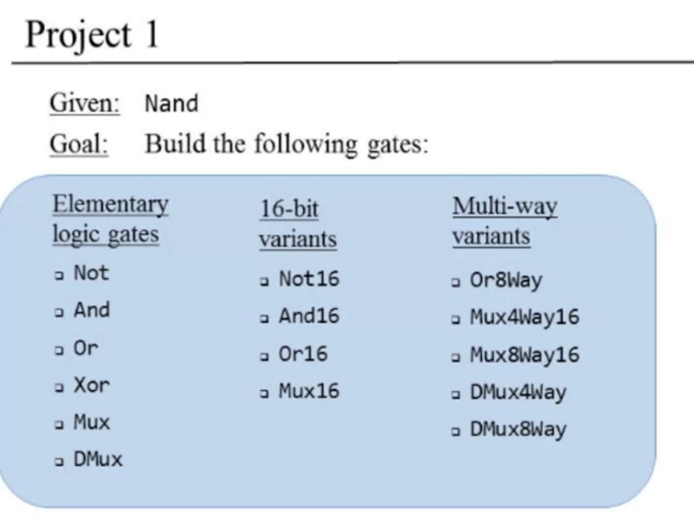
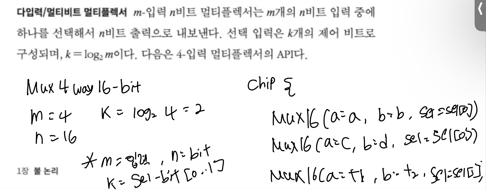

# Nand2Tetris

<details>

<summary>Properties</summary>

:pencil:2023.08.23

</details>

## Project1: Logic gates implemention



**프로젝트에서 제공 하는 NAND 게이트로 나머지를 구현하세요.**

- 기본 논리 게이트
- 16비트 변형
- 다중 방식 변형

> 제출

작업 결과는 빌드해야 하는 15개 칩의 HDL 코드가 포함된 텍스트 파일 세트가 될 것입니다. 15개의 칩을 모두 빌드하는 데 성공하면 좋습니다. 일부 칩만 빌드하는 데 성공한 경우에도 일부만 제출하여 부분 점수를 받을 수 있습니다.

적절한 테스트와 피드백을 받으려면 제출하는 HDL 파일 이름은 컴퓨터의 nand2tetris/projects/01 폴더에 표시되는 파일 이름과 정확히 일치해야 합니다. 대소문자를 구분해야 합니다. 대소문자를 구분하지 않은 파일 이름은 테스트 및 채점 절차에서 불합격 처리될 수 있습니다(정확한 이름은 And.hdl이어야 합니다). 파일을 만들거나 이름을 지정하지 않고도 이 모든 번거로움을 덜 수 있습니다. 텍스트 편집기를 사용하여 nand2tetris/projects/01 폴더에 있는 *.hdl 파일을 편집하고 그 안에 HDL 코드를 작성한 다음 주어진 이름으로 저장하면 됩니다.

작성한 모든 *.hdl 파일을 프로젝트1.zip이라는 이름의 zip 파일로 압축한 후(폴더 안에 넣지 말고 파일 자체만 압축) 제출해야 합니다. 코스에서 지정하지 않은 도우미 칩을 빌드하는 경우 해당 도우미 칩을 zip 파일에 포함해야 합니다. 제출 횟수는 무제한이며 성적은 모든 제출물의 최대치가 되므로 다시 제출해도 점수를 잃지 않습니다.

감사관으로 코스를 수강하는 경우 설명된 테스트를 사용하여 자신의 작업을 직접 확인할 수 있습니다.

<br>

### Table of Contents
- [ElementaryLogicGates](#elementary-logic-gates)
- [16-Bit Variants](#16-bit-variants)
- [Multi-Way Variants](#multi-way-variants)

<br>

### Elementary Logic Gates
> NOT

- chip: Not
- input: in
- output: out
- `if 0 in == 1 else 1` -> `not in`

  - 만약 `in` 값이 1 이라면, 0을 반대로 0이라면 1을 반환

- implement

  ```
  CHIP Not {
    IN in;
    OUT out;

    PARTS:
    Nand(a=in, b=in, out=out);
    }
  ```

> AND

- chip: And
- input: a, b
- output: out
- `1 if a==1 and b==1 else 0`

  - 만약 `a`와 `b`가 1 이라면 1을, 그게 아니라면 0을 반환

- implement

  ```
  CHIP And {
    IN a, b;
    OUT out;

    PARTS:
    Nand(a=a, b=b, out=tmp);
    Not(in=tmp, out=out);
  }
  ```

> OR

- chip: Or
- input: a, b
- output: out
- `1 if a==1 or b==1 else 0`

  - 만약 `a`나 `b` 둘 중 하나라도 1이면 1을 아니면 0을 반환

- implement

  ```
    CHIP Or {
        IN a, b;
        OUT out;

        PARTS:
        Not(in=a, out=aNot);
        Not(in=b, out=bNot);
        Nand(a=aNot, b=bNot, out=out);
    }
  ```

> XOR

- chip: Xor
- input: a, b
- output: out
- `Not(a == b)`

- implement

  ```
    CHIP Xor {
        IN a, b;
        OUT out;

        PARTS:
        Not(in=a, out=notA);
        Not(in=b, out=notB);
        Nand(a=a, b=notB, out=temp1);
        Nand(a=b, b=notA, out=temp2);
        Nand(a=temp1, b=temp2, out=out);
    }
  ```

> MUX

- chip: Mux
- input: a, b, sel
- output: out
- `If sel == 0: a, else: b`
  - sel은 맨 처음 0으로 셋팅 되기 때문에, 0일 때는 a와 and조건으로 매칭 시키기 위해 1로 뒤집어서 a가 1일 때를 매칭하고, b는 반대로 1일 때 이기 때문에 서로 같은 1이면 1을 리턴 함

- implement

  ```
    CHIP Mux {
      IN a, b, sel;
      OUT out;

      PARTS:
      Not(in=sel, out=notSel);
      And(a=notSel, b=a, out=temp1);
      And(a=sel, b=b, out=temp2);
      Or(a=temp1, b=temp2, out=out);
    }
  ```

> DMUX

- chip: Dmux
- input: in, sel
- output: a, b
- `If sel == 0: {in, 0} else {0, in}`
  - sel이 0일 때, a=in, b=0
  - sel이 1일 때, a=0, b=in
  - Reverse multiplexor 구조

- implement

  ```
    CHIP DMux {
      IN in, sel;
      OUT out;

      PARTS:
      Not(in=sel, out=notSel);
      And(a=notSel, b=in, out=a);
      And(a=sel, b=in, out=b);
    }
  ```

<br>

### 16-Bit Variants

Multi-bit logic gates: `Not`/`And`/`Or` 기본 버전에서 n개의 비트 수 만큼 반복적인 비트 연산을 행할 수 있게 만들면 된다.

그 중, `Multiplexor` 같은 경우는 `selector` 선택 비트를 모두 같은 값을 입력 하게 만들면 된다.

이 외, 나머지 기본 논리 게이트의 16비트 변형은 모두 이와 비슷한 형태를 띄고 있다.

> MUX16-Bit

- chip: Mux16
- input: a[16], b[16], sel
- output: out[16]

- implement

  ```
    CHIP Mux {
      IN a[16], b[16], sel;
      OUT out[16];

      PARTS:
      Mux(a=a[0], b=b[0], sel=sel, out=out[0]);
      Mux(a=a[1], b=b[1], sel=sel, out=out[1]);
      Mux(a=a[2], b=b[2], sel=sel, out=out[2]);
      Mux(a=a[3], b=b[3], sel=sel, out=out[3]);
      Mux(a=a[4], b=b[4], sel=sel, out=out[4]);
      Mux(a=a[5], b=b[5], sel=sel, out=out[5]);
      Mux(a=a[6], b=b[6], sel=sel, out=out[6]);
      Mux(a=a[7], b=b[7], sel=sel, out=out[7]);
      Mux(a=a[8], b=b[8], sel=sel, out=out[8]);
      Mux(a=a[9], b=b[9], sel=sel, out=out[9]);
      Mux(a=a[10], b=b[10], sel=sel, out=out[10]);
      Mux(a=a[11], b=b[11], sel=sel, out=out[11]);
      Mux(a=a[12], b=b[12], sel=sel, out=out[12]);
      Mux(a=a[13], b=b[13], sel=sel, out=out[13]);
      Mux(a=a[14], b=b[14], sel=sel, out=out[14]);
      Mux(a=a[15], b=b[15], sel=sel, out=out[15]);
    }
  ```

<br>

### Multi-Way Variants



- 다입력인 경우는 기존 제작된 논리 게이트를 기준으로 입력 값을 정한다.
  - a, b를 받는 Mux16에서 2개만 받을 수 있으니 a,b / c,d를 2개로 나누어 임의 변수에 저장 하고 그 두가지 값을 다른 선택비트를 입력 하여 결과물을 나태면 된다.

> Mux4Way16

- implement

  ```
    CHIP Mux4Way16 {
      IN a[16], b[16], c[16], d[16], sel[2];
      OUT out[16];

      PARTS:
      Mux16(a=a, b=b, sel=sel[0], out=temp1);
      Mux16(a=c, b=d, sel=sel[0], out=temp2);
      Mux16(a=temp1, b=temp2, sel=sel[1], out= out);
    }
  ```

> Mux8Way16

- implement

  ```
    CHIP Mux8Way16 {
        IN a[16], b[16], c[16], d[16],
          e[16], f[16], g[16], h[16],
          sel[3];
        OUT out[16];

        PARTS:
        Mux4Way16(a=a, b=b, c=c, d=d, sel=sel[0..1], out=temp1);
        Mux4Way16(a=e, b=f, c=g, d=h, sel=sel[0..1], out=temp2);
        Mux16(a=temp1, b=temp2, sel=sel[2], out=out);
    }
  ```

`DMux`는 `Mux`의 **역순**을 기억하고 구현하면 된다. 

> DMux4Way

- implement

  ```
    CHIP DMux4Way {
        IN in, sel[2];
        OUT a, b, c, d;

        PARTS:
        DMux(in=in, sel=sel[1], a=aB, b=cD);
        DMux(in=aB, sel=sel[0], a=a, b=b);
        DMux(in=cD, sel=sel[0], a=c, b=d);
    }
  ```

> Dmux8Way

- implement

  ```
    CHIP DMux8Way {
        IN in, sel[3];
        OUT a, b, c, d, e, f, g, h;

        PARTS:
        DMux4Way(in=in, sel=sel[1..2], a=aB, b=cD, c=eF, d=gH);
        DMux(in=aB, sel=sel[0], a=a, b=b);
        DMux(in=cD, sel=sel[0], a=c, b=d);
        DMux(in=eF, sel=sel[0], a=e, b=f);
        DMux(in=gH, sel=sel[0], a=g, b=h);
    }
  ```

<br>
