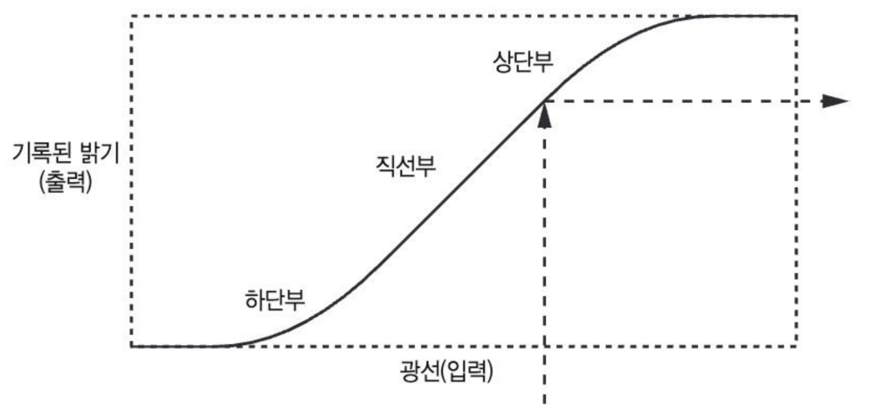
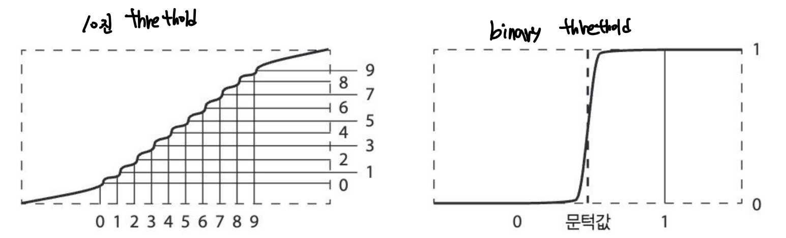
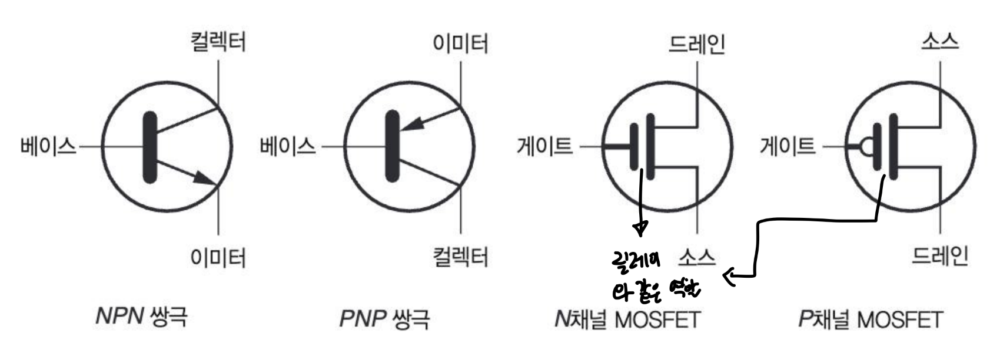
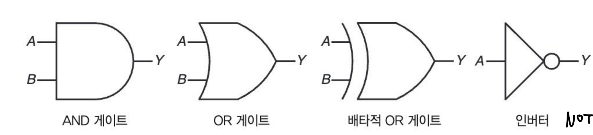
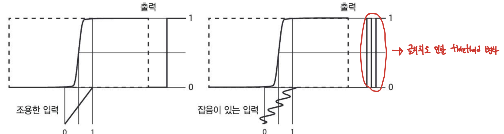
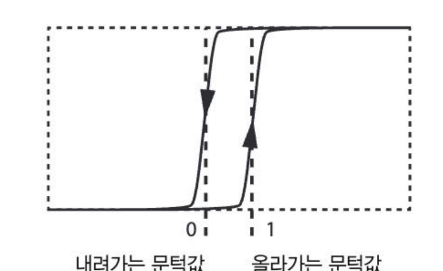
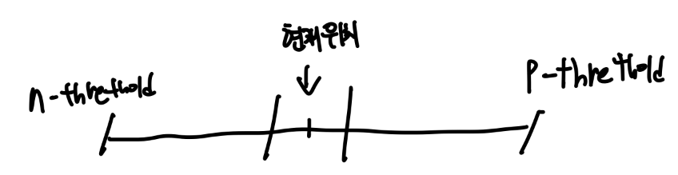
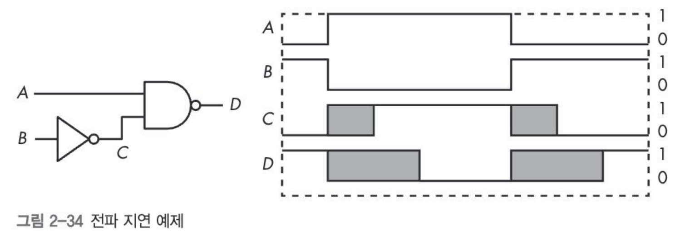

# Chapter 2. Combinatorial Logic

Properties

:pencil:2023.10.04

비트를 사용하지 않는 초기 계산 장치를 살펴봄으로써 왜 비트가 오늘 날 사용하는 기술에 어울리는 선택인지 배운다. 비트에 대해 동작하는 장치를 포함 해 모든 물리적인 장치를 하드웨어라고 부른다.

## 아날로그와 디지털의 차이

> 연속적, 이산적 개념

* 연속적: **아날로그**
* 이산적: **디지털**

> 💡 < 철학자, 물리학자의 시간 개념 > 시간의 진행은 연속적으로 생각된다.

* 즉, 두 시점 사이에는 항상 또 다른 시점이 있고 그 사이의 변화는 무한히 작음

> 💡 < 컴퓨터 과학자의 시점 >

시간이 연속적으로 진행된다고 보지 않고, 주기라는 고정된 길이의 간격으로 쪼개서 봄

* 연손적인 시간의 화살표 개념에서는 시간을 무한히 나눌 수 있지만, 주기 개념에서는 시간은 더이상 쪼개지 않고 가장 기본적인 단위가 됨
* 주기가 전환 될 때만 실제로 세상에 변화가 일어나고, 주기 도중에는 세상의 변화가 정지 됨

아날로그는 실수를 표현 할 수 있기 때문에 계산에는 더 적합한 선택 인 것 같다. 하지만, 정밀도의 문제가 있음

### 하드웨어에서 크기가 중요한 이유

현대 컴퓨터는 전자를 움직인다. 전기는 빛의 속도로 움직이며 빛의 속도는 초당 3억 미터다. 이런 물리적인 한계를 뛰어넘는 방법을 아직 발견하지 못했기 때문에, 컴퓨터에서 전자의 여행 시간을 최소화 하는 방법은 부품을 가능한 가깝게 위치 시키는 것 뿐이다.

* Cache memory가 CPU와 가깝게 위치 해 있으며 응답 속도를 개선 하고자 했던 근본적인 이유

> 💡 하드웨어 크기와 클럭속도간의 관계

컴퓨터 클럭 속도는 4GHz이며, 1초에 40억 가지 계산을 처리 할 수 있다. 40억 분의 1초 동안 전자가 이동 할 수 있는 거리는 75mm뿐이다.

예를 들어, CPUU 한 면이 18mm이라고 가정 한다면, 40억 분의 12초는 전자가 이 CPU 안을 겨우 두 번 왕복할 수 있는 정도의 시간이다. 따라서 컴퓨터에서 모든 것을 작게 만들면 더 높은 성능을 달성할 수 있음이 분명해 보인다.

따라서, 하드웨어를 작게 만들면 필요한 여행 거리가 줄어들고 여행 거리가 줄어들면 필요한 에너지 양도 줄어든다. 이런 변화는 결국 저 전력 소모와 열 발생 감소로 드러나며, 휴대폰에서 나는 열로 주머니에 구멍이 뚫리는 일을 막아준다. 계산 장치의 역사가 하드웨러를 작게 만들려는 노력으로 점철 되어 있는 이유 중 하나다.

### 디지털을 사용하면 더 안정적인 장치를 만들 수 있다

하드웨어를 작게 만들면 속도와 효율은 좋아지지만, 물체가 너무 작아지면 서로 간섭하기 아주 쉬워진다.

> 💡 이산적일 때 컴퓨터는 안정적이다

전자기력은 중력과 마찬가지로 멀리 떨어진 물체에 영향을 끼칠 수 있다. 칩 안에서 선을 통하는 신호가 다른 선에 영향을 끼칠 수 있다는 뜻이기도 하다. 특히, 두 선의 거리가 아주 가까우면 영향이 더 커지며 현대 컴퓨터 칩 안의 선은 서로 몇 나노미터로 떨어져있다.

**현대 CPU에서 신호 간섭은 마치 도로에서 마주보는 두 차가 서로 스쳐 지나갈 때 느껴지는 바람과 같은데, 이 것을 누화 효과 라고 하며 방지할 적절한 방법이 없기 때문에 더 높은 판정 기준을 통해 잡음 내성을 갖는 디지털 회로를 사용 하는 것이 필수적이다.**

**장치를 크게 만들어서 선과 선 사이를 멀리 떨어뜨리면 간섭의 효과를 줄일 수 있지만, 크기를 키우는 것은 다른 목표에 어긋난다**. 판정 기준이라는 장애물을 뛰어넘기 위해서는 추가로 에너지가 필요하기 때문에 연속적인 장치를 사용 할 때는 얻을 수 없는 일정 수준의 잡음 내성을 얻을 수 있다.

**실제로 판정 기준을 도입 해 생기는 안정성이 우리가 디지털 컴퓨터를 만드는 주된 이유이다.**

### 아날로그 세계에서 디지털 만들기

자연적으로 발생 하는 전이함수를 영리하게 응용 하는 데 초점을 두었다.

전이 함수는 수학 시간에 배운 함수와 같지만 실제 세계에서 벌어지는 현상을 표현한다는 점만 다르다.

선형 영영에 닿게 하기 위해 값을 조절 하는 장치를 만들어 전이 함수를 활용한 트릭을 사용한다.

위 처럼 값의 수정으로 인하여 입력을 충실하게 재현하지 못하기 때문에 왜곡이 발생 하며, 출력이 이상해진다. 이는 마치 주기의 이동과 같다. 이 때 판정 기준을 문턱값(Threthold) 또는 임계치 라고 부른다. 출력값이 임계치의 한쪽에서 반대쪽으로 옮겨가고 중간 정도의 출력값이 나오기는 어렵기 때문에 이런 왜곡이 유용하다.

→ **이 현상은 연속적인 공간을 이산적인 영역으로 나눠주는 역할을 한다.**

💡 아날로그는 가능한 한 선형 영역을 크게 만들기 위해 노력 하는 것이고, 디지털은 직선부를 가능하면 작게 만드는 것이라고 생각 할 수 있다. 어린 시절 시소에서 놀면서 직관적으로 이런 현상을 발견 했을 수도 있는데, 하단부 영역이나 상단부영역을 유지하기가 그 중간 상태에서 균형을 유지하는 것 보다 더 쉬운 현상을 말한다.

### 10진 숫자 대신 비트를 사용 하는 이유

사람들은 숫자를 사용 하고, 손가락이 열 개라서 10까지 세는 데 익숙하다. 손가락으로 숫자를 세는 것은 아주 직관적이지만 한 손가락이 한 숫자를 표현하기 때문에 효율적이지는 않다.

손가락 대신 비트를 사용 하면 100배 보다 더 효율이 좋아진다. 심지어 4개의 손가락을 활용 해 [BCD](https://www.notion.so/Chapter-1-a15e646908da4b728f11aea99fdc627b?pvs=21)(2진 코드화한 10진수) 표현을 사용 해도 우리가 일반적으로 사용하는 숫자를 세는 방법보다 훨씬 더 효율적이다.

비트가 숫자보다 더 좋은 또 다른 이유는 숫자를 사용하면 전이 함수를 각기 다른 10가지 임계치로 구분 할 수 있는 간단한 방법이 없기 때문이다.

💡 10진 숫자 하나보다는 10비트를 사용하는 편이 훨씬 낫다. 현대적 하드웨어가 작동하는 방식이다. 전이 함수의 하단부와 상단부 영역을 활용하며, 전기 엔지니어들은 하단부 영역을 차단이라고 부르고 상단부 영역을 포화라고 부른다. 비트를 사용하면 재량권이 아주 커진다. 전이 함수가 아주 가파르기 때문에 출력이 한 값에서 다른 값으로 아주 급하게 바뀌기 때문이다.

**임계치가 높을수록 잡음 내성에 대한 보호를 받을 수 있고, 낮을 수록 보호가 불가능하다고 생각 하면 비트를 사용하는 이유를 한 번에 이해 할 수 있다.**

## 비트를 처리 하기 위한 하드웨어

> 릴레이

**릴레이는 스위치를 움직이기 위해 전자석을 사용 하는 장치이다.**

스위치 부분 중간의 금속은 코일에 에너지가 가해졌는지 여부에 따라 연결이 움직인다.

* 릴레이를 사용 하면 NOT 함수를 구현 하는 인버터를 만들 수 있음
* 릴레이에서 전이 함수의 문턱값이 수직이며, 코일에 가하는 전압을 아무리 천천히 높여도 스위치는 이산적 개념에 따른 움직임을 보임
  * 코일의 전원을 갑자기 끄면 순간적으로 초고압이 발생 하고, 초고압에서는 공기에서도 전기가 통한다

💡 전신 시스템에서 표현 하기 위한 거리가 멀어지면 전선의 거리에 비례 하여 저항이 늘어난다. 늘어남에 따라 잡음이 발생 하게 되어 더 이상 원하는 소통이 불가능하다. 이 때, 릴레이가 적용된다.

릴레이는 거리가 먼 전선의 중계 역할을 하며 중간 측에서 수신 받은 메세지를 그대로 목적지에 전달 한다.

초기에는 중계 쪽에서 메세지를 그대로 받아 적어 목적지에 전달 했다면, 나중에는 소리만 듣고도 바로 전달 할 수 있게 되었다.

하지만, 시간이 지나고 보니 수신 받을 때 부호와 같이 수신기에 떨림이 발생하는 것을 발견 하였고 이 것을 전달 하기 위한 목적지에 스위치를 연결하였다.

이렇게 중계 역할에 있는 사람은 내용을 적을 필요도, 다시 전달 할 필요도 없어지며 오로지 수신 받은 내용이 곧 바로 전달 되는 리피터 같은 것이다.

> 진공관

진공관의 장점은 움직이는 부분이 없어서 릴레이보다 훨씬 더 빠르다

* 릴레이는 스위치 접점위치에 따라 0, 1이 결정 된다 → 예를 들면 다이얼 전화기 같은 종류

> 트랜지스터

트랜지스터는 진공관과 비슷하지만 반도체라는 특별한 물질을 사용하며, 트랜지스터를 아주 작게 만들 수 있지만 도체가 가늘고 얇아질 때 저항이 늘어나기 때문에 열의 발생률이 높아짐

* **트랜지스터는 반도체 물질로 이뤄진 기판 또는 슬랩 위에 만들어진다**
* 트랜지스터는 개별적으로 생산 되는 물체가 아니며, 광식각 과정에 의해 대량 생산에 적합함

게이트나 베이스는 스위치 손잡이이며, 이 손잡이가 올라가면 전기가 위에서 아래로 흐름

→ 릴레이의 코일이 접점을 움직이는 것과 비슷하다

* FET의 기호에서는 작은 틈이 보이는데, 이 틈은 정전기를 사용 한다는 사실을 나타냄

> 직접 회로

트랜지스터를 사용 하면 AND와 같은 논리게이트 칩을 만들 때 조차 부품이 너무 많이 필요함

* 릴레이1, 릴레이 2를 하나의 결과로 담아야 하기 때문

이러한 단점을 보완 하기 위해 직접 회로를 발명 하였고, 직접 회로를 사용 하면 복잡한 시스템을 트랜지스터 하나를 만드는 정도의 비용으로 만들 수 있고, 이 것을 **칩**이라고 부른다.

## 논리게이트

***

인버터 기호에서 중요한 부분은 삼각형이 아니라 삼각형 꼭짓점에 있는 동그라미다. 동그라미가 어뱃는 삼각형은 버퍼라고 하며, 버퍼는 단지 입력을 출력으로 보내기만 함

논리게이트에서 가장 단순한 회로는 NAND, NOR이다. NAND나 NOR은 트랜지스터를 2개나 4개 사용하는 반면 AND나 OR은 NAND나 NOR 회로 출력에 트랜지스터를 덧붙여서 출력을 반전시켜야 하기 때문에 더 비싸고 반응 속도도 느리다.

### 이력 현상을 활용한 잡음 내성 향상

실제 현실에서 사용 중인 신호 중에는 천천히 변하는 신호가 많다. 천천히 변하는 신호가 있으면 어떤 일이 벌어질까?

오른쪽 그림의 입력 신호에는 잡음이 있고, 입력 신호가 임계치를 여러 번 오락가락 하기 때문에 출력 신호에 글리치(작은 오류)가 생긴다.

이런 글리치를 이력현상을 사용 하여 방지할 수 있는데, 아래 처럼 입력 신호가 두 임계치 중 하나를 넘어간 경우 반대쪽 임계치를 지나가며 출력이 반전되려면 값이 상당히 많이 변해야 한다.

💡 **출력이 0이면 오른쪽 곡선을 사용하고, 출력이 1이면 왼쪽 곡선을 사용한다.**

* 출력이 0이라는 것은 주기가 시작되기 전이기 때문에 0 → 1이 발생함
  * 주기 진입 : 0 → 0+ → 1
    * 입력 → 메모리 할당 → 출력

이렇게 이력현상을 사용하는 논리 게이트인 슈미트 트리거 라는 게이트가 존재 하지만, 일반적인 게이트보다 더 복잡하고 비싸기 때문에 필요한 경우에만 슈미트 트리거를 사용한다.

### 차동신호

* p-threthold: 양으로 가는 임계값
* n-threthold: 음으로 가는 임계값

예를 들어, 위 처럼 되어 있는 도로를 걷고 있다고 가정 했을 때 만약 당신의 길을 방해 받는 요인이 생겨 한 쪽으로 치우쳐져있다고 생각 해보자. 그렇다면 위에 있는 이력 현상이 적용 된 슈미트 트리거 마저 많은 잡음으로 인해 효과가 없는 경우가 발생한다.

하지만, 현재 위치에서 양 쪽 임계값으로 가는 기준이 나 자기 자신이 아닌 나와 같이 걷는 친구가 대상이라면?

친구가 왼쪽에 있으면 0, 오른쪽에 있으면 1이라고 했을 때 아까와 같은 잡음에 의해 친구와 나는 따로 밀려나는 것이 아닌 같이 밀려날 것이다. 하지만, 두 사람의 위치는 그대로이며 **0과 1을 결정 하는 것은 내 옆에 친구가 어디에 있느냐 라는 상대적 기준**이기 때문에 잡음이 결과에 영향을 주지 못한다.

이러한 방식을 차동 신호 라고 하며 친구와 내가 엄청 큰 트럭에 의해 현재 위치를 벗어나는 것과 같은 공통적인 잡음에 의해 자신의 규격 범위를 넘어가게 될 수 있다는 한계점이 있다.

그럼에 불구하고 차동신호는 전화선 등 여러 곳에서 사용되는데, 1880년대 노면전차가 처음 나왔을 때 전차가 잡음을 많이 만들어 내어 전화 신호에 간섭이 생겼다. 이 때, 그레이엄 벨에 의해 **연선 케이블링** 방식이 발명 되었고 이 연선 케이블링은 한 쌍의 선을 꼬아서 전기적으로 상대적 기준을 만들어 임계치를 결정하는 효과를 만들어내어 현대 사회에 USB, SATA, 이더넷 케이블 등 사용 되고 있다.

💡 **정리**

* 전차가 잡음을 만드는 이유는 지면의 떨림 때문일 것 같다
* 전화선이 1개로 뻗어 나갈 때에는 잡음에 의해 목적지 까지 도달이 불가 → 천천히 변하는 디지털에 의한 글리치 때문일듯
* 연선을 이용한 경우 잡음의 존재가 상대적 영향이기 때문에 꼬아진 케이블이 서로 영향을 받지 않아 차동신호의 대표적인 사례로 표시 된 듯

### 전파 지연

전파 지연은 입력의 변화가 출력에 영향을 미칠 때 까지 걸리는 시간이며, 전파 지연은 정확한 값은 아니고 제조 과정과 온도에 따라 생기는 편차와 게이트 출력에 도달하기 까지 연결된 구성 부품의 수에 따라 결정되는 통계적인 측정 값이다.

* A와 B의 거리가 다른 경우, 이산적이지 않을 때 A와 B의 연산 결과를 도출 해내는 측정값이 되는 것 같다.

그렇기 때문에, 전파 지연으로 인해 출력을 신뢰 할 수 없는 구간이 생기기 마련

