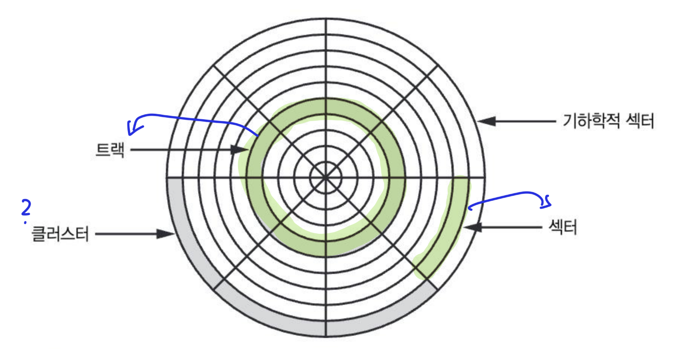

# Chapter 3. The Essentials of Memory and Disk Sequential Logic

Properties

:pencil:2023.11.10

## Introduction

컴퓨터는 비트를 어떻게 기억 하여 자신의 이전 데이터를 현재와 합산 하는 ALU를 구현 했을까s? 를 기반으로 한 순차 논리를 이해 하여 디지털 회로에서 주기를 나타내는 방법을 읽으면서 이해 하기 어려운 컴퓨터의 밑 바닥을 경험 해보자

## Goal

* 디지털 시간적 개념에서 주기를 어떻게 사용 하고 있는지 알아보자.
* 이전 데이터를 어떻게 알 수 있는지 알아보자.

#### **Sequential Logic**

* **Sequential** : 이전, 다음을 기억 하는 논리 회로로 이 것을 기반으로 ALU 역할의 논리 회로를 설계 할 수 있음
  * 사람이 직관적으로 시간을 안다고 해서 디지털 회로에서도 시간을 자연스럽게 다룰 수 있는 것은 아니다.
* **발진자** : 시간을 측정 할 수 있는 장치
  * 인버터의 출력은 다시 인버터 입력으로 들어가며, 이 입력은 다시 출력에 반영 된다. 이로 인해 출력이 0과 1 사이를 진동하는 것이 특징 -> 이 것을 **피드백루프** 라고 부른다.
    * 진동하는 속도는 전파 지연에 따라 결정 되며, 온도에 따라 달라지는 경향이 있다. -> 이 뜻은 컴퓨터 오버클럭을 할 때 힌트가 될 것 같다.
* **Clock** : CPU의 속도를 나타내는 단위 [검색 키워드](https://library.gabia.com/contents/infrahosting/1227/)
  * 발진자와 클럭간의 관계는 발진자가 나타내는 0과 1사이의 진동 수를 통해 컴퓨터에 클럭을 제공함.
    * 클록은 회로의 페이스를 결정하며, 회로의 최대 클럭 속도나 가장 빠른 템포는 회로의 전파 지연 시간에 의해 결정된다.
    * 오버 클러킹
      * 비닝이란?
    * 지연시간이 짧아 빨리 반응 할 수 있는 부품과 아닌 부품을 분류 하여 부품 전체의 편차보다 더 작은 편차를 갖도록 부품을 나눠 담는 행위
      * 오버클러킹은 빈의 중간 정도에 위치 하는 부품을 고장나지 않을 범위 안에서 클럭을 빠르게 공급 하는 도박 행위

#### Flip Flop

* **Edge** : 논리 수준이 특정 값에 머무는 동안 데이터를 잡아 내지 않고 논리 수준이 한 수준에서 다른 수준으로 전이되는 중간에 데이터를 잡아내는 것 -> 즉, 0에서 1로 이동 하는 주기의 시점에서 데이터를 기억한다.
* **Flip Flop** : 에지에 의해 데이터 변화가 촉발되는 래치를 플립 플롭이라고 부르는데, 두 상태 사이를 넘나들 수 있는 게이트를 플립 플롭이라고 한다.
  * 클록에 의한 Tik - Tok의 Tok 시점에서 입력 값이 플립 플롭에 저장된다.
* **Data FilpFlop (DFF)** : 0과 1을 왔다 갔다 하는 클록에 맞춰 시간이 변함에 따라 응답 하도록 하는 게이트이다.
  * 입력 및 출력이 1비트 데이터로 된 플립 플롭이라고 생각 하면 됨
  * 병렬적인 클록에 연결 되어 각 클록 주기가 끝날 때 컴퓨터 내 모든 이전 클록 주기의 입력에 맞춰진다.

#### Counter

* 디지털 시계를 표현 하기 위해서 발진자에서 나온 시간을 세어 디코더에 공급 하고 디스플레이 유닛을 제어 하면 된다.
  * 각 플립 플롭은 클럭 신호가 0에서 1로 바뀔 때 마다 상태가 변한다.
  * 이러한 카운터를 **리플 카운터** 라고 부르며, 전파 지연에 의하여 전파 지연 보다 더 빠른 속도로 입력을 변화 시키는 현상이 있는데, 이 것을 방지 하기 위해서 **동기적 카운터**를 이용하면 된다.

**Synchorus Counter**: 모든 플립플롭에 같은 클록을 병렬로 연결 함.

* 모든 플립 플롭에 같은 클록이 들어가기 때문에 상태가 동시에 변하여 비동기 카운터의 주기 때문에 전파 지연보다 빨리 값이 변하게 되는 현상을 제어할 수 있다.
* 카운터를 활성화 하는 EN(enable) 입력이 제공 되며, `EN != True`일 때 카운터는 수를 세지 않는다.
  * 즉, 클록이 변하고 입력이 바뀌어도 카운터 값이 변하지 않는다는 뜻

> info
>
> * 이로써 카운터로써 얻을 수 있는 인사이트는 카운터를 사용 하면 시간을 셀 수 있다는 점이다.
>

#### Register

* **레지스터**는 클록을 공유하는 여러 **Data-FlipFlop**을 한 패키지에 넣은 형태인데, 이 또한 **Counter** 처럼 활성화 비트가 따로 제공된다. 마찬가지로, 값이 수정 되어도 활성화 되어 있지 않으면 메모리에 저장을 하지 않는다.
* **레지스터**는 순차적인 번호를 갖고 있으며 이를 주소라고 부르며 레지스터의 입력을 활성화 하기 위해 사용한다.

#### Memory

* CPU 사진을 확대 해보면 메모리 덩어리로 이뤄진 영역을 볼 수 있는데, 주소를 행과 열로 나눈다. 하지만, 메모리는 16바이트만 가지고 관리 할 수 없기 때문에 더 많은 메모리를 사용하기 위해 **멀티플렉싱** 방법으로 주소 라인의 수를 절반으로 줄일 수 있다.
  * **Multiplexing**: 행 주소를 먼저 지정하고, 열 주소만 변화 시키면 좀 더 빨리 처리할 수 있는데 오늘 날 사용중인 대형 메모리 칩에서는 이러한 방식으로 주소를 처리한다.
    * 프로그래밍에서는 함께 사용되는 요소들을 같은 행에 넣어두면 성능이 좋아진다
* **Random Access Memory**: RAM이라고 부르며 원하는 주소 어디든 원하는 순서로 쓰거나 읽기 가능
  * **SRAM**: 빠르지만 용량이 작고 비용이 비싼 하드웨어
  * **DRAM**: **SRAM** 보다는 느리지만 저장 용량이 크다. **멀티플렉싱** 방식을 사용 해야하는 메모리 칩
* **Read-Only Memory**: **ROM** 이라고 칭하며 읽을 수만 있다고 말 하지만 사실 알고 보면 한 번만 쓸 수 있는 메모리라고 말 해야한다. 이 메모리는 한 번 쓰고 나면 여러번 읽을 수 있다.
  * 고전 ROM은 순차적이며 한 번 쓰고 나면 읽을 수 있었는데, **PROM**은 임의 접근이 가능 하다.
  * **EEPROM**은 지울 수 있는 읽기 전용 메모리이다. 지울 수 있다는 것은 레지스터에 저장된 데이터가 산처럼 쌓여있는 것을 지울 수 있다는 뜻으로, PROM이 산 처럼 쌓이기 쉬웠기 때문에 엔지니어들은 이 것을 기반으로 발전시켰다.

> info
>
> * ROM
>   * IBM카드, 종이 테이프, PROM, EEPROM의 순서대로 변경 되었음
>   * 즉, 순차적 읽기 전용 -> 임의 접근 읽기 전용 -> 지울 수 있는 읽기 전용으로 발전

#### Disk

* 디스크 드라이브는 엄청나게 많은 데이터를 저장하기 아주 좋은 장치로, 회전판과 비슷한 판(**Platter**)에 비트를 저장한다.
* 회전판에서 음식을 앞접시에 옮겨 담듯 디스크 드라이브에서는 **디스크 헤드**가 손 역할을 하며 데이터를 읽는다.
  * 디스크 드라이브는 메모리에 비해 느린데, 이 이유는 방금 헤드를 지나간 데이터가 필요한 경우 그 데이터를 읽기 위해 회전판이 1바퀴 돌 때 까지 기다려야 하기 때문이다.
  * 또 디스크의 문제점은 기계 부품이 시간이 지나면서 낡아진다는 점이다. 이로 인해 회전축의 마찰을 줄여주는 베어링의 마모로 디스크 오류를 일으키는 원인이 된다.
* 디스크는 **DRAM** 등과 달리 데이터 연결을 위한 공간이 필요 하지 않다.
  * 여기서 말 하는 데이터 연결을 위한 공간이란 것은 디스크를 읽기 위한 메모리 주소를 의미 하는 것 같음

* 위 그림 처럼 이뤄진 원판(**platter**)이 하나 이상 회전축에 연결 되어 돌아간다.
  * **탐색시간**: 헤드를 한 트랙에서 다른 트랙으로 옮길 때 걸리는 시간
  * **회전 지연시간**: 원하는 데이터가 헤드 아래로 올 때 까지 디스크가 돌아야 하는데 이 때 걸리는 시간
    * 보통 회전 지연시간은 밀리초 수준

#### Flash Memory and SSD

* **플래시 메모리**는 RAM처럼 원하는 위치를 마음대로 읽을 수 있다. 하지만, 빈 플래시 메모리에 데이터를 쓰기 위해 먼저 padding(0) 을 채워야한다.
  * **플래시 메모리**의 버킷은 **DRAM**보다 잘 만들어져 전자가 새지 않는다. 하지만, 여러 번 읽고 쓰기 위해 뚜껑을 여닫다 보면 뚜껑의 경첩이 닳아서 끊어진다.
  * **플래시 메모리**는 읽을 때는 **RAM**과 같고 쓸 때는 **Disk**와 같다.
    * 즉, 쓸 때는 전체 블록을 읽고 원하는 바이트를 바꾼 다음 전체 블록을 다시 써야한다.
* **SSD** : 디스크 드라이브 모양의 패키지에 넣은 플래시 메모리로, 여러 블록의 쓴 횟수를 기억 해서 모든 블록이 가능하면 똑같은 수준으로 낡도록 조정하는 프로세서가 들어있다.
  * **플래시 메모리**는 점차 낡기 때문에 **SSD**는 특정 블록만 닳지 않게 편차를 제거 하는 프로세서 인 것 같다.

#### Detecting errors

* **패리티**를 사용 하면 단 1비트만 데이터가 잘못된 경우를 감지 할 수 있다.
  * 실제로 **패리티 비트**를 포함하는 전체 비트에서 1의 개수가 **짝수**인지 **홀수**인지 여부에 따라 오류가 검증된다.
  * **패리티 비트** 검사를 할 때 **XOR** 연산을 하기 때문에 **1의 개 수가 홀수**가 되면 출력 값이 1이된다. 그렇다면 **오류가 발생** 했다는 것을 알 수 있다.
  * 하지만, **오류가 짝수 번 발생 했을 때와 오류가 발생하지 않았을 때를 구분 할 수 없다. 오로지, 오류가 홀수 번 발생한 경우를 알아낼 수 있다.**
* **해밍 코드**는 더 많은 비트를 사용 해 오류를 감지 할 수 있고, 오류 횟수가 작으면 오류가 일어난 부분을 바로 수정 할 수 있으며 오류 검사와 정정 메모리 칩도 있다.

> [!info]
>
> * **패리티** 같은 방법은 끊임 없이 변화하는 데이터를 처리 할 때 유용
> * 컴퓨터 프로그램 처럼 정적인 데이터 블록을 검사 하는 데 가장 단순한 방법은 **체크섬**이다

***

## Review

* 에지는 0에서 1로 변하는 순간 데이터를 잡아 내는데, 플립 플롭은 이러한 에지에 의해 데이터의 변화에 응답 하여 출력을 변경 한다. 그저, 플립플롭을 클럭 주기에서 Tik Tok의 Tok에 응답 하는 것 이라고 생각 했는데 이렇게 이해 하고 지나쳤다면 에지를 모르고 넘어 갔을 것 같다.

## Summary

* 컴퓨터가 시간을 어떻게 인식하는지 이해 할 수 있었다. 순차논리 게이트와 데이터 플립플롭의 응용으로 레지스터가, 레지스터의 패키지가 메모리를 이루는 구성을 배웠다.
* 앞으로는 이 지식을 조합해 컴퓨터를 만드는 과정을 학습한다.
