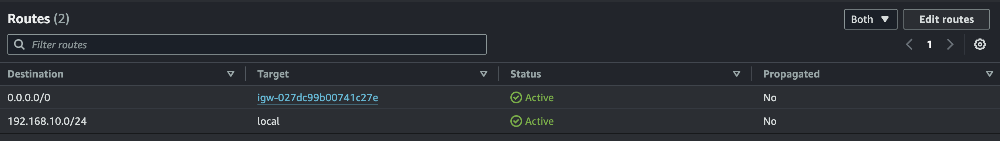

# Infra workshop

Properties

:pencil:2024.09.21

:page_facing_up: [그럴듯한 서비스 만들기](https://www.inflearn.com/course/%EC%9D%B8%ED%94%84%EB%9D%BC-%EA%B3%B5%EB%B0%A9-%EC%84%9C%EB%B9%84%EC%8A%A4-%EB%A7%8C%EB%93%A4%EA%B8%B0)

:paperclip: 지하철 노선도 미션 진행 1주차

**1주차 커리큘럼**

1. 망 구성하기

### VPC 생성

- [ ]  CIDR은 C class(x.x.x.x/24)로 생성 (현업에선 가급적 B class로 생성해주세요)

### Subnet 생성

- [ ]  외부망으로 사용할 Subnet : 64개씩 2개 (AZ를 다르게 구성)
    - 외부망은 인터넷 구간과 통신 가능
- [ ]  내부망으로 사용할 Subnet : 32개씩 1개
    - 내부망에서만 인터넷 접근 가능
- [ ]  관리용으로 사용할 Subnet : 32개씩 1개 
(system manager를 사용한다면 별도의 관리망 없이 내부망 2개로 구성, 보안그룹도 상황에 맞게 구성)

### Security Group 설정

- 외부망
    - [ ]  전체 대역 : 443 포트 오픈
    - [ ]  관리망 : 22번 포트 오픈
- 내부망
    - [ ]  외부망 : 3306 포트 오픈
    - [ ]  관리망 : 22번 포트 오픈
- 관리망
    - [ ]  자신의 로컬 PC 공인 IP : 22번 포트 오픈

2. 서버 구성하기

- [ ]  외부망에 reverse proxy, WAS 용도의 EC2 생성
- [ ]  내부망에 DB 용도의 EC2 생성
- [ ]  관리망에 베스쳔 서버용도의 EC2 생성 혹은 system manager 활용
    - [ ]  (EC2를 생성했다면) 베스쳔 서버에 Session Timeout 600s 설정
    - [ ]  (EC2를 생성했다면) 베스쳔 서버에 Command 감사로그 설정
- [ ]  외부망에 웹 애플리케이션을 배포
- [ ]  DNS 구성

3. 아키텍처 구성하기

### 운영 환경 구성하기

- [ ]  웹 애플리케이션 앞단에 Reverse Proxy 구성하기
- [ ]  Reverse Proxy에 TLS 설정하기
- [ ]  운영 데이터베이스 구성하기
- [ ]  배포 스크립트 작성하기

### 개발 프로세스를 위해 배포 환경 구성하기

- [ ]  JUnit : h2, Local : docker(mysql), Prod : 운영 DB를 사용하도록 설정

## 그럴듯한 인프라 만들기



그럴듯한 서비스 만들기 인프런 과정의 미션을 NEXTSTEP 인프라 공방처럼 커리큘럼을 만들어 진행 한 과정입니다.



### 망 구성하기

**망 구성 카테고리**

- VPC

- Subnets

- Security Groups

- Internet Gateway

- Route Tables

#### VPC



**요구사항**

- CIDR은 C class(x.x.x.x/24)로 생성 (현업에선 가급적 B class로 생성해주세요)



Default VPC는 B Class로 이루어져 범용적으로 사용이 가능하다. 하지만, 요구사항에 따르면 C Class로 Total IP Amount 갯 수가 적게 설정 하길 원한기 때문에 C Class로 설정한 VPC를 구성 해야한다.

**C Class와 B Class IP 할당 내용**

|클래스|IP 할당 범위|사용 가능한 IP 개 수|예시|
|:---:|:---:|:---:|:---:|
|B Class|128.0.0.0 ~ 191.0.0.0|2^16 (65,536)|128.12.12.12|
|C Class|192.0.0.0 ~ 223.0.0.0|2^8 (256)|192.168.10.1|

- [x] CIDR은 C class(x.x.x.x/24)로 생성

#### Subnets



**요구사항**

- 외부망으로 사용할 Subnet : 64개씩 2개 (AZ를 다르게 구성)
    - 외부망은 인터넷 구간과 통신 가능
- 내부망으로 사용할 Subnet : 32개씩 1개
    - 내부망에서만 인터넷 접근 가능
- 관리용으로 사용할 Subnet : 32개씩 1개 
(system manager를 사용한다면 별도의 관리망 없이 내부망 2개로 구성, 보안그룹도 상황에 맞게 구성)



|용도|이름|CIDR|AZ|
|:---:|:---|:---:|:---:|
|외부|external-subway-map-subnet-01|192.168.10.0/26|ap-northeast-2a|
|외부|external-subway-map-subnet-02|192.168.10.64/26|ap-northeast-2b|
|내부|internal-subway-map-subnet-01|192.168.10.128/27|ap-northeast-2c|
|관리|admin-subway-map-01|192.168.10.160/27|ap-northeast-2c|

- [x] 외부망 서브넷1 - 64개
- [x] 외부망 서브넷2 - 64개
    - 💡 외부망은 인터넷 구간과 통신 가능
- [x] 내부망 서브넷 - 32개
    - 💡 내부망에서만 인터넷 접근 가능
- [x] 관리용 서브넷 - 32개

#### Internet Gateway



**요구사항**

- [x] 외부망은 인터넷 구간과 통신 가능

**인터넷 게이트웨이는 퍼블릭 IP 주소를 지닌 인스턴스를 인터넷과 연결하면 인터넷에서 들어오는 요청을 수신할 수 있도록 한다.**



- [x] Internet Gateway <-> VPC 연결

#### Route Tables



**요구사항**

- [x] 외부망은 인터넷 구간과 통신 가능

**VPC 내에서 트래픽의 유입, 유출, 이동을 제어하려면 라우트 테이블(route table)에 저장된 라우트(route)를 이용해야 한다. 라우트는 라우팅 테이블과 연결된 서브넷 내에서 트래픽 유입 및 유출을 결정합니다.**



> IGW <-> Route Table

- [x] Internet Gateway <-> Route Table 연결로 외부 통신

> Subnets <-> Route Table

- 외부망 전용 Route
    - [x] 0.0.0.0/0: Internet Gateway 연결 (내부 <-> 외부 양방향 통신)
    - [x] 서브넷 연결: admin-subway-map-01, external-subway-map-subnet-01, external-subway-map-subnet-02

- 내부망 전용 Route
    - ❌ 0.0.0.0/0: NAT Gateway (내부 -> 외부 단방향 통신)
    - ❌ 서브넷 연결 : internal-subway-map-subnet-01

#### Security Groups

**External SG**

- [x] 전체 대역 Https 접근 허용
- [x] 관리망 SSH 접근 허용

> Inbound

> Outbound

**Internal SG**

- [x] 외부망 MySQL 접근 허용
- [x] 관리망 SSH 접근 허용

> Inbound

> Outbound

**Admin SG**

- [x] 관리자 로컬 PC만 SSH 접근 가능 하도록 허용

> Inbound

> Outbound

### 서버 구성하기

### 아키텍처 구성하기
