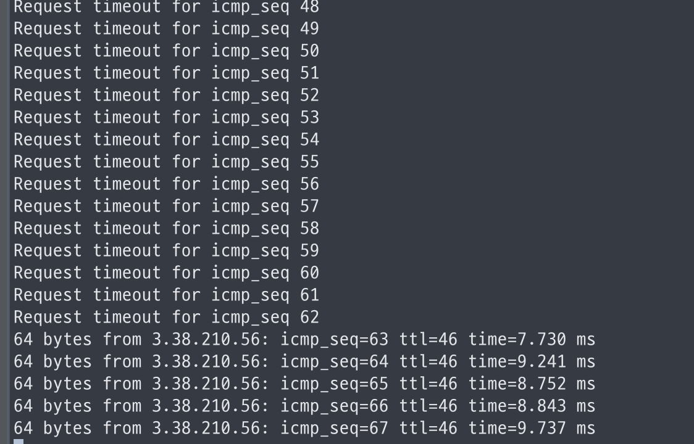
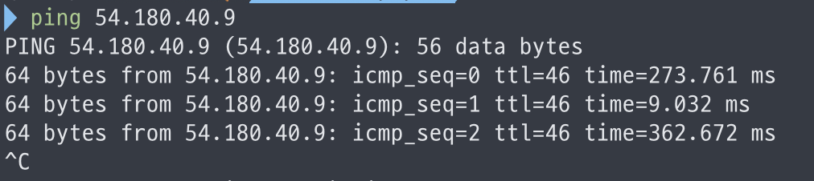
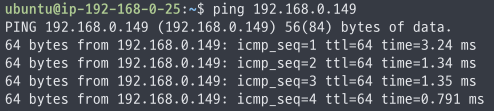
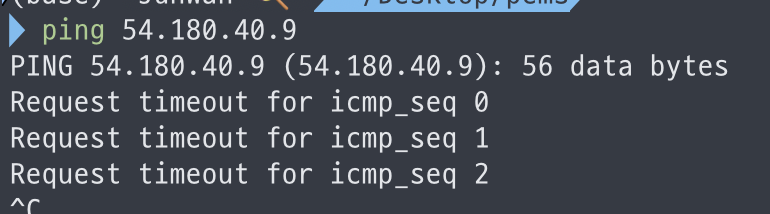
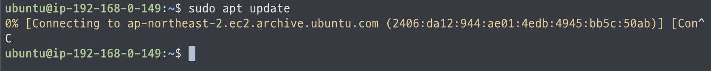
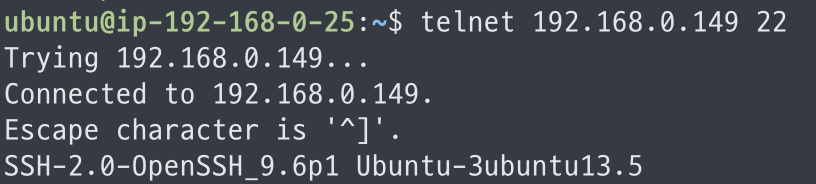
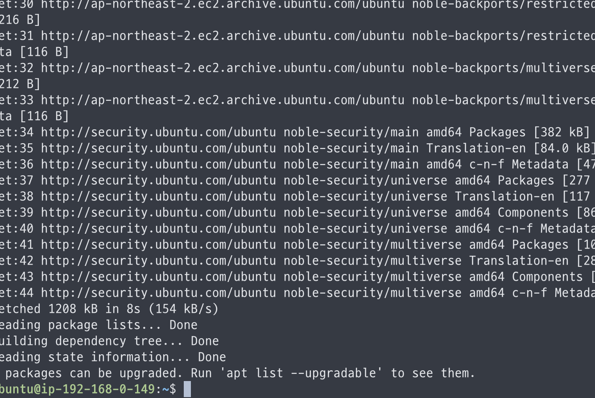
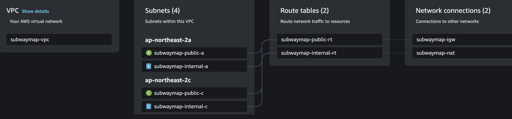

# VPC: 망분리 그리고 테스트

<details>

<summary>Properties</summary>

:pencil:2024.10.09

:page\_facing\_up: [그럴듯한 서비스 만들기](https://www.inflearn.com/course/%EC%9D%B8%ED%94%84%EB%9D%BC-%EA%B3%B5%EB%B0%A9-%EC%84%9C%EB%B9%84%EC%8A%A4-%EB%A7%8C%EB%93%A4%EA%B8%B0)

:paperclip: 그럴듯한 서비스 만들기 - 일단 오픈 해보자

</details>

## 학습

### 서브넷 구성


**Multiple AZ 구성 시 알아두면 좋은 점**

`AZ a`와 `AZ c`는 그룹으로 버저닝을 지원 받는다. <mark style="color:red;">**a에 있는 버전이 b에 없는 경우가 존재 할 수 있기 때문에 a, c로 Multiple AZ 구성이 유리함**</mark>



> #### _서브넷을 잘 구성 했는지 확인 하려면 어떻게 해야할까?_


OSI 7 Layer 기준 3계층, 4계층, 7계층 테스트 진행




### 3계층 [(네트워크)](../network/network-handbook/osi7layer.md#network-layer)


**Ping check:&#x20;**<mark style="color:blue;">**`ICMP`**</mark>


IP 정보만으로 서버에 요청이 가능한지 확인 가능한 프로토콜이며 <mark style="color:blue;">**`ICMP`**</mark>는 `TCP`, `UDP`와 달리 Port Number가 없기 때문에 SG 등의 보안 규칙 설정 시 별도 프로토콜 지정이 필요하다.

**example**

```sh
ping google.com -c 1
```


**`RTT`**(round trip time): 한 패킷이 왕복한 시간

연결 시간, 요청 시간, 응답 시간으로 구성 되어 있으며 RTT가 높을 경우 어느 구간에서 오래 걸리는지 확인 해야함(<mark style="color:red;">**이 경우 웹 서버 성능 등은 확인 할 필요도 없음**</mark>)

```sh
traceroute google.com
```


> _**"Ping 테스트가 실패하면 어떻게 해야할까?"**_

* [ ] &#x20;서버가 요청을 받을 수 있는 상태인지 확인하기
* [ ] 서버에 할당한 **공인 IP**를 대상으로 테스트하고 있는지 확인하기
* [ ] ICMP 접근 허용 설정이 되어있는지 <mark style="color:blue;">**보안 그룹**</mark> 확인하기
* [ ] <mark style="color:blue;">**라우팅 테이블**</mark> 정책에서 외부망 <mark style="color:blue;">**인터넷 게이트웨이**</mark>로 요청을 보내도록 설정 되어있는지 확인하기
* [ ] 클라이언트와 서버 구간에서 <mark style="color:blue;">**지연 구간(RTT)**</mark>이 있는지 확인하기 -> <mark style="color:purple;">**`traceroute`**</mark>



### 4계층 ([트랜스포트](../network/network-handbook/osi7layer.md#transport-layer))


**Port check:&#x20;**<mark style="color:purple;">**`telnet`**</mark>


Port를 대상으로 테스트할 때는 "<mark style="color:red;">**서버가 현재 정상적으로 구동 되고 있는지**</mark>"를 확인한다.

> _**"Port 테스트가 실패하는 경우는 어떻게 해야할까?"**_

* [ ] &#x20;<mark style="color:blue;">**보안 그룹**</mark> 에서 특정 포트 허용 정책이 있는지 확인하기
* [ ] 포트에 할당된 프로세스가 수신 받을 수 있는 상태인지 확인하기 -> <mark style="color:purple;">**`netstat`**</mark>
* [ ] 서버까지 요청이 도달하는지 확인하기 -> <mark style="color:purple;">**`tcpdump`**</mark>
* [ ] 프로세스가 현재 정상적으로 동작하고 있는지 혹



### 7계층 ([어플리케이션](../network/network-handbook/osi7layer.md#application-layer))


HTTP Response Check: <mark style="color:purple;">**`curl`**</mark>


해당 테스트는 특정 URL에 대한 API 이상 유무를 확인할 수 있다.






**OSI 7Layer를 바탕으로 패킷이 네트워크 각 구간을 돌아다니는 것을 머릿 속으로 상상하는 습관을 들이면 여러 상황에서 트러블 슈팅 할 때 유리함**


<details>

<summary>초안</summary>


3계층 Ping Check / ICMP

* Ping Check / ICMP
  * IP 정보만으로 서버에 요청이 가능한지 확인
  * ICMP는 TCP, UDP와 달리 Port가 없기 때문에 SG 등의 보안 설정시 별도 프로토콜 지정이 필요함
    * 예시: `ping google.com -c 1`
  * RTT(round trip time) 한 패킷이 왕복한 시
    * 연결 시간, 요청 시간, 응답 시간으로 구성 되어 있으며 RTT가 높을 경우 어느 구간에서 오래 걸리는지 확인 해야함(이 경우 웹 서버 성능 등은 확인 할 필요도 없음)
    * 예시: `traceroute google.com`
  * ping이 실패한 경우
    * 서버가 요청을 받을 수 있는 상태인지 확인
    * 서버에 할당한 공인 IP(대상)가 맞는지
    * ICMP 접근 허용 설정이 되어있는지(보안 그룹 확인)
    * 라우팅 테이블 정책이 없는 경우는 아닌지
      * 외부망 인터넷 게이트웨이로 요청 보내도록 설정이 되어있는지
    * Outbound에 불필요한 설정은 없는지
    * 클라이언트와 서버 구간에서 지연 구간이 있는지 확인 -> traceroute
* Port Check / telnet
  * 서비스의 정상 구동 여부를 확인
  * ping은 성공 했지만 telnet이 실패 한 경우
    * 특정 포트 허용 정책이 있는지(보안 그룹)
    * 포트 상태가 listen 되어있는지 -> netstat
    * 서버까지 요청이 도달하는지 -> tcpdump
    * 프로세스가 정상적으로 동작 하는지
* HTTP Response Check / curl
  * 특정 URL에 대한 API 이상 유무 확인
  * tcpdump host 192.168.0.207
  * tcpdump port 80
  * tcpdump net 192.168

</details>


## 실습

### 기본 망 구성

1. VPC 구성
   * 192.168.0.0/24 (C Class)
2. 서브넷 구성
   * 192.168.0.0/26 public-a
   * 192.168.0.64/26 public-c
   * 192.168.0.128/27 internal-a
   * 192.168.0.160/27 internal-c
3. IGW 구성
   * 생성 및 미션을 위해 구성 된 VPC Attatch
4. NAT Gateway 구성
   * 서브넷 연결(외부망 public a)
   * EIP 할당

### 외부망 구성

1. VPC 연결
2. public-a 서브넷 연결
3. Prod EC2 인스턴스 프로비전
   * 스펙: T2.Medium
   * 보안그룹
     * 내 IP SSH 포트 오픈
     * HTTPS Allow any 오픈
     * ICMP IPv4 Allow any 오픈
4. Public 라우팅 테이블과 인터넷 게이트웨이 연결
   * 외부망 통신을 위해 0.0.0.0 대역으로 인터넷 게이트웨이 연결
5.  내 IP로 접근이 가능하게 설정 된 운영 인스턴스 상태 체크

    * 결과: 성공

    

### 내부망 구성

1. VPC 연결
2. internal-a 서브넷 연결
3. DB EC2 인스턴스 프로비전
   * 스펙: T2.micro
   * 보안그룹
     * 내 IP SSH 포트 오픈
     * 외부망 SSH 포트 오픈
     * ICMP IPv4 Allow any 오픈
4. Elastic IP 할당
5.  내 IP -> 외부망 접근 Ping 테스트

    * 결과: 성공

    
6.  외부망 -> 내부망 Ping 테스트

    * 결과: 성공

    

### 망 분리

1. 외부망 라우팅 테이블 서브넷 설정
   * IGW 연결(외부망 통신)
   * public subnet 2개 연결
2. 내부망 라우팅 테이블 생성 및 서브넷 설정
   * internal subnet 2개 연결
3.  내부망 서버 공인 IP Ping 체크

    * 결과: 실패

    
4.  내부망 -> 인터넷망 접근 체크

    * 결과: 실패

    
5.  외부망 -> 내부망 telnet 테스트

    * 결과: 성공

    
6. Internal 라우팅 테이블에 NAT GW 연결
   * 내부망이 외부망과 통신을 위해 0.0.0.0 대역으로 NAT 게이트웨이 연결
7.  내부망에서 라이브러리 업데이트를 통해 인터넷망 사용 여부 체크

    
8. 외부망 443 Port listen 후 접근 확인
   * socket listen
     * `sudo socket -s 443`
   * 테스트
     * `telnet {IP} 443`
9. 내부망 서버의 공인 IP로 접근 테스트
   * 내부망의 공인 IP Ping 테스트

### VPC 리소스 맵


