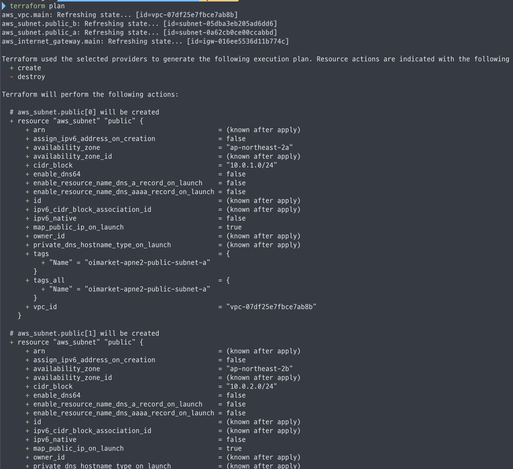

# Future 와 Callable 그리고 스레드 풀

자바 5 이전에서 [`Thread` 와 `Runnable` 이 갖고 있는 한계점](thread-runnable.md#thread-runnable)을 보완하며 `Callable` 과 `Future` 가 등장하였으며, 이러한 스레드를 관리할 수 있는 여러 객체들도 같이 등장하였다.


### Callable

기존 문제점에서 `Runnable` 인터페이스를 구현했을 때 반환 값을 사용할 수 없다는 단점을 보완하며 등장하였다.

`Callable` 은 제네릭 타입을 선언하여 반환 값을 지정할 수 있는 함수형 인터페이스이다.

`Runnable` 처럼 작업 단위를 구성하는 인터페이스로, 실제 구현된 내용의 실행을 제어하지 못하고 다른 호출자에 의해 실행되는 구조이다.



```java
/**
 * A task that returns a result and may throw an exception.
 * Implementors define a single method with no arguments called
 * {@code call}.
 *
 * <p>The {@code Callable} interface is similar to {@link
 * java.lang.Runnable}, in that both are designed for classes whose
 * instances are potentially executed by another thread.  A
 * {@code Runnable}, however, does not return a result and cannot
 * throw a checked exception.
 *
 * <p>The {@link Executors} class contains utility methods to
 * convert from other common forms to {@code Callable} classes.
 *
 * @see Executor
 * @since 1.5
 * @author Doug Lea
 * @param <V> the result type of method {@code call}
 */
@FunctionalInterface
public interface Callable<V> {
    /**
     * Computes a result, or throws an exception if unable to do so.
     *
     * @return computed result
     * @throws Exception if unable to compute a result
     */
    V call() throws Exception;
}
```



```java
public class CallableMain {

    public static void main(String[] args) {
        ExecutorService executorService = Executors.newSingleThreadExecutor();
        Callable<String> callable = () -> {
            final String result = "Callable into Thread: " + Thread.currentThread().getName();
            System.out.println(result);
            return result;
        };

        Future<String> future = executorService.submit(callable);
        try {
            String result = future.get();
            System.out.println("result = " + result);
        } catch (InterruptedException | ExecutionException e) {
            e.printStackTrace();
        } finally {
            executorService.shutdown();
        }

    }

}
```




#### Callable vs Runnable

1. `Runnable` 은 메서드의 반환 값을 사용할 수 없음
2. `Callable` 은 메서드의 예외 처리를 통해 `CheckedException` 처리 가능


`Callable` 은 자신의 `call()` 메서드를 통해 결과 값을 제네릭으로 반환할 수 있는데, 비동기로 수행되는 경우 이 작업이 언제 끝날지 모르기 때문에 값을 직접적으로 반환하지 않고 `Future` 객체를 통해 반환한다.

### Future

`Callable` 이 구현하는 작업은 비동기로 동작하는 경우 함수가 반환되는 시점이 명확하지 않기 때문에 `Future` 가 필요한데, 이 `Future` 는 비동기 작업의 미래에 완료될 결과를 나타내는 인터페이스이다. 작업이 완료될 때까지 기다리거나, 작업 완료 여부를 확인하고, 필요 시 작업을 취소할 수 있는 기능을 제공한다.



```java
public interface Future<V> {

    boolean cancel(boolean mayInterruptIfRunning);

    boolean isCancelled();

    boolean isDone();

    V get() throws InterruptedException, ExecutionException;

    V get(long timeout, TimeUnit unit)
        throws InterruptedException, ExecutionException, TimeoutException;
}
```

* get(): 작업이 완료될 때까지 기다린 후 결과를 반환하며, 만약 작업이 실패하면 예외를 발생시킨다.
* isDone(): 작업의 완료 여부를 반환한다.
* isCancelled(): 작업의 취소 여부를 반환한다.
* cancel(): 작업을 취소 시키며,그 후 `isDone()` 메서드는 항상 `true` 를 반환한다.



```java
public class CallableMain {

    public static void main(String[] args) {
        ExecutorService executorService = Executors.newSingleThreadExecutor();
        Callable<String> callable = () -> {
            final String result = "Callable into Thread: " + Thread.currentThread().getName();
            System.out.println(result);
            return result;
        };

        Future<String> future = executorService.submit(callable);
        try {
            String result = future.get(); // Callable 의 작업의 실제 반환 값
            System.out.println("result = " + result);
        } catch (InterruptedException | ExecutionException e) {
            e.printStackTrace();
        } finally {
            executorService.shutdown();
        }

    }

}
```




### 자바 5 에서 제공하는 스레드의 생성과 관리를 위한 스레드 풀

<figure><figcaption></figcaption></figure>

과거 버전에서는 `Thread()` 의 `start()` 메서드가 호출 되면서 무조건 한 개의 스레드가 생성되고 종료되기를 반복하는 사이클로 오버헤드에 대한 문제가 있었다.

이 과정을 개선하고자 미리 스레드를 만들어두고 매번 생성하지 않고 재사용할 수 있는 스레드 풀 개념이 착안되었다.

***

### Executor

`Runnable` 객체로 구현한 작업의 내용을 실행 해주는 인터페이스로 `execute()` 메서드 하나만을 제공한다.

과거 버전에서는 스레드를 직접 개발자의 논리적 흐름 안에서 관리했다면, `Executor` 인터페이스를 구현한 구현체 내부에서 스레드를 관리하도록 변경하고, 오로지 작업에 대한 수행에 초점을 맞출 수 있도록 한 단계 더 추상화 하였다.



```java
public interface Executor {

    /**
     * Executes the given command at some time in the future.  The command
     * may execute in a new thread, in a pooled thread, or in the calling
     * thread, at the discretion of the {@code Executor} implementation.
     *
     * @param command the runnable task
     * @throws RejectedExecutionException if this task cannot be
     * accepted for execution
     * @throws NullPointerException if command is null
     */
    void execute(Runnable command);
}
```



```java
public class ThreadExample implements Executor {

    @Override
    public void execute(Runnable command) {
        new Thread(command).start();
    }
    

Executor executor = new ThreadExample();
executor.execute(
        () -> System.out.println("Executor in thread: " + Thread.currentThread().getName())
);

```



`Thread` 와 동작하는 방식에 있어 다를 바 없으며, 실행 방식도 비슷하다.

하지만, `Runnable` 은 작업 그 자체를 의미하고, `Executor`는 작업을 받아 실제 스레드에 할당하는 관리자 역할을 한다.

즉, 이 예제는 `Executor`의 구조를 보여주기 위한 가장 기초적인 구현일 뿐이며, 실제 프로덕션 환경에서는 이 인터페이스를 구현한 스레드 풀을 사용하여 스레드 생성 비용 문제를 해결한다.

### ExecutorService

<figure><figcaption></figcaption></figure>

`ExecutorService`는 `Executor`를 상속받아, 작업 실행뿐만 아니라 스레드 풀의 종료와 생성된 스레드의 생명주기 관리 기능을 추가로 제공한다.


#### ExecuteService 가 지원하는 비동기 작업 기능

***

<mark style="color:$primary;">**submit**</mark>

* 작업을 수행하는 메서드이며, 결과로 Future 를 반환한다. 수행한 함수의 결과를 얻기 위해 `Future` 객체가 제공하는 메서드(`get`)를 이용해야 한다.

<mark style="color:$primary;">**invokeAll**</mark>

* 여러 작업을 동시에 요청하고 모든 작업이 완료될 때까지 대기 한다. 실행 결과로 `List<Future>`를 반환하는데, 리스트에 담긴 결과의 순서는 인자로 전달한 작업의 순서와 동일함이 보장된다.


**예시**

* input: \[Task A, Task B, Task C]
* execution: `Task B`가 0.1초,  `Task A`는 1초가 걸렸다.
* output: \[Task A Future, Task B Future, Task C Future] 가 반환된다.


```java
  /**
     * Executes the given tasks, returning a list of Futures holding
     * their status and results when all complete.
     * {@link Future#isDone} is {@code true} for each
     * element of the returned list.
     ...
  **/
<T> List<Future<T>> invokeAll(Collection<? extends Callable<T>> tasks)
     throws InterruptedException;

<T> List<Future<T>> invokeAll(Collection<? extends Callable<T>> tasks,
                          long timeout, TimeUnit unit)
throws InterruptedException;
```

<mark style="color:$primary;">**invokeAny**</mark>

* 여러 작업을 제공했을 때 가장 빨리 완료된 한 개의 작업 결과가 나올 때 까지 블로킹 방식으로 요청하며, <mark style="color:red;">**모든 작업을 동시에 수행 하지만 가장 빨리 완료된 결과 하나만 작업의 반환 타입으로 반환하고, 가장 빨리 호출된 작업 외에 나머지 작업들은 모두 취소된다**</mark>

```java
 /**
     * Executes the given tasks, returning the result
     * of one that has completed successfully (i.e., without throwing
     * an exception), if any do. Upon normal or exceptional return,
     * tasks that have not completed are cancelled.
     * The results of this method are undefined if the given
     * collection is modified while this operation is in progress.
     ...
**/
<T> T invokeAny(Collection<? extends Callable<T>> tasks)
    throws InterruptedException, ExecutionException;

<T> T invokeAny(Collection<? extends Callable<T>> tasks,
                long timeout, TimeUnit unit)
    throws InterruptedException, ExecutionException, TimeoutException;

```



#### submit 과 execute 의 차이

* `execute`: 반환 타입이 `void`로 작업의 실행 결과나 작업의 상태를 알 수 없다.
* `submit`: 작업을 할당하고 `Future` 타입의 결과값을 받는다. 결과가 반환 되어야해서 `Callable`을 구현한 작업을 인자로 지정하지만, 메서드 오버로딩을 통해 `Runnable` 객체를 사용할 수 있도록 제공한다.




```java
<T> Future<T> submit(Callable<T> task);
<T> Future<T> submit(Runnable task, T result);
Future<?> submit(Runnable task);
```



```java
void shutdown();
List<Runnable> shutdownNow();
boolean isShutdown();
boolean isTerminated();
boolean awaitTermination(long timeout, TimeUnit unit)
    throws InterruptedException;
```

* `shutdown`: 새로운 작업을 더이상 받지 않고 실행중인 작업이 완전히 종료되면 안전하게 종료
* `shutdownNow`: 현재 작업중인 작업을 모두 중단하고, 아직 실행되지 못하고 큐에 쌓여있던 작업들을 반환함
* `isShutdown`: 작업 수행 종료 여부
* `isTerminated`: `shutdown` 메서드를 호출 했을 때 실행중이던 작업들마저 모두 종료 되었는지 여부 반환
* `awaitTermination`: `shutdown` 메서드 호출 후 일정 시간까지 대기하며, 일정 시간 내 작업이 모두 종료 되었는지 여부 반환



#### ExecutorService 의 작업 종료

<mark style="color:$primary;">**shutdown**</mark>

`ExecutorService` 를 통해 작업을 실행하는 경우, 명시적으로 `shutdown` 을 호출하지 않으면 메인 스레드에서 다음 작업을 무한정 대기하는 상태로 전환되어 프로세스가 종료되지 않는다.

작업이 끝났다면 명시적으로 `shutdown` 메서드를 호출하여 정상적으로 프로세스를 종료 해주어야한다.

* 하지만, 작업이 계속 실행 중이라면 작업이 끝날 때 까지 기다리는 `Graceful shutdown` 방식을 사용하기 때문에 `shutdown` 메서드로 작업이 종료되지 않을 수 있다.


<mark style="color:$primary;">**shutdownNow**</mark>

인터럽트를 발생 시키기 때문에 스레드 내부 로직에서 인터럽트가 발생할 경우에 대한 후처리 로직을 추가할 수 있다.



```java
public class ExecuteServiceMain {

    public static void main(String[] args) {
        ExecutorService executorService = Executors.newFixedThreadPool(5);
        executorService.execute(
                () -> {
                    System.out.println("Executor in thread: " + Thread.currentThread().getName());
                    while (true) {
                        if (Thread.currentThread().isInterrupted()) {
                            System.out.println("Interrupted");
                            break;
                        }
                    }
                }
        );
        executorService.shutdownNow();
    }
}

// 콘솔 출력
// Executor in thread: pool-1-thread-1
// Interrupted
```



#### ExecutorService 를 확장한 스케줄러


#### ScheduledExecutorService 인터페이스

작업의 단위를 실행 하는 인터페이스는 매번 즉각적인 실행으로 `Future` 결과를 반환했다.&#x20;

`ScheduledExecutorService` 는  추상화된 기능에 더해 일정 시간 뒤에 실행 되거나 주기적으로 실행 시킬 수 있도록 `ExecutorService` 인터페이스를 확장하여 제공한다.




```java
public interface ScheduledExecutorService extends ExecutorService {

    /**
     * Submits a one-shot task that becomes enabled after the given delay.
     */
    public ScheduledFuture<?> schedule(Runnable command,
                                       long delay, TimeUnit unit);

    /**
     * Submits a value-returning one-shot task that becomes enabled
     * after the given delay.
     */
    public <V> ScheduledFuture<V> schedule(Callable<V> callable,
                                           long delay, TimeUnit unit);

    /**
     * Submits a periodic action that becomes enabled first after the
     * given initial delay, and subsequently with the given period;
     */
    public ScheduledFuture<?> scheduleAtFixedRate(Runnable command,
                                                  long initialDelay,
                                                  long period,
                                                  TimeUnit unit);

    /**
     * Submits a periodic action that becomes enabled first after the
     * given initial delay, and subsequently with the given delay
     * between the termination of one execution and the commencement of
     * the next.
     */
    public ScheduledFuture<?> scheduleWithFixedDelay(Runnable command,
                                                     long initialDelay,
                                                     long delay,
                                                     TimeUnit unit);

}
```

* `schedule`: 정의한 작업을 일정 시간 뒤에 실행 시킨다.
* `scheduleAtFixedRate`: `initialDelay` 인자 값 만큼 지난 후 작업이 실행 되고, `period` 인자 값 만큼 주기적으로 실행하는데, 작업이 늦게 끝나는 경우 끝난 후 지연 없이 바로 실행된다.
  * 예시) 1초 뒤 작업이 실행되고, 1분 동안 주기적으로 실행 되어 폴링하는 구조
    * `scheduleExecutorService.scheduleAtFixedRate(task, 1, 60, TimeUnit.SECONDS);`
* `scheduleWithFixedDelay`: `initialDelay` 인자 값 만큼 지난 후 작업이 실행 되고, `delay` 인자 값 만큼 주기적으로 실행하는데, 작업이 늦게 끝나는 경우 `delay` 만큼 지연 후 실행된다.



#### scheduleAtFixedRate vs scheduleWithFixedDelay

* `scheduleAtFixedRate` 는 주기적으로 수행하는 지연 시간 보다 작업이 늦게 끝나면 작업이 완료된 후 즉시 실행된다.
* `scheduleWithFixedDelay` 는 주기적으로 수행하는 지연 시간 보다 작업이 늦게 끝나면 작업이 완료된 후 지연 시간만큼 대기 했다가 작업이 다시 실행된다.





#### AbstractExecutorService 를 확장한 ThreadPoolExecutor

***


#### ThreadPoolExecutor  클래스란

`AbstractExecutorService` 를 확장하고 있는 클래스로, 스레드 풀에 대한 다양한 설정 값 들을 생성자의 인자 값으로 전달하여 유연함을 제공한다.

`Executors` 클래스의 정적 메서드를 이용하면 `ThreadPoolExecutor` 를 통해 다양한 스레드 풀을 생성할 수 있으나, 메서드 인자 값이 제한적이기 때문에 유연하게 구성하기 위해 `ThreadPoolExecutor` 를 논리적 코드 흐름에서 직접 관리할 수 있다.




```java
    public ThreadPoolExecutor(int corePoolSize,
                              int maximumPoolSize,
                              long keepAliveTime,
                              TimeUnit unit,
                              BlockingQueue<Runnable> workQueue) {
        this(corePoolSize, maximumPoolSize, keepAliveTime, unit, workQueue,
             Executors.defaultThreadFactory(), defaultHandler);
    }

    public ThreadPoolExecutor(int corePoolSize,
                              int maximumPoolSize,
                              long keepAliveTime,
                              TimeUnit unit,
                              BlockingQueue<Runnable> workQueue,
                              ThreadFactory threadFactory) {
        this(corePoolSize, maximumPoolSize, keepAliveTime, unit, workQueue,
             threadFactory, defaultHandler);
    }

    public ThreadPoolExecutor(int corePoolSize,
                              int maximumPoolSize,
                              long keepAliveTime,
                              TimeUnit unit,
                              BlockingQueue<Runnable> workQueue,
                              RejectedExecutionHandler handler) {
        this(corePoolSize, maximumPoolSize, keepAliveTime, unit, workQueue,
             Executors.defaultThreadFactory(), handler);
    }

    public ThreadPoolExecutor(int corePoolSize,
                              int maximumPoolSize,
                              long keepAliveTime,
                              TimeUnit unit,
                              BlockingQueue<Runnable> workQueue,
                              ThreadFactory threadFactory,
                              RejectedExecutionHandler handler) {
        if (corePoolSize < 0 ||
            maximumPoolSize <= 0 ||
            maximumPoolSize < corePoolSize ||
            keepAliveTime < 0)
            throw new IllegalArgumentException();
        if (workQueue == null || threadFactory == null || handler == null)
            throw new NullPointerException();
        this.corePoolSize = corePoolSize;
        this.maximumPoolSize = maximumPoolSize;
        this.workQueue = workQueue;
        this.keepAliveTime = unit.toNanos(keepAliveTime);
        this.threadFactory = threadFactory;
        this.handler = handler;

        String name = Objects.toIdentityString(this);
        this.container = SharedThreadContainer.create(name);
    }

```

* `corePoolSize`: 스레드 풀 고정 크기
* `maximumPoolSize`: 최대 확장 가능한 스레드 풀 크기
* `keepAliveTime`: `corePoolSize` 보다 더 많은 스레드가 요구 되어 `maximumPoolSize` 값 만큼 확장이 일어난 경우, 해당 시간보다 더 길게 사용하면 초과된 스레드가 종료되고 `corePoolSize` 로 다시 돌아감
  * `TimeUnit`: `keepAliveTime` 을 적용하는 시간 단위
* `workQueue`: 작업을 수행해야 할 스레드 관리 큐(`corePoolSize` 에 관리되는 스레드가 모두 작업을 수행중인 경우 해당 큐에 저장됨)
  * `SynchronousQueue`: 큐 크기가 0이고, 작업을 직접 스레드에 전달하며 즉시 처리 가능한 스레드가 없으면 새 스레드를 생성한다. `Executors.newCachedThreadPool()` 에 사용되고 <mark style="color:green;">**빠른 응답 시간, 무제한으로 스레드를 생성 할 수 있다는 특징**</mark>이 있음
  * `LinkedBlockingQueue`: 연결 리스트 기반의 큐이며 FIFO 순서를 보장하고, 인자 값으로 큐 크기를 지정하지 않으면 `Integer.MaxValue` 까지 동적으로 늘어난다. <mark style="color:green;">**`Executors`**</mark><mark style="color:green;">**&#x20;**</mark><mark style="color:green;">**의 기본적인 큐로 사용되고**</mark><mark style="color:green;">**&#x20;**</mark><mark style="color:green;">**`put`**</mark><mark style="color:green;">**,**</mark><mark style="color:green;">**&#x20;**</mark><mark style="color:green;">**`take`**</mark><mark style="color:green;">**&#x20;**</mark><mark style="color:green;">**각각의 Lock 을 사용하기 때문에 락 경합이**</mark><mark style="color:green;">**&#x20;**</mark><mark style="color:green;">**`ArrayBlockingQueue`**</mark><mark style="color:green;">**&#x20;**</mark><mark style="color:green;">**보다 줄어들고,**</mark> <mark style="color:green;">**인자를 지정하지 않고 사용하는 경우 메모리 부족이 발생하지만  대체적으로 안정적인 처리량이 특징**</mark>이다.
  * `ArrayBlockingQueue`: 고정 크기 기반의 배열 큐로 FIFO 순서를 보장한다. <mark style="color:green;">**put, take 모두 한 개의 Lock 을 사용하여 락 경합이 발생할 수 있으며**</mark>  <mark style="color:green;">**최초 생성 시 인자 값을 통해 용량을 결정한 후 변경이 불가능 하다는 특징이 있다.**</mark>
* `threadFactory`: 기본 값으로 `defaultThreadFactory` 를 사용하며, 스레드를 생성할 때 스레드의 이름을 지정하거나 우선순위를 지정할 수 있다. 기본 팩토리에서 우선순위 5로 설정하여 스레드가 생성된다.
* `handler`: 모든 스레드가 사용되고 있고, `workQueue`가 포화상태라면 새 작업을 거부하는데, 이때 다양한 정책을 설정할 수 있다.
  * `AbortPolicy`: 기본 전략으로 refectedExecution 예외를 발생 시킨다.
  * `CallerRunsPolicy`: 실행을 호출하는 스레드가 스스로 작업을 실행한다.
  * `DiscardPolicy`: 현재 요청한 작업이 거절되면 삭제한다.
  * `DiscardOldestPolocy`: 가장 오래되고 처리되지 않은 작업을 삭제한 뒤 다시 작업을 시도한다.





#### 왜 ExecutorService 를 구현하지 않고, AbstractExecutorService 를 확장했을까?

`ExecutorService` 는 `submit`, `invokeAll`, `invokeMany` 등 인터페이스가 제공하고 있는 공통 스펙을 모두 구현하는 입장에서 새롭게 작성 해야한다.

반면, `AbstractExecutorService` 는 `ExecutorService` 를 직접 구현하여 `execute()` 메서드만 추상 메서드로 제공하고, 나머지는 템플릿화 하여 기능을 제공함에 따라 재사용성이 높아진다.

위와 같은 이유로 스레드 풀에 대한 설정이 완료 된 객체를 어떻게 실행시킬지에 대한 관심사에 집중하기 위해 `AbstractExecutorService` 를 확장하였다.


### Executors

스레드를 관리하기 위한 인터페이스들을 직접 구현하기에는 구현 해야 할 내용도 많고, 저수준 API 로 인해 개발자가 내부적인 구현 요소들에 신경을 쓰는 경우가 많아 번거롭다.

그래서 이런 번거로움을 없애고 최대한의 편의성을 제공하고자 나온 고수준 API로써 `ExecutorService`나 `ScheduledExecutorService` 같은 인터페이스의 구현체를 쉽게 제공하는 팩터리 클래스이다.


#### newFixedThreadPool

스레드 갯수를 인자로 받아, 정해진 스레드 수 만큼 미리 생성 하여 재사용하며 불 필요한 스레드의 생성과 종료 없이 작업을 처리하는 스레드 풀이다.



```java
ExecutorService fixedThreadPool = Executors.newFixedThreadPool(5);
```



```java
public static ExecutorService newFixedThreadPool(int nThreads) {
    return new ThreadPoolExecutor(nThreads, nThreads,
                                  0L, TimeUnit.MILLISECONDS,
                                  new LinkedBlockingQueue<Runnable>());
}
```



> 언제 사용할까?

* CPU 자원을 고르게 사용하며, 안정적인 처리량을 원하는 경우
* 동시에 처리해야 하는 작업 수를 제한해야 하는 경우


#### 주의

인자 값으로 사용된 스레드 갯수 만큼 큐의 크기를 허용하기 때문에 과도하게 큰 큐를 생성하여 메모리 사용량을 증가 시킬 수 있다.

* `LinkedBlokingQueue` 는 인자 값을 지정하지 않으면 Integer.MaxValue 만큼 큐 사이즈를 허용한다.



#### newCachedThreadPool

매 작업 마다 필요한 만큼의 스레드를 생성하고, 특정 시간 동안 스레드가 사용되지 않으면 제거 되어 기존에 미리 생성된 스레드가 캐시로 남아 재사용하여 빠르고 유연하다.



```java
ExecutorService cachedThreadPool = Executors.newCachedThreadPool();
```



```java
    public static ExecutorService newCachedThreadPool() {
        return new ThreadPoolExecutor(0, Integer.MAX_VALUE,
                                      60L, TimeUnit.SECONDS,
                                      new SynchronousQueue<Runnable>());
    }

```



> 언제 사용할까?

* 작업이 빠르게 끝나는 I/O 중심의 작업일 때 :arrow\_right: 스레드의 작업을 얼른 반환 받아 재사용이 가능하기 때문
* 트래픽이 불규칙적일 때 :arrow\_right: 큐에 쌓아놓지 않고 바로 바로 작업을 처리하는 큐를 쓰기 때문


#### 주의

* 큐를 사용하지 않기 때문에 무한히 확장할 수 있는 구조로, 운영 환경에서는 `ThreadExecutorPool` 을 직접 제어하는 것을 권장한다.
* 작업 시간이 길면 스레드의 반환이 이루어지지 않아 매번 스레드를 새롭게 생성하기 때문에, 작업 시간이 길면 안된다.



#### newScheduledThreadPool

일정 시간 지연 실행 시키거나 주기적인 작업을 실행하는 스레드풀이다.



```java
ScheduledExecutorService scheduledThreadPool = Executors.newScheduledThreadPool(5);
```



```java
private static final long DEFAULT_KEEPALIVE_MILLIS = 10L;

/**
 * Creates a new {@code ScheduledThreadPoolExecutor} with the
 * given core pool size.
 *
 * @param corePoolSize the number of threads to keep in the pool, even
 *        if they are idle, unless {@code allowCoreThreadTimeOut} is set
 * @throws IllegalArgumentException if {@code corePoolSize < 0}
 */
public ScheduledThreadPoolExecutor(int corePoolSize) {
    super(corePoolSize, Integer.MAX_VALUE,
          DEFAULT_KEEPALIVE_MILLIS, MILLISECONDS,
          new DelayedWorkQueue());
}
```



> 언제 사용할까?

* 일정 시간 뒤에 작업을 수행 해야할 때 :arrow\_right: `scheduleAtFixedRate` 또는 `scheduleWithFixedDelay` 같은 메서드를 통해 지연과 인터벌 수행을 관리할 수 있기 때문
  * 예시) DB 커넥션을 맺고 5초 뒤 DB 커넥션 정보를 가져오는 로직이 실행되지 않을 경우 커넥션이 맺어지지 않은 상태라고 판단하여 예외 처리하는 행위


#### newSingleThreadExecutor

한 개의 스레드만을 사용하여 FIFO 순서대로 작업을 처리한다.



```java
ExecutorService singleThread = Executors.newSingleThreadExecutor();
```



```java
public static ExecutorService newSingleThreadExecutor() {
  return newSingleThreadExecutor(defaultThreadFactory());
}

/**
* Creates an Executor that uses a single worker thread operating
* off an unbounded queue, and uses the provided ThreadFactory to
* create a new thread when needed. Unlike the otherwise
* equivalent {@code newFixedThreadPool(1, threadFactory)} the
* returned executor is guaranteed not to be reconfigurable to use
* additional threads.
*
* @param threadFactory the factory to use when creating new threads
* @return the newly created single-threaded Executor
* @throws NullPointerException if threadFactory is null
*/
public static ExecutorService newSingleThreadExecutor(ThreadFactory threadFactory) {
  return new AutoShutdownDelegatedExecutorService
      (new ThreadPoolExecutor(1, 1,
                              0L, TimeUnit.MILLISECONDS,
                              new LinkedBlockingQueue<Runnable>(),
                              threadFactory));
}
```



> 언제 사용할까?

* 작업의 순서가 중요할 때 :arrow\_right: 처리해야 할 작업이 큐에 쌓이고 FIFO 순서대로 처리되기 때문


#### 주의

* 스레드가 작업을 오래 점유하면 점유할수록 대기중인 작업은 블락킹 되어 성능에 저하가 발생함
* 만약 스레드가 특정 작업 도중 오류로 인해 작업이 종료되어 죽게 되면 새로운 스레드를 생성해서 큐에 있는 다음 작업을 수행함



#### new Thread() vs Executors.newSingleThreadExecutor()

* new Thread() 같은 경우 1회성으로 스레드를 계속 생성하고, 종료 시키며 작업 도중 에러가 발생하면 스레드가 모두 종료된다.
* `singleThreadExecutor()` 는 스레드 한 개가 큐에 있는 작업을 도맡아 처리하며, 에러가 발생하여 스레드가 죽더라도 새로운 스레드로 큐에 저장된 다른 작업을 이어간다.



### Executors 팩터리 클래스 선택 가이드

<table data-full-width="false"><thead><tr><th width="226.68359375" align="center">스레드풀</th><th width="242.09375" align="center">목적</th><th align="center">이유</th></tr></thead><tbody><tr><td align="center"><code>newFixedThreadPool</code></td><td align="center">CPU 처리가 많은 경우</td><td align="center">CPU 코어 수 + 1 개 만큼의 스레드를 생성할 경우, 효율적인 병렬 처리가 가능하기 때문</td></tr><tr><td align="center"><code>newCachedThreadPool</code></td><td align="center">실행 시간이 짧고 빈번한 작업</td><td align="center">큐를 사용하지 않고 바로 작업을 처리하며, 이미 생성된 스레드가 놀고 있다면 재사용 하여 스레드 생성 비용을 아낄 수 있기 때문</td></tr><tr><td align="center"><code>newScheduledThreadPool</code></td><td align="center">주기적인 작업, 지연 작업</td><td align="center">여러 스레드를 사용하여, 하나의 작업이 오래 걸려도 다른 예정된 작업이 밀리지 않고 제시간에 실행됨을 보장하고, 스레드가 종료되더라도 새로운 스레드로 다음 작업을 다시 실행하기 때문</td></tr><tr><td align="center"><code>newSingleThreadExecutor</code></td><td align="center">작업의 순서 보장이 필수적인 경우</td><td align="center">작업을 큐에 담긴 순서대로(FIFO) 하나씩 처리함을 보장하기 때문</td></tr></tbody></table>


### Future 의 단점

1. `Future` 의 `get()` 메서드를 통해 비동기 작업의 완료까지 블락킹 상태로 대기 해야한다.
2. `Future` 작업의 결과를 의존하여 다음 작업을 실행 시키는 조합이 불가능하다.
3. `Future` 작업 도중 예외가 발생하면 `CheckedException` 예외가 발생하기 때문에 `try-catch` 가 강제된다.


<details>

<summary>참고 자료</summary>

[https://www.baeldung.com/java-executor-service-tutorial](https://www.baeldung.com/java-executor-service-tutorial)

[https://www.codingshuttle.com/blogs/java-executor-framework-tutorial-simplifying-multithreading-with-executor-service/](https://www.codingshuttle.com/blogs/java-executor-framework-tutorial-simplifying-multithreading-with-executor-service/)

</details>
