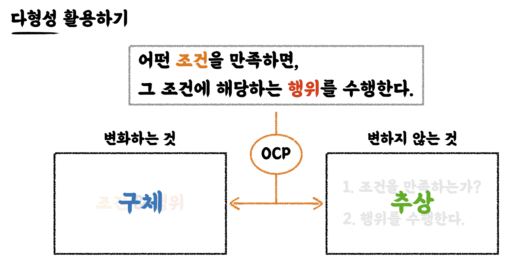
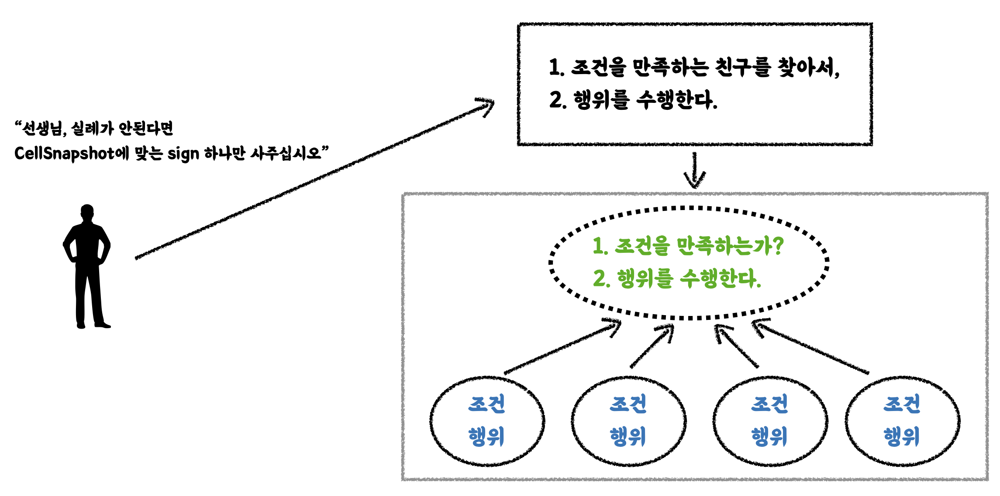
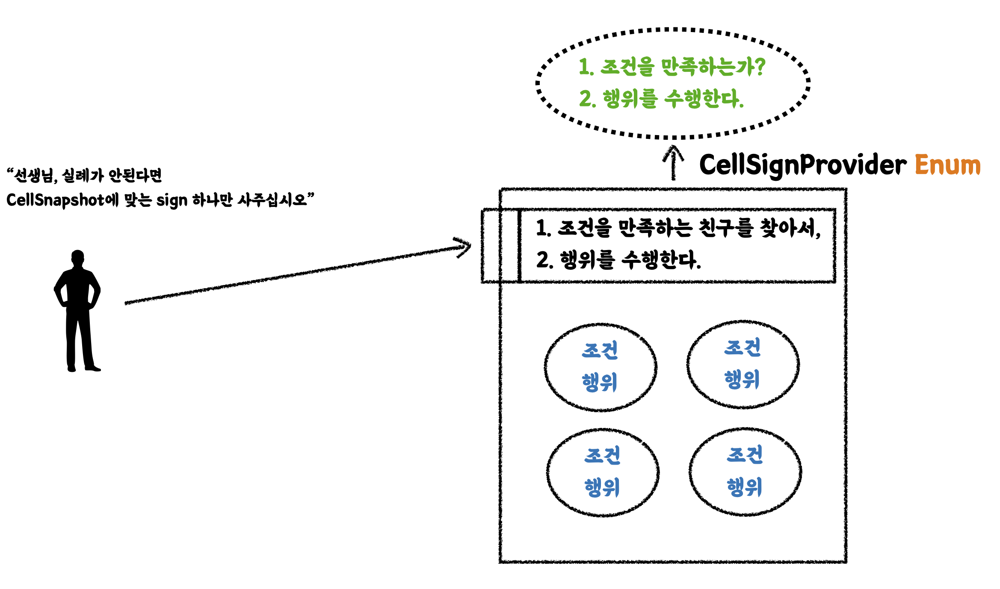

# Readable code

<details>

<summary>Properties</summary>

:pencil:2024.09.10

:page_facing_up: [읽기 좋은 코드를 작성하는 사고법](https://www.inflearn.com/course/readable-code-%EC%9D%BD%EA%B8%B0%EC%A2%8B%EC%9D%80%EC%BD%94%EB%93%9C-%EC%9E%91%EC%84%B1%EC%82%AC%EA%B3%A0%EB%B2%95/dashboard)

:paperclip: 상속과 조합

</details>

## 객체 지향 이론을 코드로 적용하기


### 상속과 조합




<mark style="color:orange;background-color:purple;">상속보다 조합을 사용하자</mark>

- 상속은 시멘트 처럼 굳어지는 구조로 수정이 어렵다. -> 부모 클래스와 자식 클래스의 결합도가 매우높음

- 조합과 인터페이스를 활용하는 것이 유연한 구조 -> **상속을 통한 코드의 중복 제거가 주는 이점 보다, 중복이 생기더라도 유연한 구조 설계가 주는 이점이 더 큼**




상속 구조는 과거에 코드 반복이 하드웨어 성능에 영향을 끼친다고 생각 했던 시절에 부모 클래스의 메서드를 자식 클래스에서 반복 없이 사용 할 수 있을 때 효율적이었다.

하지만 현대 하드웨어 성능이 과연 코드 몇 줄 줄였을 때 유의미한 성능 향상을 기대할 수 있을까? 단연 있다고 한들 굉장히 견고한 설계 구조가 아닌 이상 쉽게 상속 구조를 사용하기 어렵다.

유지보수 하는 개발자 입장에서 부모 클래스의 메서드 하나를 수정하기 위해 굉장히 많은 작업을 반복해야 하기 때문에 유연한 조합 설계 구조로 왠만한 문제는 풀어나갈 수 있다.

**Example use case**:





```java
public class EmptyCell extends Cell {

    private static final String EMPTY_SIGN = "■";

    @Override
    public boolean isLandMine() {
        return false;
    }

    @Override
    public boolean hasLandMineCount() {
        return false;
    }

    @Override
    public String getSign() {
        if (isOpened) {  // 부모 메서드
            return EMPTY_SIGN;
        }

        if (isFlagged) {  // 부모 메서드
            return FLAG_SIGN;
        }

        return UNCHECKED_SIGN;
    }
}
```





```java
public class EmptyCell implements Cell {

    private static final String EMPTY_SIGN = "■";

    private final CellState cellState = CellState.initialize();

    @Override
    public boolean isLandMine() {
        return false;
    }

    @Override
    public boolean hasLandMineCount() {
        return false;
    }

    @Override
    public void flag() {
        cellState.flag();
    }

    @Override
    public void open() {
        cellState.open();
    }

    @Override
    public boolean isOpened() {
        return cellState.isOpened();
    }

    @Override
    public boolean isChecked() {
        return cellState.isChecked();
    }

    @Override
    public String getSign() {
        if (cellState.isOpened()) {
            return EMPTY_SIGN;
        }

        if (cellState.isFlagged()) {
            return FLAG_SIGN;
        }

        return UNCHECKED_SIGN;
    }
}
```







**상속**
상속을 이용하는 경우 `isOpened`와 `isFlagged` 가 수정이 발생 했다고 가정 했을 때 과연 `getSign` 메서드는 의도한 조건에 맞게 실행 되고 있는지 테스트가 필요하다.

또한, 자식 클래스가 부모 클래스의 캡슐화 된 데이터를 모든 정보를 다 알고있다. 이 경우는 캡슐화도 깨진 경우이기 때문에 조합을 이용해서 캡슐화를 지키고 유지보수 측면에서 유연한 설계를 보자면 아래와 같다.

**조합**
조합과 인터페이스를 활용 한 경우이며 물론 상속 보다는 반복되는 코드 구조가 발생 하는 것은 사실이다. 하지만, `cell`과 관련 된 데이터 내부는 캡슐화 된 다른 객체로 대체 되었고 외부 객체와 협력하고 있다. 또한 인터페이스를 물려 받아 구현한 메서드들은 해당 객체의 고유한 행동을 나타낼 수 있기 때문에 수정 되더라도 메인 로직의 변함은 없다.



### Value Object(VO)



<mark style="color:orange;background-color:purple;">Value Object</mark>

- 도메인의 어떤 개념을 추상화하여 표현한 값 객체

- 값으로 취급하기 위해서, 불변성, 동등성, 유효성 검증 등을 보장해야 한다.
  - 불변성: final 필드, setter 금지
  - 동등성: 서로 다른 인스턴스여도(Object ID가 달라도), 내부의 값이 같으면 같은 값 객체로 취급한다. `equals()` & `hashCode()` 재정의 필요

- 유효성 검증: 객체가 생성되는 시점에 값에 대한 유효성을 보장하기 



**Example use case**:



```java
public class Money {
  private final long amount;
  
  public Money(long amount){
    if (amount < 0) {
      throw new IllegalArgumentException("금액은 0원 이상이어야 합니다.);
    }
    this.amount = amount;
  }
  
  // equals() && hashCode() 재정의
}

/*
Money money1 = new Money(1_000L);
Money money2 = new Money(1_000:);

assertThat(money1 == money2).isFalse();
assertThat(money1.equals(money2)).isTrue();
*/
```



#### VO vs Entity






```java
class UserAccount {
  private String userId; // 식별자
  private String 이름;
  private String 생년월일;
  private Address 집주소;
}
```





```java
class Address {
  private String 시도;
  private String 시군구;
  private String 도로명;
  private String 건물번호;
}
```
 




- Entity는 **식별자**가 존재한다. 식별자가 아닌 필드의 값이 달라도 식별자가 같으면 동등한 객체로 취급한다.
  - `equals()` & `hashCode()`도 식별자 필드만 가지고 재정의 할 수 있다.
  - 식별자가 같은데 식별자가 아닌 필드의 값이 서로 다른 두 인스턴스가 있다면 같은 Entity가 시간이 지남에 따라 값이 수정된 것으로 이해 할 수 있다.

- VO는 식별자 없이 **내부의 모든 값이 다 같아야 동등한 객체로 취급한다**
  - 개념적으로 전체 필드가 다 같이 식별자 역할을 한다고 생각해도 된다.


### 일급 컬렉션

- 컬렉션을 포장하면서 컬렉션만을 유일하게 필드로 가지는 객체
  - 컬렉션을 다른 객체와 동등한 레벨로 다루기 위함
  - 단 하나의 컬렉션 필드만을 가진다

- 컬렉션을 추상화하며 의미를 담을 수 있고 흩어져 있던 가공 로직을 객체 내부로 옮길 수 있다.
  - 가공 로직에 대한 테스트도 가능

- 만약 `getter`로 컬렉션을 반환 할 일이 생긴다면 포장 된 컬렉션을 반환 하지 말 것!
  - Private attribute를 외부에 그대로 제공 했을 때 컬렉션이기 때문에 조작이 가능 함
    - 조작을 하게 되면 동일한 메모리 주소를 갖고 있어 내부 로직에 영향을 받을 수 있음
  - 그렇기 때문에 외부 조작을 피하기 위해 **꼭 새로운 컬렉션으로 만들어서 반환 해주자**

#### 일급 시민

- 다른 요소에게 사용 가능한 모든 연산을 지원하는 요소
  - 변수로 할당 될 수 있음
  - 파라미터로 전달 될 수 있음
  - 함수의 결과로 반환 될 수 있음


**examples** 일급 함수
- 함수형 프로그래밍 언어에서, 함수는 일급 시민이다.
- 함수는 변수에 할당 되거나 인자로 전달 되거나 함수의 결과로 함수가 반환 될 수 있다.


**Example use case**:



```java
public class Money {
  private final List<CreditCard> cards;

  // 생성자

  public List<CreditCard> findValidCards() {
    return this.cards.stream()
        .filter(CreditCard::isValid)
        .toList();
  }
}
```




### Enum의 특성과 활용

- Enum은 상수의 집합이며, 상수와 관련된 로직을 담을 수 있는 공간이다.
  - 상태와 행위를 한 곳에서 관리할 수 있는 추상화된 객체

- 특정 도메인 개념에 대해 그 종류와 기능을 명시적으로 표현 해줄 수 있다.

- 만약, 변경이 정말 잦은 개념은 Enum 클래스 보다 DB로 관리하는 것이 나을 수 있다.

> Tips

- Enum을 만들 때 제3자가 읽을 때 해석 하는 데 도움을 줄 설명을 한글로 작성 한다.


**Example use case**:





```java
public enum CellSnapshotStatus {

    EMPTY("비어있는 셀"),
    FLAG("깃발"),
    LAND_MINE("지뢰"),
    NUMBER("숫자"),
    UNCHECKED("확인 전");

    private final String description;

    CellSnapshotStatus(String description) {
        this.description = description;
    }

}
```





```java
    private CellSnapshot(CellSnapshotStatus status, int nearbyLandMineCount) {
        this.status = status;
        this.nearbyLandMineCount = nearbyLandMineCount;
    }

    public static CellSnapshot of(CellSnapshotStatus status, int nearbyLandMineCount) {
        return new CellSnapshot(status, nearbyLandMineCount);
    }

    public static CellSnapshot ofEmpty() {
        return of(CellSnapshotStatus.EMPTY, 0);
    }

    public static CellSnapshot ofFlag() {
        return of(CellSnapshotStatus.FLAG, 0);
    }

    public static CellSnapshot ofLandMine() {
        return of(CellSnapshotStatus.LAND_MINE, 0);
    }

    public static CellSnapshot ofNumber(int nearbyLandMineCount) {
        return of(CellSnapshotStatus.NUMBER, nearbyLandMineCount);
    }

    public static CellSnapshot ofUnchecked() {
        return of(CellSnapshotStatus.UNCHECKED, 0);
    }

    public CellSnapshotStatus getStatus() {
        return status;
    }

    public int getNearbyLandMineCount() {
        return nearbyLandMineCount;
    }
```
 




```java
private String decideCellSignFrom(CellSnapshot snapshot) {
    CellSnapshotStatus status = snapshot.getStatus();

    if (status == CellSnapshotStatus.EMPTY) {
        return EMPTY_SIGN;
    }

    if (status == CellSnapshotStatus.FLAG) {
        return FLAG_SIGN;
    }

    if (status == CellSnapshotStatus.LAND_MINE) {
        return LAND_MINE_SIGN;
    }

    if (status == CellSnapshotStatus.NUMBER) {
        return String.valueOf(snapshot.getNearbyLandMineCount());
    }

    if (status == CellSnapshotStatus.UNCHECKED) {
        return UNCHECKED_SIGN;
    }

    throw new IllegalArgumentException("확인 할 수 없는 셀 입니다.");
}
```
 





### 다형성 활용하기

Enum의 특성 활용하기에서 확인 했던 Enum의 사용하기 예시에 문제점이 있다. 상태에 따른 조건문이 굉장히 많다는 것이고, 상태가 늘어날 때 마다 조건이 추가 되는 매우 큰 코드 덩어리를 만들고 있다는 것이다.

#### <mark style="color:orange;background-color:purple;">변하는 것과 변하지 않는 것을 분리하여 추상화 하고, OCP를 지키는 구조</mark>

> "반복적인 if문을 단순하게 만들 수 없을까?"

어떤 조건을 만족 하면, 어떠한 행위를 수행하는 것은 반복적인 if문을 만들어낸다.

- 변화 하는 것: **구체**

- 변하지 않는 것: **추상**




**다형성을 위한 인터페이스 구현**:



```java
public interface CellSignProvidable {

    boolean supports(CellSnapshot cellSnapshot);

    String provide(CellSnapshot cellSnapshot);
}
```



**Example use case**:





```java
public class CellSignFinder {

    private static final List<CellSignProvidable> CELL_SIGN_PROVIDERS = List.of(
            new EmptyCellSignProvider(),
            new FlagSignProvider(),
            new LandMineCellSignProvider(),
            new NumberCellSignProvider(),
            new UncheckedCellSignProvider()
    );

    public String findCellSignFrom(CellSnapshot snapshot) {

        return CELL_SIGN_PROVIDERS.stream()
                .filter(provider -> provider.supports(snapshot))
                .findFirst()
                .map(provider -> provider.provide(snapshot))
                .orElseThrow(() -> new IllegalArgumentException("확인 할 수 없는 셀 입니다."));
    }
```





```java
public enum CellSignProvider implements CellSignProvidable{

    EMPTY(CellSnapshotStatus.EMPTY) {
        @Override
        public String provide(CellSnapshot cellSnapshot) {
            return EMPTY_SIGN;
        }
    },
    FLAG(CellSnapshotStatus.FLAG) {
        @Override
        public String provide (CellSnapshot cellSnapshot) {
            return FLAG_SIGN;
        }
    },
    LAND_MINE(CellSnapshotStatus.LAND_MINE) {
        @Override
        public String provide (CellSnapshot cellSnapshot) {
            return LAND_MINE_SIGN;
        }
    },
    NUMBER(CellSnapshotStatus.NUMBER) {
        @Override
        public String provide (CellSnapshot cellSnapshot) {
            return String.valueOf(cellSnapshot.getNearbyLandMineCount());
        }
    },
    UNCHECKED(CellSnapshotStatus.UNCHECKED) {
        @Override
        public String provide (CellSnapshot cellSnapshot) {
            return UNCHECKED_SIGN;
        }
    };

    private static final String EMPTY_SIGN = "■";
    private static final String FLAG_SIGN = "⚑";
    private static final String LAND_MINE_SIGN = "☼";
    private static final String UNCHECKED_SIGN = "□";


    private final CellSnapshotStatus status;

    CellSignProvider(CellSnapshotStatus cellSnapshotStatus) {
        this.status = cellSnapshotStatus;
    }

    @Override
    public boolean supports(CellSnapshot cellSnapshot) {
        return cellSnapshot.isSameStatus(status);
    }

    public static String findCellSignFrom(CellSnapshot snapshot) {
        CellSignProvider cellSignProvider = findBy(snapshot);
        return cellSignProvider.provide(snapshot);
    }

    private static CellSignProvider findBy(CellSnapshot snapshot) {
        return Arrays.stream(values())
                 .filter(provider -> provider.supports(snapshot))
                 .findFirst()
                 .orElseThrow(() -> new IllegalArgumentException("확인할 수 없는 셀입니다."));
    }
}
```







**List로 관리 할 때**
List로 관리 했을 때 상태가 늘어나게되면 해당 List 요소에 상태가 추가 되어야 하는 것은 물론이며 그 상태에 따른 `Provider` 객체가 같이 생성 되어야 한다. 상태의 갯 수가 적을 땐 이해할 수 있지만 많아졌을 땐 굉장히 많은 파일이 생성 되기 때문에 좋은 선택지가 아니다.





**Enum을 활용 할 때**
Enum은 List로 관리했을 때의 문제점인 파일이 무수히 많이 증가하는 부분을 개선 할 수 있다. 내부 소스코드에서 상태 값에 대한 정의, 인터페이스에 대한 구현 내용만 정의 해준다면 하나의 파일에서 상태에 대한 행동을 관리 할 수 있는 장점이 있기 때문에 좋은 선택지가 된다.








### 숨겨져 있는 도메인 개념 도출하기



#### <mark style="color:orange;background-color:purple;">완벽한 설계는 없다. 그 당시의 최선이 있을 뿐</mark>

:heavy_check_mark: **도메인 지식은 만드는 것이 아니라 발견 하는 것**

:heavy_check_mark: 객체 지향은 현실을 100% 반영 하는 도구가 아니라 흉내 내는 것이다.
    - 현실 세계에서 쉽게 인지하지 못하는 개념도 도출해서 사용 해야 할 때가 있다.

:heavy_check_mark: 설계할 때는 근시적, 거시적 관점에서 최대한 미래를 예측 하고, **시간이 지나 만약 틀렸다는 것을 인지한다면 언제든 돌아올 수 있도록 코드를 만들어야 한다.**


나중에 시간이 지나 레거시 코드를 임할 때 "왜 이렇게 코드를 작성 했을까" 란 공격적인 생각보다 그 당시의 최선이 이런 설계 구조 였을까를 고민 해보자.




**Example use case**:





```java
public class GameApplication {

    public static void main(String[] args) {
        GameLevel gameLevel = new VeryBeginner();
        ConsoleInputHandler consoleInputHandler = new ConsoleInputHandler();
        ConsoleOutputHandler consoleOutputHandler = new ConsoleOutputHandler();
        Minesweeper minesweeper = new Minesweeper(gameLevel, consoleInputHandler, consoleOutputHandler);
        minesweeper.initialize();
        minesweeper.run();
    }
```





```java
public class GameApplication {

    public static void main(String[] args) {
        GameConfig gameConfig = new GameConfig(
                new VeryBeginner(),
                new ConsoleInputHandler(),
                new ConsoleOutputHandler()
        );

        Minesweeper minesweeper = new Minesweeper(gameConfig);
        minesweeper.initialize();
        minesweeper.run();
    }
```






## 요약

#### [ **상속과 조합** ]

상속 설계를 선택 하면 부모와 자식 관계의 결합도가 굉장히 높아져, 부모의 코드 변경이 모든 자식에게 영향을 미치게 되는 단점이 존재했다.

그에 반면, 중복 되는 코드를 제거 할 수 있다는 장점이 있지만 이 단점을 감안하지 않더라도 같은 기대치를 안고 있는 조합으로 재설계 할 수 있었다.


#### [ **Value Object, Entity** ]

의미 없는 원시 타입의 객체는 어플리케이션 내에서 객체간 협력을 할 때 아무런 역할을 하지 못하는 관계이다.

이런 객체에 의미를 부여하여 협력 관계에서 역할을 제공 할 수 있다.

VO vs Entity는 유명한 주제인데 둘의 차이는 식별자가 있냐, 없냐의 차이를 나타내며 식별자가 있다면 "Entity", 없다면 "VO"로 이해할 수 있다.


> VO 객체를 설계 할 때 필요한 3가지 특성

- 불변성

- 동등성

- 유효성 검증


#### [ **일급 컬렉션** ]

VO와 비슷한 개념이지만 일급 컬렉션은 원시 타입이 아닌 컬렉션을 래핑하여 의미를 부여한 객체이다.

컬렉션을 포장 하면서 해당 컬렉셔 내 데이터를 가공 하거나, 도메인 영역에서 다룰 수 있는 문제를 저장 하는 공간을 만들어낼 수 있는 추상화 도구이다.

일급 컬렉션에 대한 `getter` 를 제공 할 때는 객체 내 데이터를 그대로 반환 하지말고 꼭 새로운 객체로 반환 해야한다.
즉, 메모리 주소를 공유 하여 외부에서 컬렉션에 대한 수정을 일으켰을 때 객체 내 데이터가 흔들리지 말아야한다.


#### [ **Enum** ]

상수의 집합인 열거형 타입이며 상수를 처리하는 로직도 담을 수 있는 객체이다.

#### [ **추상화와 다형성을 활용하여 반복되는 if문 제거, OCP 지키기** ]

위 Enum을 잘 활용 하면 다형성을 손 쉽게 적용 할 수 있었는데, 그 중 인터페이스를 Enum에서 구현 하여 조건에 따라 바뀌는 행동에 대한 조건문을 제거 할 수 있었고 OCP 원칙을 지키기 위해 변하는 것과 변하지 않는 내용을 구분해서 보는 시각을 기를 수 있다.

#### [ **숨겨져 있는 도메인 개념 도출하기** ]

객체지향은 100% 현실을 반영 한 것이 아닌 모방이기 때문에 우리 도메인에서 드러나지 않는 개념을 도출해내는 노력이 필요한데, 그러기 위해선 어플리케이션의 미래를 고려하여 변경이 생길 것 같은 지점에 숨겨진 도메인 개념을 찾아보고 변경하는 과정이다.

