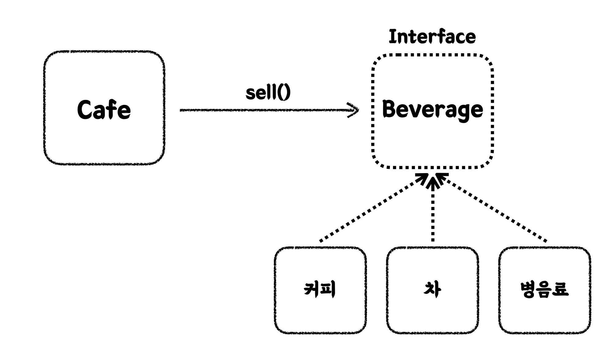

# Readable code

<details>

<summary>Properties</summary>

:pencil:2024.08.16

:page_facing_up: [읽기 좋은 코드를 작성하는 사고법](https://www.inflearn.com/course/readable-code-%EC%9D%BD%EA%B8%B0%EC%A2%8B%EC%9D%80%EC%BD%94%EB%93%9C-%EC%9E%91%EC%84%B1%EC%82%AC%EA%B3%A0%EB%B2%95/dashboard)

:paperclip: 추상의 관점으로 바라보는 객체 지향, 객체 설계하기 (1)


</details>

## 객체지향 패러다임
- 비공개 필드(데이터) + 비공개 메서드(코드)의 조합을 공개 메서드로 외부 객체와 소통 하는 방식
- 외부 객체와 소통 하는 방식 덕분에 객체의 협력과 책임이 발생



 객체가 제공 하는 것
- 객체의 생성은 관심사를 기준으로 하기 때문에 유지 보수의 장점 제공
- 다양한 객체가 협력 할 때 구현하는 코드 레벨에서 소통 하는 것이 아닌 추상화 레벨에서 비즈니스 로직을 다룰 수 있는 방식 제공



### 새로운 객체를 만들 때 주의 할 점

1. **관심사가 여러개는 아닌지 확인하기**

	- 해당 객체를 왜 만들어야 하는가?

	- 객체로 인해 외부 객체와 어떤 소통을 하고자 하는가?

2. **`setter` 사용 자제**

	- 가변적인 데이터는 어떠한 사이드 이펙트의 여지를 남길 수 있음

	- 외부 데이터를 이용하지 않고 객체 내부에서 처리가 가능한지 확인하기

	- 외부 데이터를 이용 해야 하는 경우
		- 단순 데이터를 업데이트 하는 네이밍 사용하기 → ex) `updateAction`
	
	**Example use case**:

	```java
	public class Cell {  
		private int nearbyLandMineCount;
		
		private Cell(int nearbyLandMineCount) {  
			this.nearbyLandMineCount = nearbyLandMineCount;  
		}
	
		public void updateNearbyLandMineCount(int count) {  
			this.nearbyLandMineCount = count;  
		}
	}
	```

3. **`getter` 메서드는 요구사항에 의해 변경되지 않는 한 초기 생성 자제, 꼭 필요한 경우만 생성**

	- 아래 예시를 보고 `getter` 는 폭력적인 메서드라는 것을 기억하자

	- 상황: 친구들과 술집에 갔는데 종업원이 신분증을 검사 하고 있다.

		- `getter` 를 사용 하는 경우의 코드 해석
			- 종업원이 다짜고짜 다가와 내 주머니에서 지갑을 꺼내고 지갑에서 신분증을 꺼내고 나이를 확인 한 다음 입장을 시킨다.

		- 객체 메서드를 이용하는 경우
			- 종업원이 손님에게 "19" 살 이상인지 정중하게 묻고 맞다면 입장시킨다.

	- 위 상황을 어울러 봤을 때 `getter` 는 얼마나 폭력적인가? 객체를 존중 하도록하자.

	```java
	Person person = new Person();

	// Getter를 이용하는 경우
	if (person.get지갑().get신분증().findAge() >= 19) {
		pass();
	}

	// 객체의 공개 메서드를 이용 하는 경우
	if (person.isAgeGreaterThanOrEqualTo(19)) {
		pass();
	}
	```

	**Example use case**:

	```java
	public class Cell {  
  
	    private static final String FLAG_SIGN = "⚑";  
	    private static final String LAND_MINE_SIGN = "☼";  
	    private static final String UNCHECKED_SIGN = "□";  
	    private static final String EMPTY_SIGN = "■";  
	  
	    private int nearbyLandMineCount;  
	    private boolean isLandMine;  
	    private boolean isFlagged;  
	    private boolean isOpened;


		public String getSign() {  
		    if (isOpened) {  
		        if (isLandMine) {  
		            return LAND_MINE_SIGN;  
		        } 
		        if (hasLandMineCount()) {  
		            return String.valueOf(nearbyLandMineCount);  
		        }
		        return EMPTY_SIGN;  
		    }  
		    if (isFlagged) {  
		        return FLAG_SIGN;  
		    }
		      
		    return UNCHECKED_SIGN;
		    }
	}
	```

4. **무분별한 `getter`, `setter` 대신 객체에게 메세지를 보낼 것**

5. **객체가 갖고 있는 필드는 적을수록 좋다**

	- 필드가 많을수록 처리해야 할 복잡한 내용들이 증가함

	- 일부 필드를 사용 하는 대신 메서드로 해결 할 수 있는것인지 고민 해볼 것

		- 단, 시간복잡도가 큰 메서드를 제공할 때 매번 호출되는 것이 성능상 문제가 생긴다면 필드로 사전에 최초 생성하는 방식이 더 나을 수 있음


## SOLID 원칙 알아보기

### SRP: Single Responsibility Principle

- 하나의 클래스는 단 한 가지의 변경 이유만을 가져야 한다.
- 관심사의 분리
- 높은 응집도, 낮은 결합도
	- → ‘변경 이유’ = 책임
- 객체가 가진 공개 메서드, 필드, 상수 등은
- 해당 객체의 단일 책임에 의해서만 변경 되는가?


쉽게 예를 든다면 아래와 같이 화면에 보여주는 동작을 하는 구현체와 가까운 코드 뭉치를 `OutputHandler` 가 관리를 하여 메서드를 추상화 시키면 메인 코드에서 쉽게 관리할 수 있고 사용자에게 출력 할 내용을 하나의 객체에서 관리할 수 있고 반대로 사용자가 입력해야 하는 구현체를 갖고 있는 객체는 `InputHandler` 에서 관리할 수 있다.

이렇게 입력과 출력을 관리하는 객체는 극히 작은 예시일 뿐 이지만 비즈니스 로직을 담고 있는 코드 객체는 본인의 책임에 따른 관심사를 기준으로 잡는다면 메인 로직이나 바라보는 관점이 달라질 수 있기 때문에 항상 메서드의 시그니처를 생각 할 때 어떤 정보가 필요한지, 해당 객체에서 관리하는게 맞는 것인지 고민을 하는 습관이 필요하다.

	

**Example use case**:

```java
public class ConsoleOutputHandler {  

	public void showGameStartComments() {  
		System.out.println(">>>>>>>>>>>>>>>>>>>>>>>>>>>>>>>>>>");  
		System.out.println("지뢰찾기 게임 시작!");  
		System.out.println(">>>>>>>>>>>>>>>>>>>>>>>>>>>>>>>>>>");  
	}  
	public void showBoard(GameBoard board) {  
		System.out.println("   a b c d e f g h i j");  
		for (int row = 0; row < board.getRowSize(); row++) {  
			System.out.printf("%d  ", row + 1);  
			for (int col = 0; col < board.getColSize(); col++) {  
				System.out.print(board.getSign(row, col) + " ");  
			}            System.out.println();  
		
		}        System.out.println();  
	}
}

public class ConsoleInputHandler {  
	public static final Scanner SCANNER = new Scanner(System.in);  
	
	
	public String getUserInput() {  
		return SCANNER.nextLine();  
	}
}

public class Minesweeper {
	public void run() {  
		consoleOutputHandler.showGameStartComments();
	}

	private String getCellInputFromUser() {  
		consoleOutputHandler.printCommentForSelectingCell();  
		return consoleInputHandler.getUserInput();  
	}
}
```

<br></br>

### OCP: Open-Closed Principle

- 확장에는 열려 있고, 수정에는 닫혀 있어야 한다.
	- → 기존 코드의 변경 없이, 시스템의 기능을 확장할 수 있어야 한다.

- 추상화와 다형성을 활용해서 OCP를 지킬 수 있다


현재 어플리케이션이 잘 동작하고 있는 와중에 새로운 요구사항이 들어왔다고 생각 해보자.

과연 어플리케이션의 코드는 얼만큼의 수정이 일어날 것인가,  개발자가 해당 요구사항을 해결 하기 위해 쏟아야 할 피로감이 어느정도인가?

이러한 고민을 조금이나마 수월하게 해결 하기 위해서 `OCP` 원칙에 따라 메인 로직은 수정되지 않으며 구현부만 수정하는 상황을 만들어낼 수 있다.


> 설명

기존에 운영중이던 지뢰찾기 게임 로직이 있다고 가정 해보자. 지뢰찾기 게임은 가로 10칸, 세로 8칸의 보드판으로 이루어져있고 총 지뢰 갯 수는 10개로 고정 되어있다.
이 때, 사용자가 매우 시시하다고 건의를 했다.
- 난이도 조절이 가능할 것
- 난이도는 초급, 중급, 고급으로 나타내며 난이도의 상승에 따라 보드판이 넓어지고 지뢰 갯 수가 증가함

이런 요구사항을 해결 하기 위해서 SRP 원칙에 근거 하여 보드판을 다루는 기본 로직이 객체화 되어야 한다. 그 다음 어플리케이션을 실행 할 레벨에서 난이도를 조정할 수 있도록 객체를 주입 해보자.

**Example use case**:

변경 전
```java
public class GameApplication {  
  
    public static void main(String[] args) {  
        Minesweeper minesweeper = new Minesweeper();
        minesweeper.run();  
    }  
}
```

변경 후

- 인터페이스
	```java
	package cleancode.minesweeper.tobe.gamelevel;  
	  
	public interface GameLevel {  
	  
	    int getRowSize();  
	  
	    int getColSize();  
	  
	    int getLandMineCount();  
	}
	```

- 구현 객체
	```java
	package cleancode.minesweeper.tobe.gamelevel;  
	  
	public class VeryBeginner implements GameLevel{  
	  
	  
	    @Override  
	    public int getRowSize() {  
	        return 4;  
	    }  
	    @Override  
	    public int getColSize() {  
	        return 5;  
	    }  
	    @Override  
	    public int getLandMineCount() {  
	        return 2;  
	    }
	}
	```

- 메인 로직
	```java
	public class GameApplication {  
	  
	    public static void main(String[] args) {  
	        GameLevel gameLevel = new VeryBeginner();  
	  
	        Minesweeper minesweeper = new Minesweeper(gameLevel);  
	        minesweeper.run();  
	    }  
	}
	```

이렇게 인터페이스를 이용 하면 추상화 레벨에 대한 관점이 다이렉트로 드러나기 때문에 쉽게 구현체의 코드와 상관 없이 인터페이스의 메서드만을 이용 해서 보드판을 그리고, 지뢰 갯수를 생성 하는 등 어플리케이션의 최소 실행 조건이 만족하게 된다.

<br></br>

### LSP: Liskov Substitution Principle

- 상속 구조에서, 부모 클래스의 인스턴스를 자식 클래스의 인스턴스로 치환할 수 있어야 한다.
	- → 자식 클래스는 부모 클래스의 책임을 준수하며, 부모 클래스의 행동을 변경하지 않아야 한다.

- LSP를 위반하게 되는 경우
	- 상속 클래스를 사용할 때 오동작, 예상 밖의 예외가 발생하거나 이를 방지하기 위한 불필요한 타입 체크가 동반될 수 있다.

쉽게 말해, 리스코프 치환 원칙에 중점은 상속 구조에서 부모 클래스의 메서드를 자식 클래스에서 오버라이딩 하여 별도의 실행 동작을 구성하는 것을 방지하는 것을 일컫는다.

아래 예시에서 자바 다형성을 통해 구현된 메서드가 LSP를 어긋난 경우에서 어떻게 동작하고, 올바르게 사용하는 방법을 거시적으로 살펴보자.

**Example use case**:

`BAD Case` 에서는 부모 클래스인 추상클래스의 메서드가 불필요한 내용도 포함 하고 있어 자식 클래스에서 어쩔 수 없이 오버라이딩 하여 지원하지 않는 기능이라고 명시 하고 있다.

- :thumbsdown: **BAD!**

	```java
	public abstract class Cell2 {  
	  
	    private static final String FLAG_SIGN = "⚑";  
	    private static final String UNCHECKED_SIGN = "□";  
	    private static final String EMPTY_SIGN = "■";  
	  
	    private int nearbyLandMineCount;  
	    protected boolean isFlagged;  
	    protected boolean isOpened;  
	  
	    public abstract void turnOnLandMine();  
	  
	    public abstract void updateNearbyLandMineCount(int count);  
	  
	    public abstract boolean isLandMine();  
	  
	    public abstract String getSign();  
	  
	    public abstract boolean hasLandMineCount();  
	  
	    public void flag() {  
	        this.isFlagged = true;  
	    }  
	    public void open() {  
	        this.isOpened = true;  
	    }  
	    public boolean isOpened() {  
	        return isOpened;  
	    }  
	    public boolean isChecked() {  
	        return isFlagged || isOpened;  
	    }  
	}
	```


	```java
	public class LandMineCell extends Cell2{  
	  
	    private boolean isLandMine;  
	    private static final String LAND_MINE_SIGN = "☼";  
	  
	    @Override  
	    public void turnOnLandMine() {  
	        this.isLandMine = true;  
	    }  
	    @Override  
	    public void updateNearbyLandMineCount(int count) {  
	        throw new UnsupportedOperationException("지원하지 않는 기능입니다.");  
	    }  
	    @Override  
	    public boolean isLandMine() {  
	        return true;  
	    }  
	    @Override  
	    public boolean hasLandMineCount() {  
	        return false;  
	    }  
	    @Override  
	    public String getSign() {  
	        if (isOpened) {  
	            return LAND_MINE_SIGN;  
	        }  
	        if (isFlagged) {  
	  
	        }    
	    }  
	}
	```

	```java
	public class NumberCell extends Cell2{  
	  
	    private int nearbyLandMineCount;  
	  
	    public NumberCell(int nearbyLandMineCount) {  
	        this.nearbyLandMineCount = nearbyLandMineCount;  
	    }  
	  
	    @Override  
	    public void turnOnLandMine() {  
	        throw new UnsupportedOperationException("지원하지 않는 기능입니다.");  
	    }  
	    @Override  
	    public void updateNearbyLandMineCount(int count) {  
	        this.nearbyLandMineCount = count;  
	    }  
	    @Override  
	    public boolean isLandMine() {  
	        return false;  
	    }  
	    @Override  
	    public boolean hasLandMineCount() {  
	        return true;  
	    }  
	    @Override  
	    public String getSign() {  
	        if (isOpened) {  
	            return String.valueOf(nearbyLandMineCount);  
	        }  
	        if (isFlagged) {  
	            return FLAG_SIGN;  
	        }  
	        return UNCHECKED_SIGN;  
	    }
	}
	```

만약, 위와 같은 코드가 있다고 했을 때 아래와 같은 메서드를 사용 해야 하는 경우가 있다고 가정을 해보자.

```java
public void temp(Cell2 cell) {
	cell.updateNearbyLandMineCount(0);
}
```

위 메서드가 실행 되는 시점을 머릿속으로 떠올리며 어떤 문제가 있을지 생각 해 보았을 때 이런 문제가 있을 것 같다.

1. Cell2의 자식 클래스 중 `NumberCell` 이 아닌 경우는 `throw` 처리가 되어 서버 에러가 발생한다.
2. 정상 동작을 위해 해당 메서드 내부에서 기능을 지원하는 클래스로 `instance of` 타입 검사가 발생한다.

그렇기 때문에 부모 클래스에서 오버라이딩 한 기능을 사용하지 않는 자식 클래스가 있다면 별도의 에러 또는 기능을 정의 하지 말고 필요한 기능만 제공 하는 것이 바람직하다. 아래 코드는 자식 클래스에서 무조건 오버라이딩 할 필요가 없는 메서드는 제외 한 추상 클래스이다.

- :thumbsup: **Good!**

	```java
	public abstract class Cell {  
	
		protected static final String FLAG_SIGN = "⚑";  
		protected static final String UNCHECKED_SIGN = "□";  
	
		protected boolean isFlagged;  
		protected boolean isOpened;  
	
		public abstract boolean isLandMine();  
	
		public abstract String getSign();  
	
		public abstract boolean hasLandMineCount();  
	
		public void flag() {  
			this.isFlagged = true;  
		}  
		public void open() {  
			this.isOpened = true;  
		}  
		public boolean isOpened() {  
			return isOpened;  
		}  
		public boolean isChecked() {  
			return isFlagged || isOpened;  
		}  
	}
	```


### ISP: Interface Segregation Principle

- 클라이언트는 자신이 사용하지 않는 인터페이스에 의존하면 안 된다.
	- 인터페이스를 잘게 쪼개라!

- ISP를 위반하면, 불필요한 의존성으로 인해 결합도가 높아지고, 특정 기능의 변경이 여러 클래스에 영향을 미칠 수 있다.


인터페이스 1개의 여러 메서드를 갖고 있는 경우, 인터페이스를 구현 하는 구현체에서 수정이 일어날 때 메서드 시그니처에 영향을 받기 때문에 유지보수 할 때 회귀 케이스가 많이 늘어난다.

사실 바로 위에서 보았던 `LSP` 에서 상속 단계에서 불필요한 메서드를 상속 받아 기능을 사용하지 않는다고 명시 하지 말고 제외 시키는 구조를 연습 해봤다. 그 원리가 `ISP` 에서도 똑같이 적용된다.

그래서 불 필요한 메서드를 갖고 있는 인터페이스 한 개를 여러 클래스에서 구현하지 말고 **필요한 인터페이스만 유지될 수 있도록 잘게 쪼개고, 필요한 것을 다중으로 구현 하는 것이 핵심이다.**


### DIP: Dependency Inversion Principle

- 상위 수준의 모듈은 하위 수준의 모듈에 의존해서는 안 된다.

- 둘 모두 추상화에 의존해야 한다.

	- 저수준 모듈이 변경되어도, 고수준 모듈에는 영향이 가지 않는다.




고수준 모듈: 구현 되어있는 모듈을 사용 하여 추상화 된 메서드를 제공 하는 모듈

저수준 모듈: 객체 내부에서 실제 코드 레벨을 구현 하는 모듈

의존성: A객체가 B객체의 메서드를 사용 해야 하는 경우 "의존성"이 있다고 판단 함

의존성의 순방향: 고수준 모듈이 저수준 모듈을 참조하는 것

의존성의 역방향: 고수준, 저수준 모듈이 **모두 추상화에 의존**하는 것





> 왜 DIP 개념이 필요할까?

의존성을 띈다는 것은 참조 당하고 있는 객체의 메서드가 수정 될 때 참조 하고 있는 객체의 실행 결과가 달라질 수 있다. 그렇다면 매번 수정이 일어날 때 마다 A객체, B객체 전부 수정 하는 것은 개발자의 코스트를 많이 빼앗는 행위가 되는 것이 아닐까란 생각이든다.

그렇게 DIP 개념이 사용 되는데, 이는 추상화 된 모듈에서 스펙만 제공 하고, 구현체는 내부에서 어떤 행동을 하든 언제든 갈아끼워질 수 있다. 갈아 끼워진 코드는 참조 하고 있는 객체에서 스펙을 사용하고 있기 때문에 전혀 문제 될 것이 없다.

**Example use case**:

사용자의 입력, 출력을 담당하는 객체는 현재 콘솔로만 국한 되어있다. 만약 요구사항에 의해 콘솔도 사용 하지만 앞으로는 웹도 사용 된다고 해보자.

웹은 콘솔에서 사용 하는 프린트문을 쓸 수 없기 때문에 직접적으로 참조 하고 있는 객체는 당연히 메서드 실행 결과가 나타나지 않을 것이다.

간략하게 DIP 예시 코드를 살펴보자면 인터페이스로 스펙을 정의하고 구현체에서 스펙을 구현하고 메인 로직에서 스펙을 사용 한다고 보면 된다.

**인터페이스 스펙 정의**

```java
public interface InputHandler {

    String getUserInput();

}
```


**인터페이스 스펙 구현**

```java
public class ConsoleInputHandler implements InputHandler {
    public static final Scanner SCANNER = new Scanner(System.in);

    @Override
    public String getUserInput() {
        return SCANNER.nextLine();
    }
}
```

**인터페이스 스펙 사용**
```java
public class Minesweeper implements GameInitializable, GameRunnable {

    private final GameBoard gameBoard;
    private final InputHandler inputHandler;
    private final OutputHandler outputHandler;

    public Minesweeper(GameLevel gameLevel, InputHandler inputHandler, OutputHandler outputHandler) {
        gameBoard = new GameBoard(gameLevel);
        this.inputHandler = inputHandler;
        this.outputHandler = outputHandler;
    }
    private String getUserActionInputFromUser() {
        outputHandler.showCommentForUserAction();
        return inputHandler.getUserInput();
    }
}

```

**컴파일 단계에서 인터페이스의 구현체 의존성 주입**

```java
public class GameApplication {

    public static void main(String[] args) {
        GameLevel gameLevel = new VeryBeginner();
        ConsoleInputHandler consoleInputHandler = new ConsoleInputHandler();
        ConsoleOutputHandler consoleOutputHandler = new ConsoleOutputHandler();

        Minesweeper minesweeper = new Minesweeper(gameLevel, consoleInputHandler, consoleOutputHandler);
        minesweeper.initialize();
        minesweeper.run();
    }
}
```

위 단계별로 코드를 읽고 나면 대충 짐작이 된다. 의존성 역전 원칙은 저수준 모듈을 직접 참조하여 변경사항이 있을 때 마다 서로 수정을 발생 시키는 것이 아니라 추상화 된 스펙을 고수준 모듈에서 참조 하여 저수준 모듈이 비교적 쉽게 코드를 수정 할 수 있도록 해야한다.
