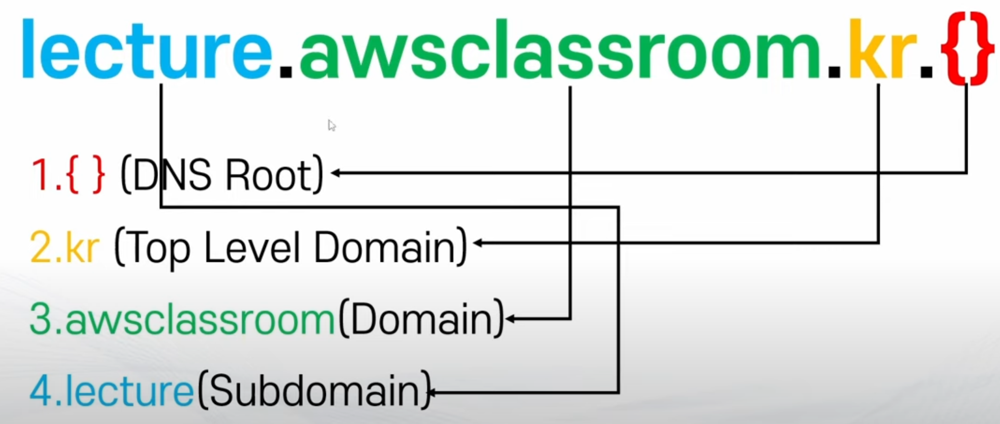
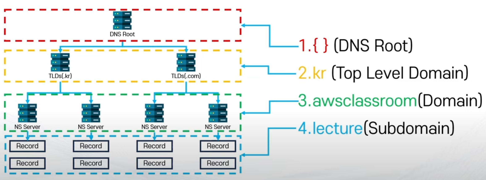
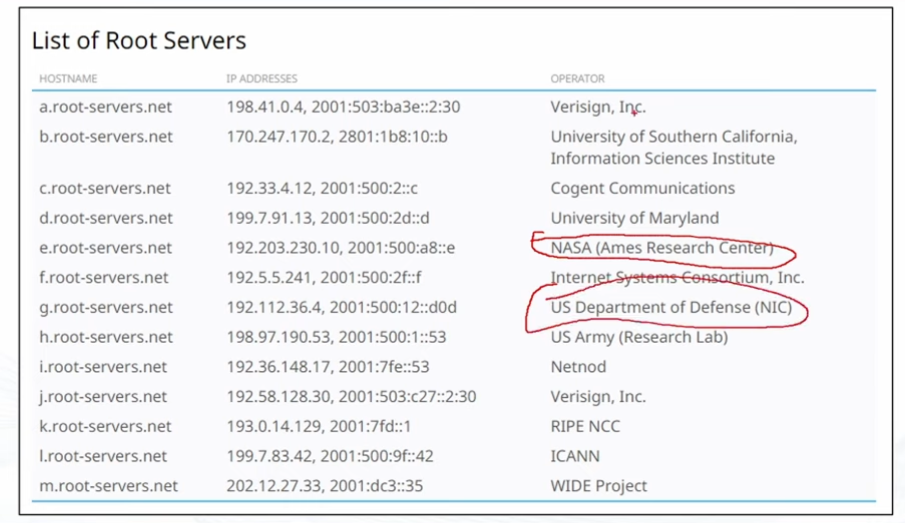
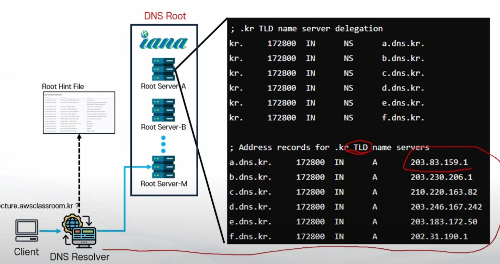
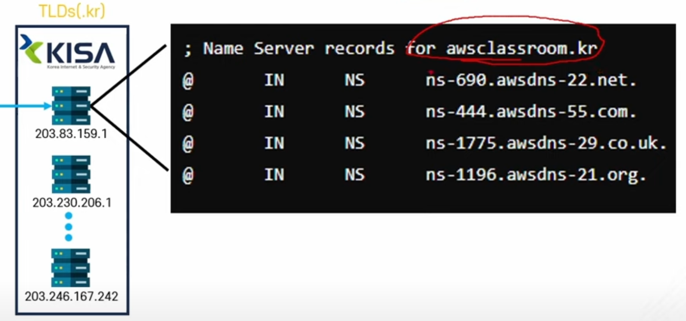
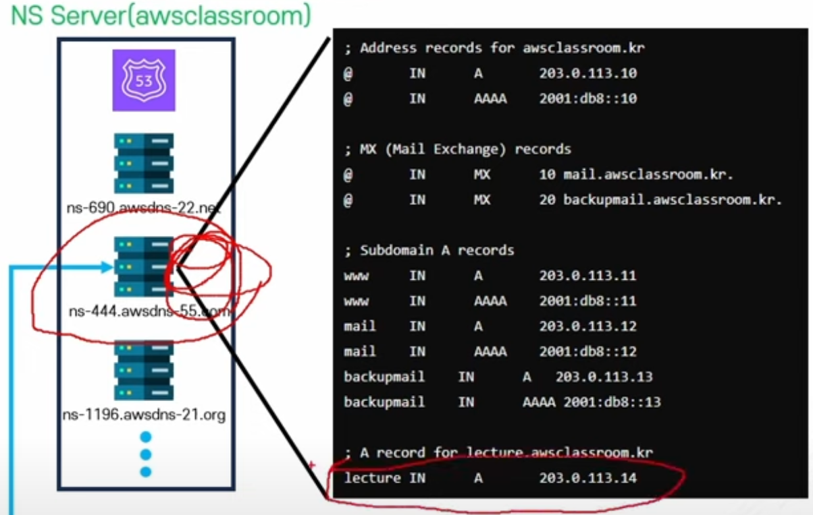

# DNS

Properties

:pencil:2024.08.09

## DNS


- 도메인 이름 시스템(DNS)는 사람이 읽을 수 있는 도메인을 머신이 읽을 수 있는 IP 주소로 변환


### DNS 주요 개념
- DNS: 사람이 읽을 수 있는 문자열과 Internet 프로토콜 기반 정보를 매칭 시켜주는 시스템
	- `ICANN` 이라는 기관에서 관리 함

- 도메인: 대상의 IP 주소 체계를 매핑 하여 사람이 읽을 수 있는 문자열
	- 서브 도메인: 도메인 정보의 추가 문자열이 붙은 도메인
		- e.g) test.example.com → 여기서 "test" 가 서브도메인에 해당
	- APEX 도메인(Zone Apex, Root Domain): 도메인 이름 중 순수한 이름만 존재하는 최상위 도메인 이름
		- e.g) example.com

- 레코드(DNS Record): 도메인이 어떤 방식으로 데이터와 매칭 되는지 정의 하는 기록
	- 다양한 레코드 종류가 있고 각각 다른 정보와 매칭 하게 됨
	- A Record: IPv4 주소와 매칭
	- MX Record: 메일 서버와 매칭

- Domain Zone: 다양한 레코드들이 어느 다른 대상과 매칭 되는지의 집합
	- e.g) www.example.com 이 어디와 매칭 되는지 등

- Zone File: Domain Zone 정보를 저장 하고 있는 파일이며 일종의 데이터베이스와 같은 역할을 함

- DNS Query: 특정 도메인에 매칭 되는 주소 정보를 요청 하는 쿼리로 "www.example.come"의 IP 주소를 묻는 행위

- Name Sever(NS): Zone File을 기반으로 DNS Query의 질문을 응답 할 수 있는 서버
	- Authoritative: DNS 정보의 원본을 보유한 최상위 NS 서버
	- None-Authoritative: 최상위 NS 서버를 조회 하여 정보를 보관 하고 있는 서버로 캐시와 같은 역할을 함 → 해당 서버에 데이터가 없다면 최상위 NS 서버에 요청, 그 전 까진 해당 서버에서 처리

- DNS Resolver: DNS Query를 요청 하는 것은 클라이언트의 컴퓨터가 아닌 DNS Resolver에서 요청을 보내며 **사용자와 NS 서버 사이에 위치한 서버이며 실제 유저의 요청에 따라 IP 주소 등의 정보를 확보하는 서버**
	- 유저의 클라이언트가 제일 먼저 쿼리를 요청 하는 대상이며 보통 ISP가 관리

### DNS의 규모
- 2024년 7월 기준 약 3억 6천만 개의 도메인이 존재

- 거의 모든 HTTP 통신에서 매번 활용

- 매우 큰 규모로 이를 호스팅 하기 위한 서버 구조에 큰 고민이 필요함
	- 일반적인 서버 구조로 분산 처리를 하더라도 초당 요청 횟 수가 굉장히 많기 때문에 관리하는 데 어려움이 잇따르기 때문

### DNS의 구성

- DNS는 계층 구조를 띄고 있음
	- 최상위 도메인부터 차례대로 계층 구조로 구성
	- 실제 레코드는 마지막 계층에서 보관하고 처리 함

	
	- 실제 모든 도메인은 "." 을 기준으로 하위 계층을 나누는 구조이며 흔히 입력하지 않는 마지막 "."은 생략 되어 사용된다.

	- 도메인을 조회 할 때 아래와 같이 계층 구조로 접근 하여 맨 마지막(NS)에 도달 하여야 정보를 얻을 수 있음 → **최대한 트래픽을 효율적으로 처리하기 위한 방식**
	

> DNS Root

- 계층 구조 최상위 레벨에 위치
	- DNS Query 수행 시 최초로 조회 되는 곳
	- 다음 단계인 TLDs(Top Level Domain)의 Zone File을 가진 NS서버의 주소 정보를 보유 하고 있음

- IANA에서 조율 하는 13개의 주체에서 관리
	- A~M 까지 각 관리 주체별로 다른 서버 주소를 보유 함

- Root Hints File
	- DNS Root의 주소를 담고 있는 파일이며 각 `DNS Resolver`에 하드코딩 되어있음

    



- DNS Resolver가 맨 처음 DNS Query 정보를 요청 할 때 계층 구조의 첫 시작점을 안다는 것은 DNS Root의 주소를 담고 있는 파일을 자신이 보유 하고 있다는 것을 알 수 있다

- 도메인 정보를 잘 모르겠다면 위 사진에 있는 내용 중 가장 적절한 곳 부터 찾아보게 된다.



> Top Level Domains(TLDs)

- DNS 계층 구조의 두 번째 계층
- 실질적으로 정보를 가지고 있는 최 상위 레벨임
	- e.g) .com, .org, .net, .info 등
- 종류
	- Country Code TLDs: 각 나라에 할당 된 두 자리 코드 정보
		- e.g) .kr, .jp, .uk, .ai
	- Sponsored TLDs: 사설 조직이나 기관에 할당 된 TLDs
		- e.g) .edu, .gov, .mil
	- New Generic TLDs: 기타 다양한 TLDs
		- e.g) .app, .tech, .xyz, .blog
- 관리 주체
	- TLDs Registry
		- .com, .net: Verisign
		- .org: Public Interest Registry
		- .kr: Korea Internet & Security Agency(KISA)
	- 실제 도메인의 레코드를 관리하는 NS서버의 주소 정보를 담은 Zone File들을 보유 하고 있음
	- www.example.com 에서 www.example.com 을 **누가 관리하고 있는지에 정보를 담고 있다**

> NS 서버

- 실제 도메인의 레코드를 가지고 있는 서버
	- 이 NS서버의 주소를 TLDs에 등록 해두면 클라이언트에서 DNS 쿼리 요청에 따라 해당 계층으로 도착 할 수 있음
- 해당 도메인 및 서브 도메인들이 어떤 프로토콜의 어떤 주소로 매핑되는지(레코드)에 관한 Zone File을 보유 하고 있음
- **여기서 최종적으로 매핑된 주소(IP 등) 확보**

### 웹 브라우저에서 도메인을 입력 하면 어떤 과정을 거칠까?

- 예시 도메인: `lecture.awsclassroom.kr`

1. 클라이언트 → DNS Resolver: 클라이언트가 DNS Resolver에게 `lecture.awsclassroom.kr`이 어떤 IP인지 물어봄
	1-1. Root Hint File에서 DNS Root를 찾아 DNS Query를 처음 요청 하게 됨
	1-2. DNS Root는 Client가 보낸 도메인 이름을 모르기 때문에 다음 계층으로 갈 수 있는 내용을 응답 하게 됨
	
    

2. DNS Resolver → TLDs(.com): DNS Resolver가 DNS Root를 통해 응답 받은 관리 주체에게 `lecture.awsclassroom.kr`이 어느 주소를 갖고 있는지 요청을 보냄
	2-1. 해당 계층에서도 도메인 이름의 전체적인 정보를 모르고 있기 때문에 `awsclassroom.kr`이 어떤 NS 서버에서 관리하고 있는지에 대한 정보를 알려줌
	
    
	
3. DNS Resolver → NS Server: DNS Resolver가 TLDs를 통해 응답 받은 관리 주체에게 `lecture.awsclassroom.kr`이 어느 주소를 갖고 있는지 요청을 보냄
	- NS서버는 최종 주소 정보를 갖고 있기 때문에 레코드와 매핑 된 주소 정보를 DNS Resolver에게 전달함
	- `lecture.awsclassroom.kr` → 203.0.113.14 라는 아이피 주소로 응답을 받음

    

4. DNS Resolver → Client: NS서버를 통해 응답 받은 값을 클라이언트에게 전달 하게 되며 실질적인 IP주소로 클라이언트가 접근하게 된다.

### 도메인 등록

- 도메인 등록 대행을 통해 등록 하게 됨 → 일정 금액을 지불 하고 도메인을 구매 하면 대행 업체에서 도메인을 등록 하는 시스템
	- 도메인 등록 대행: ICANN에게 인증 받고 TLDs Registry와 협의 하여 도메인 등록의 권한을 가진 주체
	- e.g) 가비아, GoDaddy, Cafe24, AWS Route53 등
- 등록 할 때 TLDs Registry에 자신이 원하는 NS서버 주소를 등록
	- 일종의 남은 슬롯에 자신의 NS서버를 예치 하는 개념
	- NS서버는 자신의 개인 NS서버를 사용 하거나, DNS Hosting Service 업체에서 대여가 가능함
	- DNS Hosting Service: DNS 기능을 제공 하는 주체
