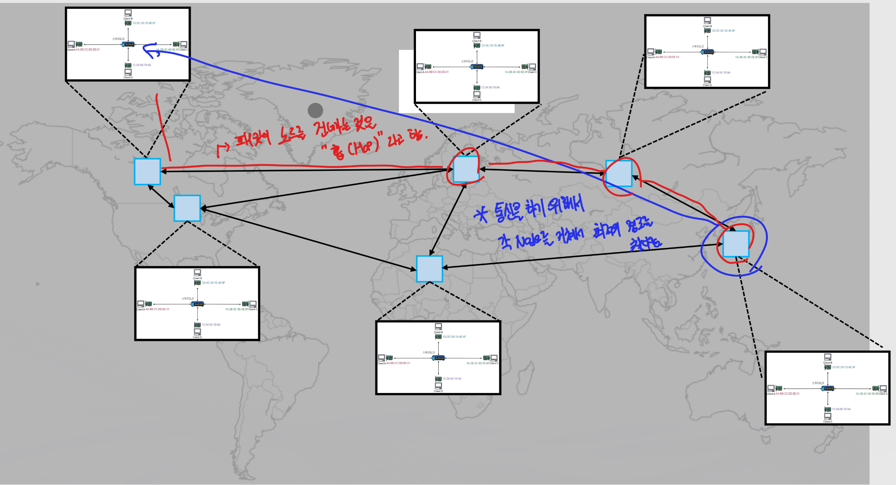
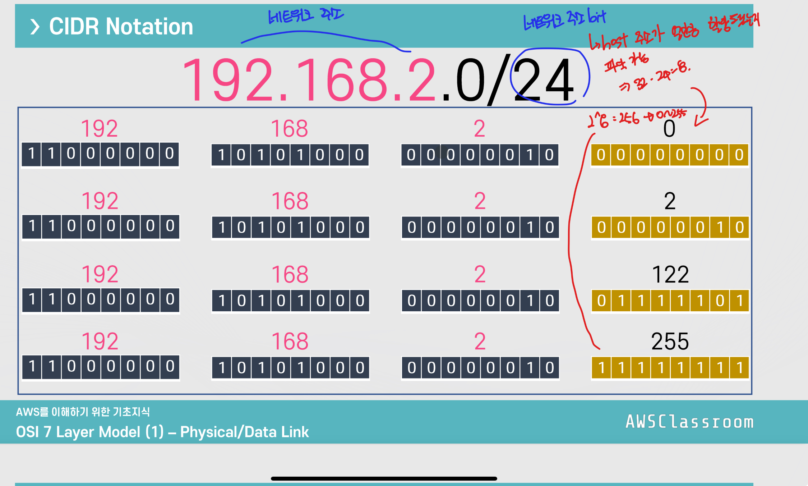
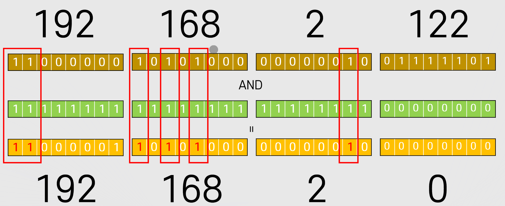
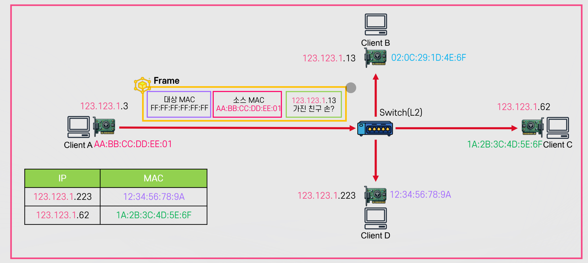
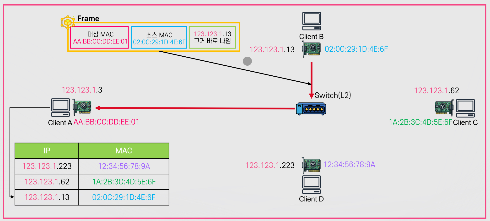
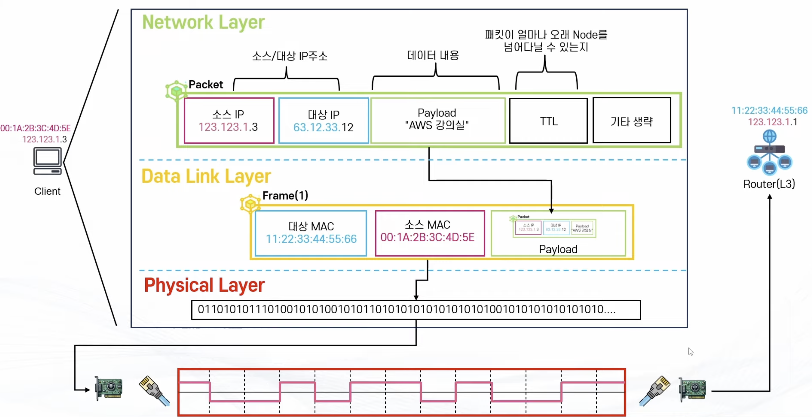
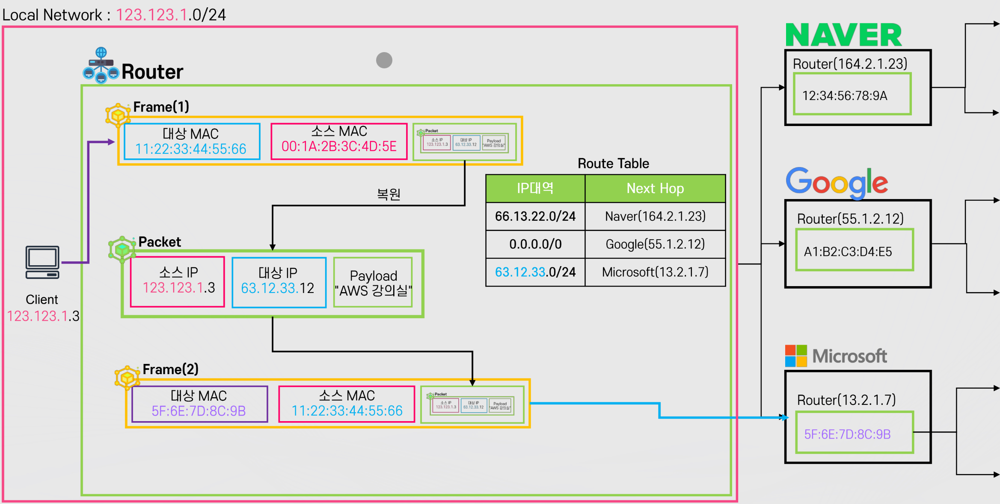
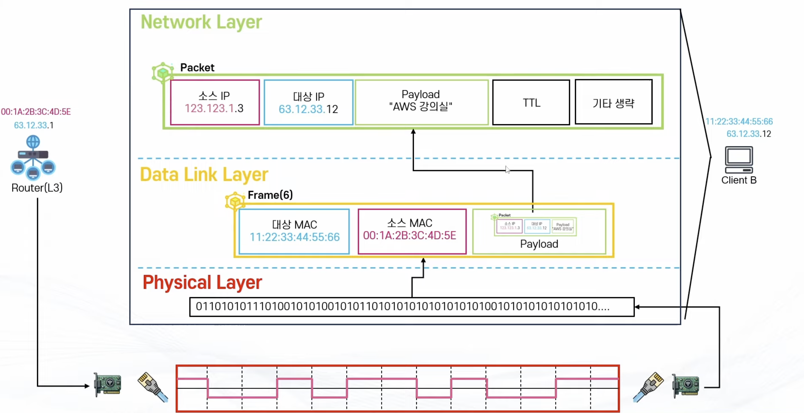

# OSI7Layer

Properties

:pencil:2024.07.03

## OSI 7 Layer Model


OSI 7 Layer Model


* 컴퓨터 네트워크 및 통신을 7개의 레이어로 표현한 모델
* 각 계층은 하위 계층의 기능을 활용해 역할을 수행하고 상위 계층으로 처리 결과를 전달 함

### Physical Layer

* 장치를 연결 하기 위한 매체의 물리적인 사항을 정의
  * 통신을 하기 위한 가장 기본적인 매체
  * 전압, 주기, 시간, 전선의 규격, 거리 등
* 주요 단위 : bits
* 대표 구성 요소
  * 케이블, 안테나, RF 등 전송매체, **허브**, **리피터**

Physical Layer는 두 주체간 어떤 방식으로 데이터를 교환 할 것인가를 다루는 물리적인 내용 이며 위 그림 처럼 와이파이, 블루투스, 광섬유, 구리선, USB 등 다양한 매체로 데이터를 교환한다.

그러므로, Physical Layer는 **물리적으로 어떻게 비트 스트림을 전달 할 것인가란 내용이 핵심이다.**


Hub


* Physical Layer 단위에서 다수의 기기들을 연결 해주는 장치
*   특징

    * 에러 /충돌 / 디바이스 별 제어 기능 없음
    * 받은 내용을 그대로 전달 하기 때문에 무조건 **Broadcast** 방식

    

허브에서 만약 클라이언트 A,B,C,D 가 동시에 요청을 보내면 충돌이 발생한다. 하지만, 허브는 충돌을 막거나 방지할 방법이 없다. 왜냐면 허브는 받은 요청을 그대로 전달만 하는 장치이기 때문이다.

그리고, 허브는 누군가에게 직접적으로 데이터를 전송 할 수도 없다. 허브는 요청을 받으면 다른 모든 매체에게 받은 요청을 전달 하기 때문이다.


Physical Layer에서 해결하지 못한 문제


* 충돌
* BroadCast만 가능 -> 대상을 지정해서 전달 할 수 없음
* 위 문제를 해결 하기 위해서는 다음 레이어인 Data Link Layer로 전달 해야한다.

### Data Link Layer

* 물리적인 통신을 제어하여 디바이스와 디바이스간의 통신 및 전송을 안정화 하기 위한 프로토콜
* 주요 단위: Frame
* 주요 구성 요소
  * **Mac Address**, **Switch**
* 주요 특징
  * CSMA/CD 방식을 활용해서 각 디바이스간의 통신을 원활하게 연결
    * CSMA/CD는 Carrier-Sense Multiple Access with Collision Detection의 약자로 충돌을 방지하는 방식이다.
  * 대상을 구별하여 디바이스간의 통신을 지원
    * 유니캐스트 방식 지원, 브로드 캐스트 방식도 가능


MAC(Media Access Control) Address


* 네트워크 인터페이스에 부여된 고유의 주소
  * 데이터가 지정한 대상에게 잘 전달될 수 있도록 대상 식별에 사용
* 2개의 Hexadecimal(byte) 단위로 6개를 나열 = 48 bits = 6byts
  * 예: 00:1A:2B:3C:4D:5E
* MAC Address는 일반적으로 2개의 파트로 구분
  * 첫 3개의 Byte는 OUI: 제조사에 부여된 고유 식별자
  * 나머지 3개의 Byte는 NIC: 네트워크 인터페이스 별 고유 번호

**네트워크 인터페이스이 MAC Address는 고유의 값이며 변하지 않음** 마치, MAC Address는 주민등록번호와 같고 IP는 주거지의 주소 정보와 같다.


Data Link Layer - Frame


- Data Link에서 Frame을 생성 하게 되면 다른 매체에게 전달 할 때 Physical Layer를 통해 거쳐가는데, 이 때 Frame을 BitStream으로 변환 하여 1010101000... 형태로 Phsyical Layer로 전달하게 된다.

 


CSMA/CD


- Carrier-Sense는 Physical Layer에서 010101 형태로 신호를 주고 받는데 **이 신호가 없을 때**만 데이터를 보내는 방식이다.

- Multiple Access는 직역 그대로 여러개가 함께 쓸 수 있다라는 내용이다.

- Collision Detection 은 데이터 신호가 없다고 판단하여 데이터를 전송 했을 때 통신하는 두 매체가 동시에 전송할 시 **충돌**이 발생 하는데, 이 충돌을 확인한다.
    - 만약 충돌이 발생 한 경우 두 매체는 일단 보내던 데이터 전송을 멈추고 Jamming Signal을 보내 "충돌이 발생 했다" 라는 것을 인지할 수 있다.
    - 충돌이 발생하면 두 매체는 랜덤한 시간을 기다린다. 만약, 랜덤한 시간을 기다렸지만 또 한번 충돌이 발생하면 조금 더 오랜 시간을 기다린다.

이런식으로 충돌을 방지하는 것이 **CSMA/CD** 이다.

- 여기서 Client A가 신호를 보내려고 한다면 Client B, C, D는 아무런 데이터를 보내지 않는 상태여야만 가능하다.

- Client A가 보내려고 할 때 Client C가 보내게 되면 다른 매체들은 모두 기다려야한다. 이럴수록 Client A가 데이터를 보내기 위해 기다리는 시간이 길어지고, 매체가 많아질수록 데이터 전송이 불가능해지는 수준이 된다.

그렇다면 이런 불편함은 어떻게 해결할까?


Switch(L2) -> Switch는 CSMA/CD를 이해하고있다.


- Switch는 어떤 디바이스가 현재 연결 되어있는지 관리하는 테이블이 존재한다.

- 프레임을 저장할 수 있는 공간이 존재한다.

> **Client A가 Client D에게 통신을 하려고 한다면?**

- Client A가 데이터를 보낼 때 Client A와 Switch간 충돌이 발생 했는지만 확인 하면 된다. 여타 다른 매체들(Client B, C, D)들이 통신이 이뤄지고 있든 없든 상관이 없다.

- 충돌이 발생 했다면 Switch는 CSMA/CD를 이해하는 것 처럼 행동하게 된다.
    - 다른 클라이언트에게 전송할 Frame을 Frame Storage에 저장하고 있다가 아무런 통신이 일어나지 않을 때 저장 되어있던 Frame을 전송하게 된다.

    - Hub는 이 기능을 수행 할 수 없지만 Switch는 연결된 모든 디바이스에게 해당 기능을 가능하게 하기 때문에 Phsycial Layer에서 해결하지 못한 문제를 여기서 해결할 수 있다.

> Switch를 요약 하자면

1. Client A가 통신하기 위해 다른 모든 디바이스를 신경 쓸 필요 없이 오로지 Client A와 Switch만 신경 쓰면 되도록 하는 것

2. 전송해야 할 Frame을 저장 해뒀다가 제대로 전달 할 수 있는 것


Data Link Layer의 BroadCast


- 대상: FF:FF:FF:FF:FF:FF -> 모두에게
- 소스 MAC: 자기 자신 MAC Address
- 스위치가 해당 내용을 받게 되면 Destination을 분석 하여 모두에게 전송하게 된다.


Data Link Layer에서 해결 하지 못한 문제


1. Local Network 외부로 통신 불가능

    

    - LocalNetwork1 -> LocalNetwork2로 통신을 할 수 없기 때문에 외부 통신을 가능하게 하기 위해서 다음 Layer인 Network Layer로 데이터를 전송해야한다. 

 

### Network Layer


    Network Layer

    💡각 각의 Local Network 혹은 Network간의 통신을 하는 방법을 정의


- 여러 노드의 경로를 찾고 올바르게 전달 될 수 있는 기능과 수단을 정의
- 단위: 패킷
- 구성 요소: **Router, IP, ARP**
- 특징: **서로 떨어진** Local Network간의 통신을 지원
    - "Network간의" -> Inter Network -> Internet
    - 중간 중간 Node들을 거쳐서 목적지 까지 도달 할 수 있는 방법을 지원

    

👉 중간 중간 노드들을 거쳐 목적지까지 도달 할 수 있는지에 대한 내용을 정의 하는 계층이다


    IP(Internet Protocol) Address


- Internet Protocol상에서 통신 주체를 식별하기 위한 아이디
    - Data Link Layer에서 MAC Address를 사용 했지만 Network Layer에서는 IP Address를 사용

- 두 가지 종류가 존재
    - IPv4: 32bits(2^32 = 약 32억개)
        - 아이피 개 수가 턱없이 부족하기 때문에 최대로 활용하기 위해서 사설(Private)IP와 공인(Public)IP로 분류
    - IPv6: 128bits(2^128 = 지구에 있는 사람 당 수만개 씩 사용해도 부족하지 않을 정도의 양)
        - 따라서 사설 IP 개념이 불 필요함
- IP Address는 디바이스당 하나의 주소를 갖게 되며 MAC Address와 다르게 수시로 변동이 가능

> IPv4
- `67.133.25.33` 과 같이 10진수로 표시되며 각 각 8Bit Binary로 이루어져 총 32Bit 주소 체계를 사용함

> IPv6
- `2001:0유8:85a3:0000:0000:8a2e:0370:7334` 처럼 16진수로 표시 되며 IPv4보다 4배 큰 128비트 주소 체계를 사용함


    CIDR(Classless Inter Domain  Routing)
    - IPv4를 표시 하는 여러 방법 중 하나
    - IP는 주소의 영역을 여러 네트워크 영역으로 나누기 위해 IP를 묶는 방식
        - 10.10.0.0/16 -> 10.10.(0~255).(0~255)
    - 여러 개의 사설망을 구축하기 위해 망을 나누는 방법



    CIDR Notation


- IP 주소의 집합
- 네트워크 주소와 호스트 주소로 구성
- 각 호스트 주소 숫자 만큼의 IP를 가진 네트워크 망 형성 가능
- A.B.C.D/E 형식
    - 예: 10.0.1.0/24, 172.16.0.0/12
    - A, B, C, D: 네트워크 주소 + 호스트 주소 표시
    - E: 0 ~ 32: 네트워크 주소가 몇 Bit 인지 표시

    


    CIDR Block


- 호스트 주소 비트만큼 IP 주소를 보유 가능
- 예: 192.168.2.0/24
    - 네트워크 비트 24
    - 호스트 주소: 32-24 = 8
    - 즉 2^8 = 256개의 IP 주소 보유
    - 192.168.2.0 ~ 192.168.2.255까지 총 256개 주소를 의미
- 네트워크 비트가 무엇이냐에 따라 같은 네트워크에 있는지 없는지를 식별할 수 잇는 정보이다.
    - 네트워크 비트가 같다면 같은 네트워크를 사용한다고 판단
    - 네트워크 비트가 다르다면 외부 네트워크와 통신 해야 한다고 판단


    Subnet Mask


- 어느 부분이 호스트 비트인지, 어느 부분이 네트워크 비트인지 구분 해주는 Mask
    - AND 연산을 활용해 네트워크 주소를 필터링

- 네트워크 비트 수 만큼 1을 보유한 마스크를 IP에 적용하면 네트워크 비트만 추출 가능

    


    라우터(Router)


- 네트워크간에 패킷을 주고 받는 Layer3 장치
- IP대역별 최적 경로를 수집 및 관리
    - 어떤 경로의 노드를 경유해야 가장 효율적으로 대상에 도착하는지 알고 있음(Router Table이 있기 때문)
    - 이 경로를 바탕으로 특정 IP 주소가 대상인 패킷의 전달을 요청 받을 때 해당 경로로 요청
- Local Network는 자신의 Local Network 주소가 아니라면 라우터로 전달
    - 확인 방법: 네트워크 주소가 같은지 확인(Subnet Mask 등)
- 이후 Router는 패킷을 Frame안에 넣어서 최적 경로에 따른 다른 Router로 전달
    - IP 주소에 따른 Frame 확인 방법: ARP
    - Frame은 MAC Address가 필요한데 Network Layer에서는 현재 IP Address로 대상을 지정하고 있음, 그러므로 IP Addres를 MAC Address로 변환하는 과정이 필요한데 이 것이 **ARP**를 통해 이루어짐


    ARP(Addre ss Resolution Protocol)


- IP Address로 MAC Address를 찾는 프로토콜
- 흐름
    - Broadcast -> MAC Address FF:FF:FF:FF:FF:FF로 IP 요청
        - 연결 되어있는 모두에게 해당 IP를 소유하고 있는지 물어봄

        

    - 응답 받은 IP MAC Address를 기반으로 MAC 확정 후 테이블에 저장
        - IP를 갖고 있는 대상의 응답을 받아 테이블에 저장 

        


    Network Layer Summary


1. 라우터까지 데이터 전달하기
    - IP 대상(63.12.33.12)이 로컬이 아닌 것을 식별 함
        - 식별 기준은 네트워크 주소가 같은지 다른지를 판단
    - 같은 네트워크가 아니라면 라우터로 전달
        - 하지만 라우터의 IP는 알지만 MAC 주소를 모르는 상황
        - 이때, ARP를 호라용 하여 IP 주소로 MAC 주소를 찾는 과정을 거침
    - 이후 해당 MAC 주소로 Frame(Data Link Layer의 데이터 단위) 생성 후 전달

    

2. 라우터에서 패킷을 분석하고 최적화 된 경로로 전달하기
    - 대상이 로컬 네트워크가 아니라면 가장 잘 전달할 수 있는 노드로 전달 하는 과정

    - 라우터로 전달 된 Frame을 확인 함
        - Frame에는 Dest, Src, Packet이 존재
    - 패킷 분석
        - 패킷에 담겨있는 대상 IP의 주소를 확인 하여 로컬 네트워크인지 아닌지 판별
    - 최적화 된 경로로 Frame 전달
        - Route Table에 대상 IP 주소와 가장 정확하게 매칭 되는 Node의 MAC 주소 저장
        - 기존에 전달 받으 Frame을 폐기하고 새롭게 생성
            - 새로운 Frame은 현재 Router의 MAC 주소, 가장 정확하게 매칭 된 Node의 MAC 주소, 기존에 전달받은 패킷을 그대로 포함 하여 생성함
        - 가장 정확하게 매칭 된 Node로 전달

    

3. 최적의 경로로 전달한 라우터에서 목적지의 로컬 네트워크로 식별 될 때 까지 2번 과정을 반복 함

4. 목적지에 도착 하여 데이터를 전달
    - 2번 과정을 거쳐 로컬 네트워크로 판별 되었을 때 더 이상 다른 경로로 전달 할 필요가 없기 때문에 Router로 보내는 것이 아닌 데이터링크 레이어의 Switch를 통해 보내게 됨
        - 이 때, 라우터 입장에서는 목적지의 MAC 주소를 알고 있기 때문에 Unicast 방식으로 어디로 보내야 하는지 알고 있음
    
    - 프레임을 새로 생성 하여 목적지 대상에게 데이터 전달
        - 라우터는 물리적인 신호로 Physical Layer를 통해 보내게 됨
        - 로컬 컴퓨터는 최초 Binary data(Physical Layer에서 변환 된 데이터)를 수신 함
        - Binary 데이터를 복원해서 확인 하면 Frame을 확인 할 수 있음
            - 대상 MAC 주소는 나 자신, 소스 주소는 전달 받은 라우터, 최초 데이터를 전달한 패킷이 들어있음
        - 패킷 내용 분석
            - 패킷은 맨 처음 보냈던 소스 IP와 대상인 나의 IP, Payload(데이터), 기타 내용이 있음
            - 패킷은 많은 노드를 거쳐 여행을 해왔지만 패킷은 변하지 않음
            - 반면 Frame은 노드를 거칠 때 마다 새롭게 생성 되었음
    
    

> 💡 여기서 알 수 있는 사실

- 데이터를 전달 할 때는 Network Layer - DataLink Layer - Physical Layer 순서로 전달 됨
- 데이터를 수신 할 때는 역 순인 Physical Layer - Data Link Layer - Network Layer를 통해 수신 함
- Packet은 최초 전달 되는 내용이 변하지 않지만 Frame은 Node를 거칠 때 마다 새롭게 생성되어 변함


    Network Layer에서 해결하지 못한 문제


- 한 번에 하나의 통신만 가능
    - 여러 어플리케이션이 동시에 통신이 불가능 함

- 패킷 등의 순서를 보장 할 수 없으며 유실에 대한 대응도 불가능
    - 라우터에 의해 최적화 된 경로로 보내지지만 매번 같은 홉을 통해 이동하는 것이 아니기 때문에 달라질 수 있음, 달라졌을 때 첫 번째 패킷보다 그 다음에 보내진 패킷이 먼저 도착할 가능성이 있음
    - 패킷이 홉에 의해 이동 하다 다음 경로가 없을 땐 유실이 될 수 있음
