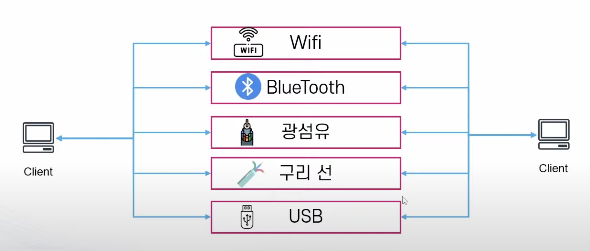
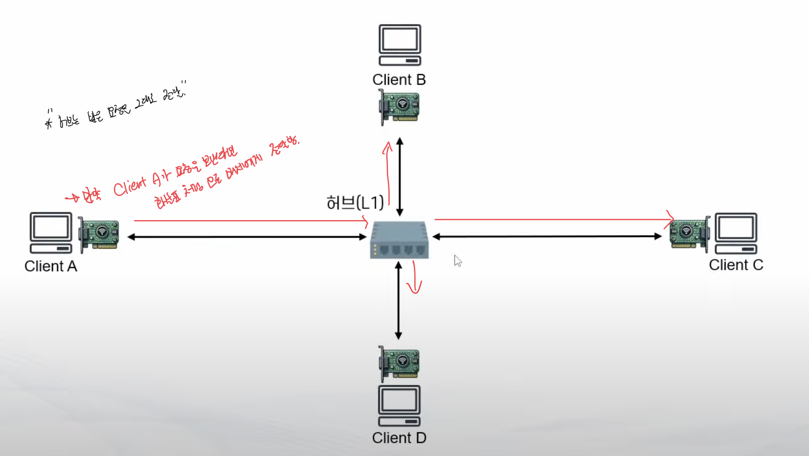

# OSI 7 Layer

Properties

:pencil:2024.07.03

## OSI 7 Layer Model

> OSI 7 Layer Model

- 컴퓨터 네트워크 및 통신을 7개의 레이어로 표현한 모델

- 각 계층은 하위 계층의 기능을 활용해 역할을 수행하고 상위 계층으로 처리 결과를 전달 함

### Physical Layer

- 장치를 연결 하기 위한 매체의 물리적인 사항을 정의
    - 통신을 하기 위한 가장 기본적인 매체
    - 전압, 주기, 시간, 전선의 규격, 거리 등

- 주요 단위 : bits
- 대표 구성 요소
    - 케이블, 안테나, RF 등 전송매체, **허브**, **리피터**

Physical Layer는 두 주체간 어떤 방식으로 데이터를 교환 할 것인가를 다루는 물리적인 내용 이며 위 그림 처럼 와이파이, 블루투스, 광섬유, 구리선, USB 등 다양한 매체로 데이터를 교환한다.

**물리적으로 어떻게 비트 스트림을 전달 할 것인가**

> Hub

- Physical Layer 단위에서 다수의 기기들을 연결 해주는 장치

- 특징
    - 에러 /충돌 / 디바이스 별 제어 기능 없음
    - 받은 내용을 그대로 전달 하기 때문에 무조건 **Broadcast** 방식

    

허브에서 만약 클라이언트 A,B,C,D 가 동시에 요청을 보내면 충돌이 발생한다. 하지만, 허브는 충돌을 막거나 방지할 방법이 없다. 왜냐면 허브는 받은 요청을 그대로 전달만 하는 장치이기 때문이다.

그리고, 허브는 누군가에게 직접적으로 데이터를 전송 할 수도 없다. 허브는 요청을 받으면 다른 모든 매체에게 받은 요청을 전달 하기 때문이다.

> Physical Layer에서 해결하지 못한 문제

- 충돌
- BroadCast만 가능 -> 대상을 지정해서 전달 할 수 없음

### Data Link Layer

- 물리적인 통신을 제어하여 디바이스와 디바이스간의 통신 및 전송을 안정화 하기 위한 프로토콜
- 주요 단위: Frame
- 주요 구성 요소
    - **Mac Address**, **Switch**

- 주요 특징
    - CSMA/CD 방식을 활용해서 각 디바이스간의 통신을 원활하게 연결
        - CSMA/CD는 Carrier-Sense Multiple Access with Collision Detection의 약자로 충돌을 방지하는 방식이다.
    - 대상을 구별하여 디바이스간의 통신을 지원
        - 유니캐스트 방식 지원, 브로드 캐스트 방식도 가능

> MAC(Media Access Control) Address

- 네트워크 인터페이스에 부여된 고유의 주소
    - 데이터가 지정한 대상에게 잘 전달될 수 있도록 대상 식별에 사용
- 2개의 Hexadecimal(byte) 단위로 6개를 나열 = 48 bits = 6byts
    - 예: 00:1A:2B:3C:4D:5E
- MAC Address는 일반적으로 2개의 파트로 구분
    - 첫 3개의 Byte는 OUI: 제조사에 부여된 고유 식별자
    - 나머지 3개의 Byte는 NIC: 네트워크 인터페이스 별 고유 번호

**네트워크 인터페이스이 MAC Address는 고유의 값이며 변하지 않음**
마치, MAC Address는 주민등록번호와 같고 IP는 주거지의 주소 정보와 같다.

