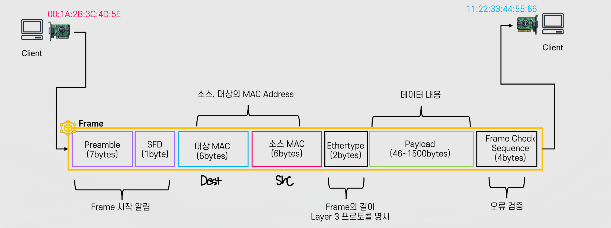
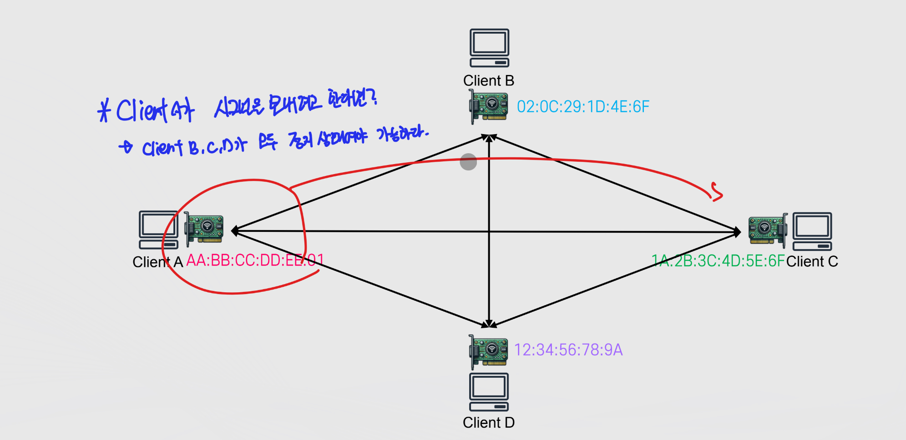
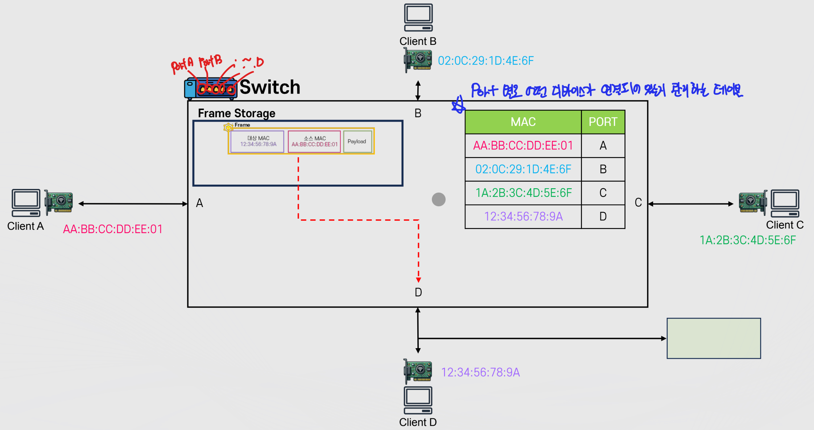
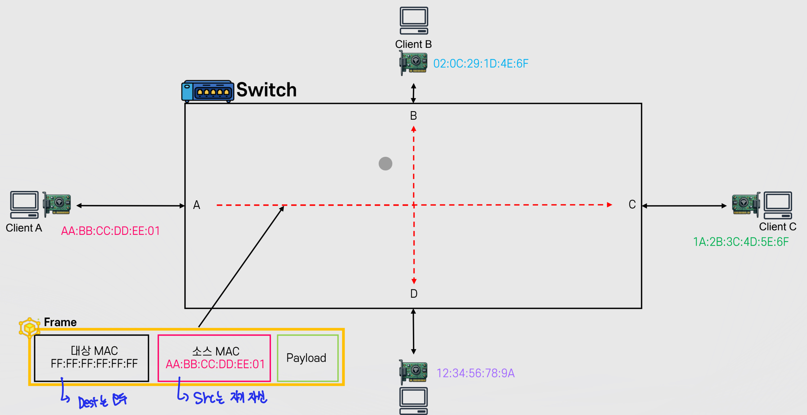
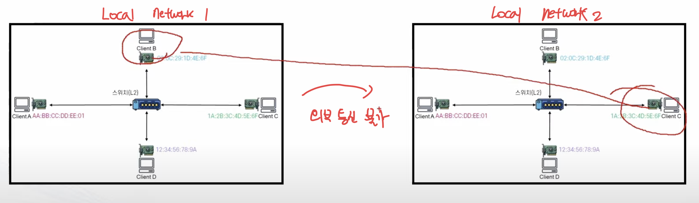

# OSI7Layer

Properties

:pencil:2024.07.03

## OSI 7 Layer Model


OSI 7 Layer Model


* 컴퓨터 네트워크 및 통신을 7개의 레이어로 표현한 모델
* 각 계층은 하위 계층의 기능을 활용해 역할을 수행하고 상위 계층으로 처리 결과를 전달 함

### Physical Layer

* 장치를 연결 하기 위한 매체의 물리적인 사항을 정의
  * 통신을 하기 위한 가장 기본적인 매체
  * 전압, 주기, 시간, 전선의 규격, 거리 등
* 주요 단위 : bits
* 대표 구성 요소
  * 케이블, 안테나, RF 등 전송매체, **허브**, **리피터**

Physical Layer는 두 주체간 어떤 방식으로 데이터를 교환 할 것인가를 다루는 물리적인 내용 이며 위 그림 처럼 와이파이, 블루투스, 광섬유, 구리선, USB 등 다양한 매체로 데이터를 교환한다.

그러므로, Physical Layer는 **물리적으로 어떻게 비트 스트림을 전달 할 것인가란 내용이 핵심이다.**


Hub


* Physical Layer 단위에서 다수의 기기들을 연결 해주는 장치
*   특징

    * 에러 /충돌 / 디바이스 별 제어 기능 없음
    * 받은 내용을 그대로 전달 하기 때문에 무조건 **Broadcast** 방식

    

허브에서 만약 클라이언트 A,B,C,D 가 동시에 요청을 보내면 충돌이 발생한다. 하지만, 허브는 충돌을 막거나 방지할 방법이 없다. 왜냐면 허브는 받은 요청을 그대로 전달만 하는 장치이기 때문이다.

그리고, 허브는 누군가에게 직접적으로 데이터를 전송 할 수도 없다. 허브는 요청을 받으면 다른 모든 매체에게 받은 요청을 전달 하기 때문이다.


Physical Layer에서 해결하지 못한 문제


* 충돌
* BroadCast만 가능 -> 대상을 지정해서 전달 할 수 없음
* 위 문제를 해결 하기 위해서는 다음 레이어인 Data Link Layer로 전달 해야한다.

### Data Link Layer

* 물리적인 통신을 제어하여 디바이스와 디바이스간의 통신 및 전송을 안정화 하기 위한 프로토콜
* 주요 단위: Frame
* 주요 구성 요소
  * **Mac Address**, **Switch**
* 주요 특징
  * CSMA/CD 방식을 활용해서 각 디바이스간의 통신을 원활하게 연결
    * CSMA/CD는 Carrier-Sense Multiple Access with Collision Detection의 약자로 충돌을 방지하는 방식이다.
  * 대상을 구별하여 디바이스간의 통신을 지원
    * 유니캐스트 방식 지원, 브로드 캐스트 방식도 가능


MAC(Media Access Control) Address


* 네트워크 인터페이스에 부여된 고유의 주소
  * 데이터가 지정한 대상에게 잘 전달될 수 있도록 대상 식별에 사용
* 2개의 Hexadecimal(byte) 단위로 6개를 나열 = 48 bits = 6byts
  * 예: 00:1A:2B:3C:4D:5E
* MAC Address는 일반적으로 2개의 파트로 구분
  * 첫 3개의 Byte는 OUI: 제조사에 부여된 고유 식별자
  * 나머지 3개의 Byte는 NIC: 네트워크 인터페이스 별 고유 번호

**네트워크 인터페이스이 MAC Address는 고유의 값이며 변하지 않음** 마치, MAC Address는 주민등록번호와 같고 IP는 주거지의 주소 정보와 같다.


Data Link Layer - Frame


- Data Link에서 Frame을 생성 하게 되면 다른 매체에게 전달 할 때 Physical Layer를 통해 거쳐가는데, 이 때 Frame을 BitStream으로 변환 하여 1010101000... 형태로 Phsyical Layer로 전달하게 된다.

 


CSMA/CD


- Carrier-Sense는 Physical Layer에서 010101 형태로 신호를 주고 받는데 **이 신호가 없을 때**만 데이터를 보내는 방식이다.

- Multiple Access는 직역 그대로 여러개가 함께 쓸 수 있다라는 내용이다.

- Collision Detection 은 데이터 신호가 없다고 판단하여 데이터를 전송 했을 때 통신하는 두 매체가 동시에 전송할 시 **충돌**이 발생 하는데, 이 충돌을 확인한다.
    - 만약 충돌이 발생 한 경우 두 매체는 일단 보내던 데이터 전송을 멈추고 Jamming Signal을 보내 "충돌이 발생 했다" 라는 것을 인지할 수 있다.
    - 충돌이 발생하면 두 매체는 랜덤한 시간을 기다린다. 만약, 랜덤한 시간을 기다렸지만 또 한번 충돌이 발생하면 조금 더 오랜 시간을 기다린다.

이런식으로 충돌을 방지하는 것이 **CSMA/CD** 이다.

- 여기서 Client A가 신호를 보내려고 한다면 Client B, C, D는 아무런 데이터를 보내지 않는 상태여야만 가능하다.

- Client A가 보내려고 할 때 Client C가 보내게 되면 다른 매체들은 모두 기다려야한다. 이럴수록 Client A가 데이터를 보내기 위해 기다리는 시간이 길어지고, 매체가 많아질수록 데이터 전송이 불가능해지는 수준이 된다.

그렇다면 이런 불편함은 어떻게 해결할까?


Switch(L2) -> Switch는 CSMA/CD를 이해하고있다.


- Switch는 어떤 디바이스가 현재 연결 되어있는지 관리하는 테이블이 존재한다.

- 프레임을 저장할 수 있는 공간이 존재한다.

> **Client A가 Client D에게 통신을 하려고 한다면?**

- Client A가 데이터를 보낼 때 Client A와 Switch간 충돌이 발생 했는지만 확인 하면 된다. 여타 다른 매체들(Client B, C, D)들이 통신이 이뤄지고 있든 없든 상관이 없다.

- 충돌이 발생 했다면 Switch는 CSMA/CD를 이해하는 것 처럼 행동하게 된다.
    - 다른 클라이언트에게 전송할 Frame을 Frame Storage에 저장하고 있다가 아무런 통신이 일어나지 않을 때 저장 되어있던 Frame을 전송하게 된다.

    - Hub는 이 기능을 수행 할 수 없지만 Switch는 연결된 모든 디바이스에게 해당 기능을 가능하게 하기 때문에 Phsycial Layer에서 해결하지 못한 문제를 여기서 해결할 수 있다.

> Switch를 요약 하자면

1. Client A가 통신하기 위해 다른 모든 디바이스를 신경 쓸 필요 없이 오로지 Client A와 Switch만 신경 쓰면 되도록 하는 것

2. 전송해야 할 Frame을 저장 해뒀다가 제대로 전달 할 수 있는 것


Data Link Layer의 BroadCast


- 대상: FF:FF:FF:FF:FF:FF -> 모두에게
- 소스 MAC: 자기 자신 MAC Address
- 스위치가 해당 내용을 받게 되면 Destination을 분석 하여 모두에게 전송하게 된다.


Data Link Layer에서 해결 하지 못한 문제


1. Local Network 외부로 통신 불가능

    

    - LocalNetwork1 -> LocalNetwork2로 통신을 할 수 없기 때문에 외부 통신을 가능하게 하기 위해서 다음 Layer인 Network Layer로 데이터를 전송해야한다.