# OSI7Layer

Properties

:pencil:2024.07.03

## OSI 7 Layer Model


OSI 7 Layer Model: 1970s ~ 


* 컴퓨터 네트워크 및 통신을 7개의 레이어로 표현한 모델
* 각 계층은 하위 계층의 기능을 활용해 역할을 수행하고 상위 계층으로 처리 결과를 전달 함

## 하드웨어 모델 계층

### Physical Layer

* 장치를 연결 하기 위한 매체의 물리적인 사항을 정의
  * 통신을 하기 위한 가장 기본적인 매체
  * 전압, 주기, 시간, 전선의 규격, 거리 등
* 주요 단위 : bits
* 대표 구성 요소
  * 케이블, 안테나, RF 등 전송매체, **허브**, **리피터**

Physical Layer는 두 주체간 어떤 방식으로 데이터를 교환 할 것인가를 다루는 물리적인 내용 이며 위 그림 처럼 와이파이, 블루투스, 광섬유, 구리선, USB 등 다양한 매체로 데이터를 교환한다.

그러므로, Physical Layer는 **물리적으로 어떻게 비트 스트림을 전달 할 것인가란 내용이 핵심이다.**


Hub


* Physical Layer 단위에서 다수의 기기들을 연결 해주는 장치
*   특징

    * 에러 /충돌 / 디바이스 별 제어 기능 없음
    * 받은 내용을 그대로 전달 하기 때문에 무조건 **Broadcast** 방식

    

허브에서 만약 클라이언트 A,B,C,D 가 동시에 요청을 보내면 충돌이 발생한다. 하지만, 허브는 충돌을 막거나 방지할 방법이 없다. 왜냐면 허브는 받은 요청을 그대로 전달만 하는 장치이기 때문이다.

그리고, 허브는 누군가에게 직접적으로 데이터를 전송 할 수도 없다. 허브는 요청을 받으면 다른 모든 매체에게 받은 요청을 전달 하기 때문이다.


Physical Layer에서 해결하지 못한 문제


* 충돌
* BroadCast만 가능 -> 대상을 지정해서 전달 할 수 없음
* 위 문제를 해결 하기 위해서는 다음 레이어인 Data Link Layer로 전달 해야한다.

### Data Link Layer

* 물리적인 통신을 제어하여 디바이스와 디바이스간의 통신 및 전송을 안정화 하기 위한 프로토콜
* 주요 단위: Frame
* 주요 구성 요소
  * **Mac Address**, **Switch**
* 주요 특징
  * CSMA/CD 방식을 활용해서 각 디바이스간의 통신을 원활하게 연결
    * CSMA/CD는 Carrier-Sense Multiple Access with Collision Detection의 약자로 충돌을 방지하는 방식이다.
  * 대상을 구별하여 디바이스간의 통신을 지원
    * 유니캐스트 방식 지원, 브로드 캐스트 방식도 가능


MAC(Media Access Control) Address


* 네트워크 인터페이스에 부여된 고유의 주소
  * 데이터가 지정한 대상에게 잘 전달될 수 있도록 대상 식별에 사용
* 2개의 Hexadecimal(byte) 단위로 6개를 나열 = 48 bits = 6byts
  * 예: 00:1A:2B:3C:4D:5E
* MAC Address는 일반적으로 2개의 파트로 구분
  * 첫 3개의 Byte는 OUI: 제조사에 부여된 고유 식별자
  * 나머지 3개의 Byte는 NIC: 네트워크 인터페이스 별 고유 번호

**네트워크 인터페이스이 MAC Address는 고유의 값이며 변하지 않음** 마치, MAC Address는 주민등록번호와 같고 IP는 주거지의 주소 정보와 같다.


Data Link Layer - Frame


- Data Link에서 Frame을 생성 하게 되면 다른 매체에게 전달 할 때 Physical Layer를 통해 거쳐가는데, 이 때 Frame을 BitStream으로 변환 하여 1010101000... 형태로 Phsyical Layer로 전달하게 된다.

 


CSMA/CD


- Carrier-Sense는 Physical Layer에서 010101 형태로 신호를 주고 받는데 **이 신호가 없을 때**만 데이터를 보내는 방식이다.

- Multiple Access는 직역 그대로 여러개가 함께 쓸 수 있다라는 내용이다.

- Collision Detection 은 데이터 신호가 없다고 판단하여 데이터를 전송 했을 때 통신하는 두 매체가 동시에 전송할 시 **충돌**이 발생 하는데, 이 충돌을 확인한다.
    - 만약 충돌이 발생 한 경우 두 매체는 일단 보내던 데이터 전송을 멈추고 Jamming Signal을 보내 "충돌이 발생 했다" 라는 것을 인지할 수 있다.
    - 충돌이 발생하면 두 매체는 랜덤한 시간을 기다린다. 만약, 랜덤한 시간을 기다렸지만 또 한번 충돌이 발생하면 조금 더 오랜 시간을 기다린다.

이런식으로 충돌을 방지하는 것이 **CSMA/CD** 이다.

- 여기서 Client A가 신호를 보내려고 한다면 Client B, C, D는 아무런 데이터를 보내지 않는 상태여야만 가능하다.

- Client A가 보내려고 할 때 Client C가 보내게 되면 다른 매체들은 모두 기다려야한다. 이럴수록 Client A가 데이터를 보내기 위해 기다리는 시간이 길어지고, 매체가 많아질수록 데이터 전송이 불가능해지는 수준이 된다.

그렇다면 이런 불편함은 어떻게 해결할까?


Switch(L2) -> Switch는 CSMA/CD를 이해하고있다.


- Switch는 어떤 디바이스가 현재 연결 되어있는지 관리하는 테이블이 존재한다.

- 프레임을 저장할 수 있는 공간이 존재한다.

> **Client A가 Client D에게 통신을 하려고 한다면?**

- Client A가 데이터를 보낼 때 Client A와 Switch간 충돌이 발생 했는지만 확인 하면 된다. 여타 다른 매체들(Client B, C, D)들이 통신이 이뤄지고 있든 없든 상관이 없다.

- 충돌이 발생 했다면 Switch는 CSMA/CD를 이해하는 것 처럼 행동하게 된다.
    - 다른 클라이언트에게 전송할 Frame을 Frame Storage에 저장하고 있다가 아무런 통신이 일어나지 않을 때 저장 되어있던 Frame을 전송하게 된다.

    - Hub는 이 기능을 수행 할 수 없지만 Switch는 연결된 모든 디바이스에게 해당 기능을 가능하게 하기 때문에 Phsycial Layer에서 해결하지 못한 문제를 여기서 해결할 수 있다.

> Switch를 요약 하자면

1. Client A가 통신하기 위해 다른 모든 디바이스를 신경 쓸 필요 없이 오로지 Client A와 Switch만 신경 쓰면 되도록 하는 것

2. 전송해야 할 Frame을 저장 해뒀다가 제대로 전달 할 수 있는 것


Data Link Layer의 BroadCast


- 대상: FF:FF:FF:FF:FF:FF -> 모두에게
- 소스 MAC: 자기 자신 MAC Address
- 스위치가 해당 내용을 받게 되면 Destination을 분석 하여 모두에게 전송하게 된다.


Data Link Layer에서 해결 하지 못한 문제


1. Local Network 외부로 통신 불가능

    

    - LocalNetwork1 -> LocalNetwork2로 통신을 할 수 없기 때문에 외부 통신을 가능하게 하기 위해서 다음 Layer인 Network Layer로 데이터를 전송해야한다. 

 

### Network Layer


Network Layer

💡각 각의 Local Network 혹은 Network간의 통신을 하는 방법을 정의


- 여러 노드의 경로를 찾고 올바르게 전달 될 수 있는 기능과 수단을 정의
- 단위: 패킷
- 구성 요소: **Router, IP, ARP**
- 특징: **서로 떨어진** Local Network간의 통신을 지원
    - "Network간의" -> Inter Network -> Internet
    - 중간 중간 Node들을 거쳐서 목적지 까지 도달 할 수 있는 방법을 지원

    

👉 중간 중간 노드들을 거쳐 목적지까지 도달 할 수 있는지에 대한 내용을 정의 하는 계층이다


IP(Internet Protocol) Address


- Internet Protocol상에서 통신 주체를 식별하기 위한 아이디
    - Data Link Layer에서 MAC Address를 사용 했지만 Network Layer에서는 IP Address를 사용

- 두 가지 종류가 존재
    - IPv4: 32bits(2^32 = 약 32억개)
        - 아이피 개 수가 턱없이 부족하기 때문에 최대로 활용하기 위해서 사설(Private)IP와 공인(Public)IP로 분류
    - IPv6: 128bits(2^128 = 지구에 있는 사람 당 수만개 씩 사용해도 부족하지 않을 정도의 양)
        - 따라서 사설 IP 개념이 불 필요함
- IP Address는 디바이스당 하나의 주소를 갖게 되며 MAC Address와 다르게 수시로 변동이 가능

> IPv4
- `67.133.25.33` 과 같이 10진수로 표시되며 각 각 8Bit Binary로 이루어져 총 32Bit 주소 체계를 사용함

> IPv6
- `2001:0유8:85a3:0000:0000:8a2e:0370:7334` 처럼 16진수로 표시 되며 IPv4보다 4배 큰 128비트 주소 체계를 사용함


CIDR(Classless Inter Domain  Routing)
- IPv4를 표시 하는 여러 방법 중 하나
- IP는 주소의 영역을 여러 네트워크 영역으로 나누기 위해 IP를 묶는 방식
    - 10.10.0.0/16 -> 10.10.(0~255).(0~255)
- 여러 개의 사설망을 구축하기 위해 망을 나누는 방법



CIDR Notation


- IP 주소의 집합
- 네트워크 주소와 호스트 주소로 구성
- 각 호스트 주소 숫자 만큼의 IP를 가진 네트워크 망 형성 가능
- A.B.C.D/E 형식
    - 예: 10.0.1.0/24, 172.16.0.0/12
    - A, B, C, D: 네트워크 주소 + 호스트 주소 표시
    - E: 0 ~ 32: 네트워크 주소가 몇 Bit 인지 표시

    


CIDR Block


- 호스트 주소 비트만큼 IP 주소를 보유 가능
- 예: 192.168.2.0/24
    - 네트워크 비트 24
    - 호스트 주소: 32-24 = 8
    - 즉 2^8 = 256개의 IP 주소 보유
    - 192.168.2.0 ~ 192.168.2.255까지 총 256개 주소를 의미
- 네트워크 비트가 무엇이냐에 따라 같은 네트워크에 있는지 없는지를 식별할 수 있는 정보이다.
    - 네트워크 비트가 같다면 같은 네트워크를 사용한다고 판단
    - 네트워크 비트가 다르다면 외부 네트워크와 통신 해야 한다고 판단


Subnet Mask


- 어느 부분이 호스트 비트인지, 어느 부분이 네트워크 비트인지 구분 해주는 Mask
    - AND 연산을 활용해 네트워크 주소를 필터링

- 네트워크 비트 수 만큼 1을 보유한 마스크를 IP에 적용하면 네트워크 비트만 추출 가능

    


라우터(Router)


- 네트워크간에 패킷을 주고 받는 Layer3 장치
- IP대역별 최적 경로를 수집 및 관리
    - 어떤 경로의 노드를 경유해야 가장 효율적으로 대상에 도착하는지 알고 있음(Router Table이 있기 때문)
    - 이 경로를 바탕으로 특정 IP 주소가 대상인 패킷의 전달을 요청 받을 때 해당 경로로 요청
- Local Network는 자신의 Local Network 주소가 아니라면 라우터로 전달
    - 확인 방법: 네트워크 주소가 같은지 확인(Subnet Mask 등)
- 이후 Router는 패킷을 Frame안에 넣어서 최적 경로에 따른 다른 Router로 전달
    - IP 주소에 따른 Frame 확인 방법: ARP
    - Frame은 MAC Address가 필요한데 Network Layer에서는 현재 IP Address로 대상을 지정하고 있음, 그러므로 IP Addres를 MAC Address로 변환하는 과정이 필요한데 이 것이 **ARP**를 통해 이루어짐


ARP(Addre ss Resolution Protocol)


- IP Address로 MAC Address를 찾는 프로토콜
- 흐름
    - Broadcast -> MAC Address FF:FF:FF:FF:FF:FF로 IP 요청
        - 연결 되어있는 모두에게 해당 IP를 소유하고 있는지 물어봄

        

    - 응답 받은 IP MAC Address를 기반으로 MAC 확정 후 테이블에 저장
        - IP를 갖고 있는 대상의 응답을 받아 테이블에 저장 

        


Network Layer Summary


1. 라우터까지 데이터 전달하기
    - IP 대상(63.12.33.12)이 로컬이 아닌 것을 식별 함
        - 식별 기준은 네트워크 주소가 같은지 다른지를 판단
    - 같은 네트워크가 아니라면 라우터로 전달
        - 하지만 라우터의 IP는 알지만 MAC 주소를 모르는 상황
        - 이때, ARP를 호라용 하여 IP 주소로 MAC 주소를 찾는 과정을 거침
    - 이후 해당 MAC 주소로 Frame(Data Link Layer의 데이터 단위) 생성 후 전달

    

2. 라우터에서 패킷을 분석하고 최적화 된 경로로 전달하기
    - 대상이 로컬 네트워크가 아니라면 가장 잘 전달할 수 있는 노드로 전달 하는 과정

    - 라우터로 전달 된 Frame을 확인 함
        - Frame에는 Dest, Src, Packet이 존재
    - 패킷 분석
        - 패킷에 담겨있는 대상 IP의 주소를 확인 하여 로컬 네트워크인지 아닌지 판별
    - 최적화 된 경로로 Frame 전달
        - Route Table에 대상 IP 주소와 가장 정확하게 매칭 되는 Node의 MAC 주소 저장
        - 기존에 전달 받으 Frame을 폐기하고 새롭게 생성
            - 새로운 Frame은 현재 Router의 MAC 주소, 가장 정확하게 매칭 된 Node의 MAC 주소, 기존에 전달받은 패킷을 그대로 포함 하여 생성함
        - 가장 정확하게 매칭 된 Node로 전달

    

3. 최적의 경로로 전달한 라우터에서 목적지의 로컬 네트워크로 식별 될 때 까지 2번 과정을 반복 함

4. 목적지에 도착 하여 데이터를 전달
    - 2번 과정을 거쳐 로컬 네트워크로 판별 되었을 때 더 이상 다른 경로로 전달 할 필요가 없기 때문에 Router로 보내는 것이 아닌 데이터링크 레이어의 Switch를 통해 보내게 됨
        - 이 때, 라우터 입장에서는 목적지의 MAC 주소를 알고 있기 때문에 Unicast 방식으로 어디로 보내야 하는지 알고 있음
    
    - 프레임을 새로 생성 하여 목적지 대상에게 데이터 전달
        - 라우터는 물리적인 신호로 Physical Layer를 통해 보내게 됨
        - 로컬 컴퓨터는 최초 Binary data(Physical Layer에서 변환 된 데이터)를 수신 함
        - Binary 데이터를 복원해서 확인 하면 Frame을 확인 할 수 있음
            - 대상 MAC 주소는 나 자신, 소스 주소는 전달 받은 라우터, 최초 데이터를 전달한 패킷이 들어있음
        - 패킷 내용 분석
            - 패킷은 맨 처음 보냈던 소스 IP와 대상인 나의 IP, Payload(데이터), 기타 내용이 있음
            - 패킷은 많은 노드를 거쳐 여행을 해왔지만 패킷은 변하지 않음
            - 반면 Frame은 노드를 거칠 때 마다 새롭게 생성 되었음
    
    

> 💡 여기서 알 수 있는 사실

- 데이터를 전달 할 때는 Network Layer - DataLink Layer - Physical Layer 순서로 전달 됨
- 데이터를 수신 할 때는 역 순인 Physical Layer - Data Link Layer - Network Layer를 통해 수신 함
- Packet은 최초 전달 되는 내용이 변하지 않지만 Frame은 Node를 거칠 때 마다 새롭게 생성되어 변함


Network Layer에서 해결하지 못한 문제


- 한 번에 하나의 통신만 가능
    - 여러 어플리케이션이 동시에 통신이 불가능 함

- 패킷 등의 순서를 보장 할 수 없으며 유실에 대한 대응도 불가능
    - 라우터에 의해 최적화 된 경로로 보내지지만 매번 같은 홉을 통해 이동하는 것이 아니기 때문에 달라질 수 있음, 달라졌을 때 첫 번째 패킷보다 그 다음에 보내진 패킷이 먼저 도착할 가능성이 있음
    - 패킷이 홉에 의해 이동 하다 다음 경로가 없을 땐 유실이 될 수 있음

### Transport Layer

네트워크 계층에서 해결하지 못한 문제를 해결하기 위해 나온 계층


Transport Layer


- 통신 주체끼리 데이터 전달의 신뢰성을 확보하는 방법을 정의

- 주요 단위: 세그먼트

- 주요 구성 요소: TCP/UDP

- 주요 특징: Network Layer로 성립된 통신 위에서 실질적인 활용을 위한 다양한 기능을 정의
    - 패킷의 순서 보장, 에러 처리, 포트 기반 분할 등


Transmission Control Protcol(TCP)


- 패킷의 전달 과정에서 순서를 보장하고 유실되지 않도록 보장할 수 있는 통신 규약
    - 패킷 안에 세그먼트를 담아 주고 받아서 로직을 처리함

- 연결 지향
    - 지속적으로 채널을 수립 하여 전달 여부를 확인하고 무결성을 확인
    - 지속적으로 무결성을 확보하는 과정에서 비교적 **느리고** 복잡한 과정이 필요함

- 주요 사용 사례
    - 웹 페이지(HTTP/HTTPS)
    - 이메일
    - 파일 전송
    - SSH 등

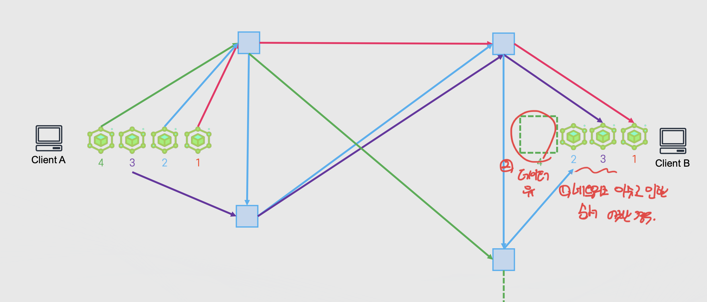


Segment(세그먼트)


- TCP/UDP의 데이터 전달 단위
- TCP 세그먼트의 주요 구성
    - Port(Source/Destination)
    - Sequece/Acknowledgement Number: 통신 주체끼리 데이터를 주고 받았는지 확인 할 때 사용
    - Flags: Segment의 목적 등을 정의(예: ACK, SYN, FIN)
    - Window Size: 세그먼트를 만든 주체가 얼마나 많은 데이터를 받을지 전달
    - Urgent Pointer: 세그먼트의 중요도를 설정(먼저 처리해야 하는 세그먼트)
    - 기타 (checksum 등)
    - 실제 데이터

    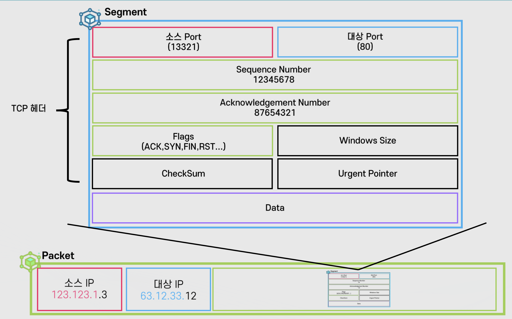

    - 세그먼트는 바로 밑에 레이어인 패킷에 담기게 되며 패킷은 그 밑에 레이어인 프레임에 담긴다.

> TCP에서 데이터의 순서 보장, 유실 방지 과정

1. 세그먼트들에서 1번 세그먼트를 Client A -> Client B로 전송
2. Client B는 1번 세그먼트를 잘 받았다는 의미로 Acknowledgement를 Client A에게 전달
3. Client A는 1번을 잘 받았다는 것을 인지하고 Client B에게 전달 받은 데이터를 확인 하여 다음 보내야 할 데이터를 보낸다.
    - 이 때, Client B가 Client A에게 전달 할 때 다음 보내야 할 데이터를 미리 알려준다.
3-1. 만약, 세그먼트를 보낼 때 유실이 된 경우
    - 유실이 되었다면 Client B가 응답을 하지 않았기 때문에 Client A는 "아직 B가 데이터를 받지 못했나보다" 라며 다시 보내게 된다.
    - 다시 보낼 때 Client B가 정상적으로 수신 하여 Acknowledgement로 응답 값을 보냈다면 그 다음 보내야 할 데이터를 Client A는 보내게 되며 이 과정을 반복한다.

💡 TCP는 전달 하고 싶은 데이터가 잘 전달 되었는지 무결성을 확보함
    - 받았는지 받지 못했는지를 체크하는 과정이 있음

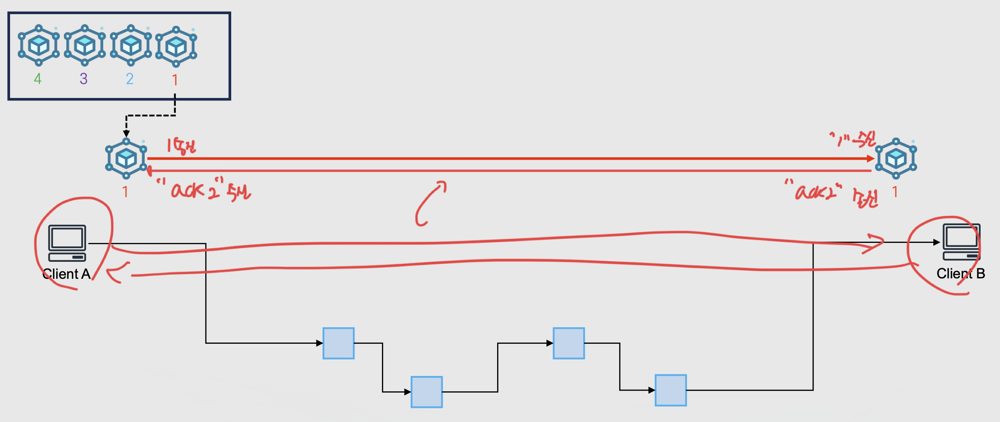


Port


- IP 프로토콜에서 패킷을 올바른 프로세스로 라우팅 하기 위한 논리적 단위
- TCP Port / UDP Port로 구분
    - 각각 0~65535까지 정수 범위를 갖을 수 있음
- Well Known Port: 주로 서버에서 사용하는 어플리케이션/프로토콜 별로 미리 지정된 포트로 **이 포트는 마음대로 변경 할 수 있다.**
    - 예:
        - 80: HTTP
        - 443: HTTPS
        - 22: SSH
        - 3306: MySQL
        - 5432: PostgreSQL

    - 웹 브라우저에 접속 할 때 생각 해보면 80번 포트를 입력 하지 않아도 자동으로 80번 포트를 우선적으로 시도한다. 그 외에는 클라이언트가 별도로 포트를 입력해야한다.

- Ephemeral Port: 클라이언트에서 사용하는 포트로 연결 할 때 마다 임의로 지정되는 포트로 **남는 포트 아무거나 지정한다**

    - 클라이언트 입장에서 자기만 통신 하기 때문에 포트를 남는 것 아무거나 사용해도 문제가 없다.
    - 서버 입장에서 요청을 받을 때 마다 포트가 변경 된다면 **클라이언트가 어떤 포트로 보내야 하는지 알 수가 없고 서버가 점유해야 할 포트가 무수히 많아야 한다** 이런 이유 때문에 서버는 일반적으로 잘 알려진 포트를 점유한다.

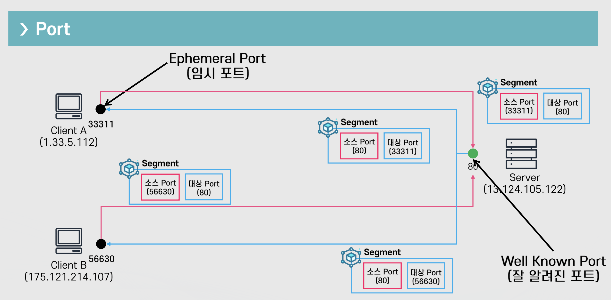

각 Application 마다 임의의 포트 번호를 점유 하여 Source Port를 할당 하고 서버에서 사용 하고 있는 Port를 할당 하여 `Segment` 안에 `Source Port`, `Destination Port`로 대상을 지정하여 여러 한 번에 여러 개의 어플리케이션과 통신 할 수 있는 구조가 생성 된다.

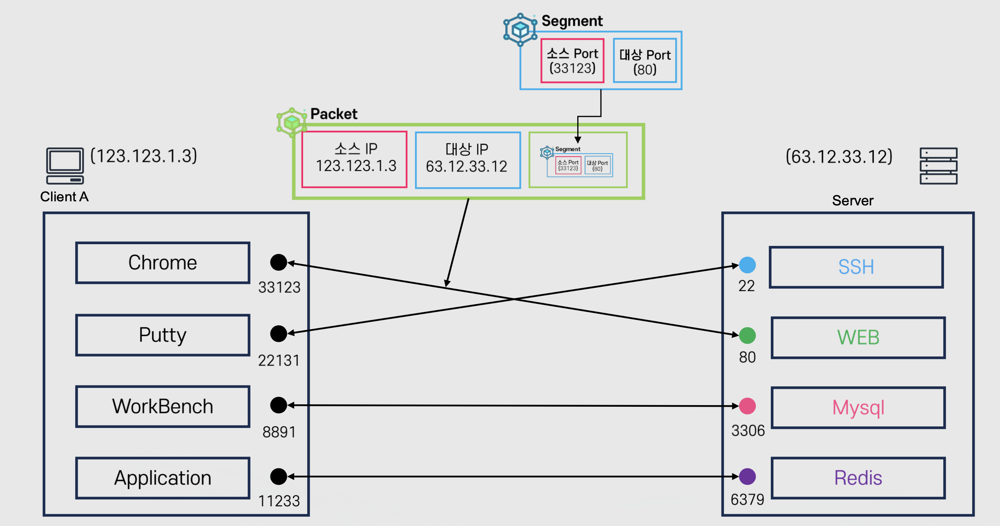

> 만약, 위 그림에서 Chrome Browser에서 Server로 요청을 보냈다 라고 가정 한다면
- 네트워크 계층에서 Packet을 전달한다.
- Packet을 분석 하면 안에 Segment가 존재 하기 때문에 Segment를 분석 하게 된다.
- Segment는 Source Port, Destination Port가 존재 하기 때문에 Destination에 해당 하는 WEB으로 전달한다.
- WEB에서 요청을 받아들이고 응답 할 때 받았던 Source Port로 다시 전달하면 사용자가 Chrome Browser를 클릭 하여 접속 했을 때 나타나는 화면이 된다.

💡 서로 통신 하는 아이피가 동일 하더라도 Packet 안에 Segment를 활용 할 수 있게 된다면 동일한 IP에서 여러 어플리케이션과 통신할 수 있게된다.


TCP Handshake


- TCP Protocol에서 통신을 수립하고 서로를 인식하는 첫 과정

- 보통 Three Way Handshake로 부르며 3가지 과정으로 구분
    - Syn(Synchronize): 첫 요청으로 사용할 것 클라이언트 Sequence Number(랜덤 숫자/CS)를 전달
    - Syn-Ack(Synchronize-Acknowledge): Syn에 대한 응답으로 CS+1과 서버 Sequence Number(SS)를 전달
    - ACK(Acknowledge): 마지막 단계로 연결이 수립 되었음을 알려주며 CS + 1과 SS + 1을 전달 하며 서버에서 보낸 요청을 잘 받았다고 인식 시켜줌

> TCP Handshake를 통해 통신하는 과정

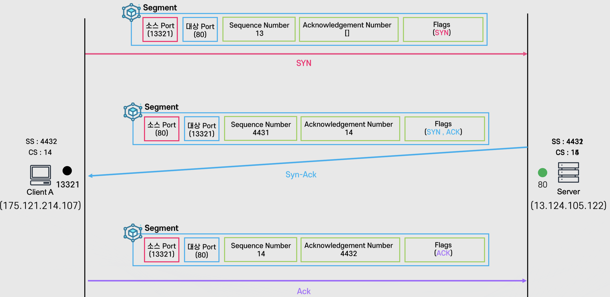

1. 클라이언트가 서버에게 요청을 보냄
    - 이 때 세그먼트 정보는 Source Port(클라이언트 자신), Destination Port(대상 서버), Sequence Number(클라이언트의 임의의 수), Acknowldegement Number(서버의 임의의 수), Flags(요청 목적)
    - 클라이언트의 Sequence Number 생성 "13"
    - Flags 할당 "SYN": 클라이언트의 첫 요청이기 때문

2. 서버가 요청을 받은 뒤 응답 함
    - 클라이언트의 Sequence Number에서 + 1: "14" -> 요청을 잘 받았다는 의미
    - 서버의 Sequence Number 생성 "4431"
    - 이 때 세그먼트는 Sequence Number는 "4431", Acknowldegement Number는 "14", Flags는 "SYN, ACK"
    - 생성된 세그먼트를 다시 클라이언트에게 응답

3. 클라이언트가 응답을 확인 후 서버와 통신 종료 요청
    - 서버가 보내준 Acknowledege Number는 기존 "13" 이었지만 서버와 통신 후 응답을 받을 땐 "14"로 1이 증가 되어있음
    - 서버의 Sequence Number를 잘 받았다는 의미로 +1 -> "4432"
    - Flags를 ACK로 할당 하여 세그먼트를 생성 후 전달

💡 Sequence Number는 자기 자신이 보내야 할 임의의 수이며 Acknowledegement Number는 상대에게 다음 차례에 보내야 할 숫자를 가르키는 것과 같다.


User Datagram Protocol(UDP)


- 빠르고 간단하게 데이터를 주고 받을 수 있는 방법을 정의
- ConnectionLess
    - 연결 지향(TCP)와는 달리 데이터의 무결성, 순서, 전달 여부를 체크 하지 않는 단방향 통신
    - 즉 패킷이 순서대로 오지 않거나 중복 되거나 아예 전달 되지 않을 수 있음
    - 결론은 빠르게 보내는 것을 목적으로 함

- 주요 사례
    - 스트리밍 서비스
        - 스트리밍 서비스를 보다가 1프레임을 놓쳐도 사용자는 느낄정도로 민감한 정보가 아님
    - 보이스톡
        - 상대방과 통화 시 잠시 지지직 걸린다고 해도 다시 통화가 유지 되기 때문에 크게 민감하지 않음
    - 온라인 게임

> UDP Segment vs TCP Segment

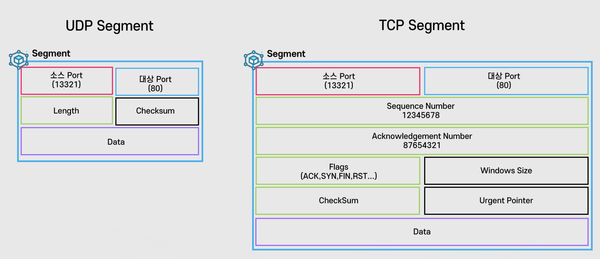

- UDP Segment는 TCP에 비해 많은 필드들이 비어있다
    - 패킷에 들어가는 정보는 동일 하지만 세그먼트는 내용이 훨씬 적기 때문에 용량 적으로 훨씬 효율적임

- UDP 통신은 단방향이기 때문에 요청 하는 데이터를 전송 하고 그 뒤 응답을 신경 쓰지 않는다.
    - 만약 유실 될 경우라도 **현재 요청은 마치 어쩔 수 없다는 듯 버린 뒤 다음 요청을 보냄**

- UDP는 요청을 계속 보내기만 하면 되기 때문에 굉장히 효율적
    - TCP 통신은 클라이언트와 서버가 통신 중 요청과 응답이 정상인지 결과를 기다려야 하는 시간이 매우 오래 걸림
        - 트래픽이 2배로 증가 -> 요청과 응답

    - 단, 패킷의 유실, 순서 보장 없음 등에 단점이 존재함

> 주요 프로토콜(TCP/UDP)

- TCP
    - HTTP/HTTPS: 80, 443
    - FTP: 20, 21
    - SSH: 22
    - DNS: 53

- UDP
    - DNS: 53
    - DHCP(Dynamic Host Configuration Protocol): 67, 68
    - VoIP(Voice over IP): 5060

## 소프트웨어 모델 계층

### Session Layer


Session Layer


- 통신 주체끼리 연결을 유지 할 수 있는 방법을 정의
- 예전의 컴퓨터 환경에서 Layer 1, 2, 3, 4 이외의 차원에서 지속적인 연결(세션)이 수립 될 수 있는 방법을 제공
    - 예: MAC Address(Layer2)와 IP(Layer3)주소와 포트(Layer4)가 동일한 상황에서 어떻게 구분 할 것인가?
- 현대에서도 마찬가지로 Layer4 이상의 추가적인 차원에서 지속적인 연결(세션)을 수립 할 수 있는 방법을 포함
    - 예: HTTP Cookie

        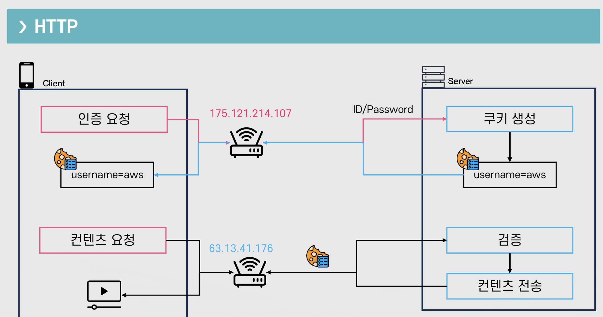

        - HTTP는 클라이언트의 아이피 정보가 달라지더라도 기존에 검증 된 쿠키값을 서버로 전달 하게 되면 검증된 사용자로 통신을 유지 할 수 있다.

- 몇 몇 프로토콜의 경우 Session Layer 자체를 구현 하지 않음
    - 예: FTP

        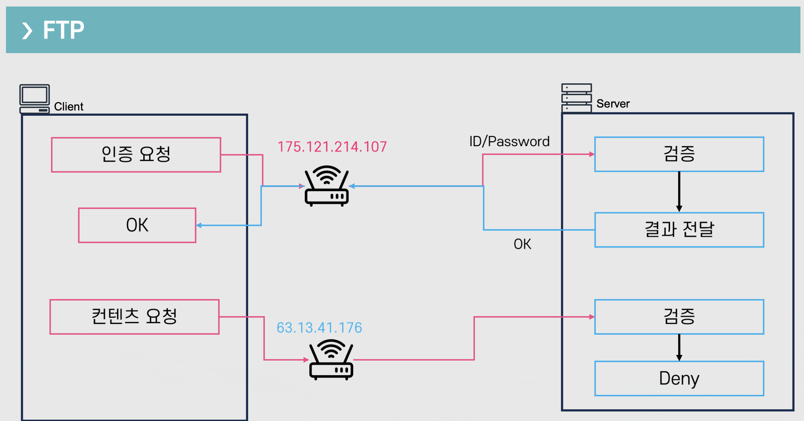

        - FTP는 HTTP와 달리 접속 하는 아이피 정보가 달라지면 기존 검증 절차를 기억 하지 않고 다시 검증을 시도 해야한다.

  

> 지하철 타고 가면서 유튜브를 볼 때를 떠올려보면 지하철 역이 바뀌어도 유튜브는 정상 송신이 되고 있다. 왜 그럴까?

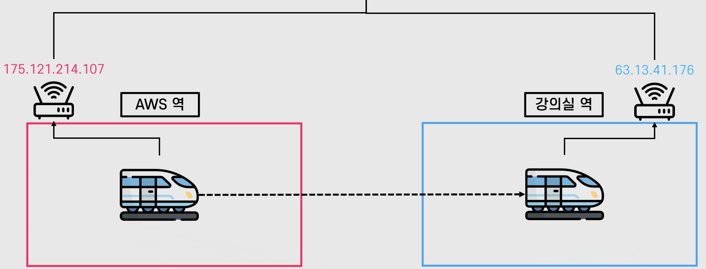

- 각 역 마다 중계기의 아이피는 서로 다를 것이고 유튜브 서버 입장에서는 받는 아이피가 모두 달라질 것이다. 즉, Layer 1 ~ Layer 4가 모두 달라진다.

💡 자신의 통신 환경이 달라져도 지속적인 통신을 유지 할 수 있는 이유는 세션이 연결 되어 있기 때문이다.

### Presentation Layer


Presentation Layer


- 받은 데이터를 해석하는 방법을 정의
    - 파싱, 압축 해제, 복호화 등 Application Layer에서 사용 할 수 있는 형식으로 변환을 담당

        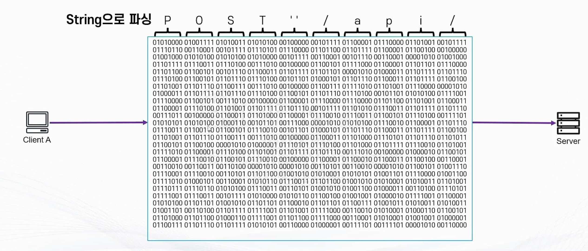

  

> 어디까지가 Presentation Layer의 역할일까?

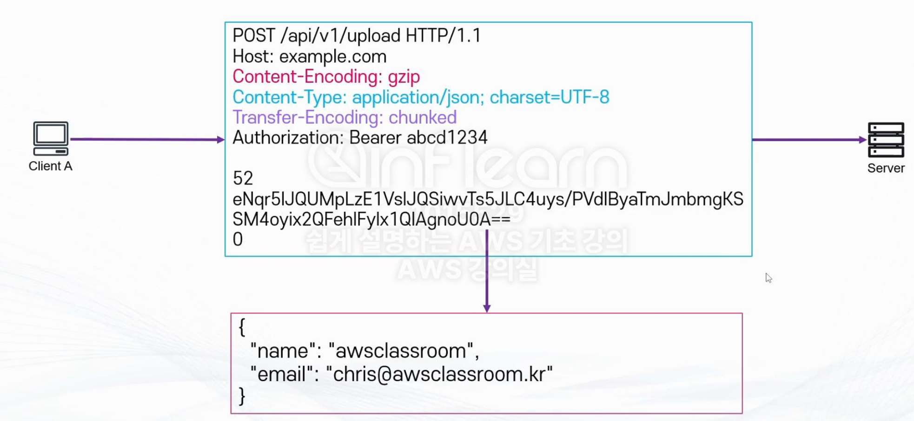

- 정확하게 구분 되는 것이 아니며 전달 받은 내용을 문자로 변경 하는 것
- 문자로 받은 내용을 어떻게 전달 하는가

💡 결론적으로 Presentation Layer는 위 내용들이 개념적으로 구현이 되어있다

### Application Layer


Application Layer


- 실제 받은 데이터를 처리하는 방법을 정의
    - 말 그대로 데이터를 가지고 무엇을 어떻게 처리할지에 관한 레이어

- 예: HTTP
    - Method(GET/POST/PUT/DELETE/HEAD/OPTION/PATCH)
    - Status Code
    - Header
        - Host
        - User-Agent
        - Authorization
        - Accept-Encoding
        - Content-Type

실질적으로 AWS `Application Load Balancer`는 Layer 7을 이해 할 수 있는 로드 밸런서이며 HTTP의 여러가지 기능(헤더, 도메인명 등)을 이해 하고 있다.

이러한 어플리케이션 로드 밸런서는 레이어 1부터 7까지 거쳐 최종적인 결과물로 의사 결정을 할 수 있다.

- 예시: 대표적인 예시로 호스트 기반으로 라우팅을 하는 행위
- 네트워크 로드밸런서(L4) 보다 많은 정보를 담고 있기 때문에 속도 측면에서는 더 느리다.

