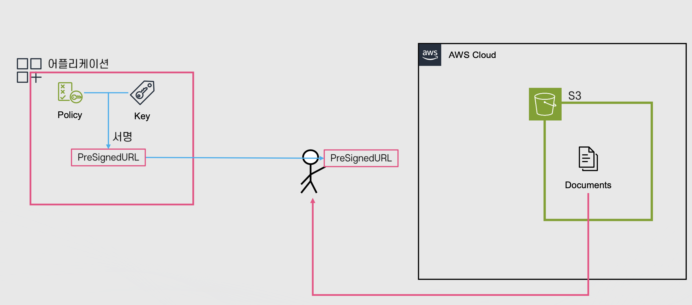

# DNS

Properties

:pencil:2024.08.29

:page_facing_up: - [AWS 강의실](https://www.inflearn.com/course/%EC%89%BD%EA%B2%8C-%EC%84%A4%EB%AA%85%ED%95%98%EB%8A%94-aws-%EA%B8%B0%EC%B4%88/dashboard)

## 암호화

### 용어

- 평문(Planetext): 암호화 하기 전의 데이터

- 암호문(Ciphertext): 평문을 암호 키와 알고리즘을 사용 해 암호화 한 데이터

- 암호화(Encryption): 평문에 암호화 알고리즘과 키를 적용하여 키를 소유한 주체가 아니면 알아볼 수 없는 암호문으로 만드는 과정

- 복호화(Decryption): 암호문에 키와 복호화 알고리즘을 적용하여 평문으로 되돌리는 과정

- 키(Key): 평문을 암호화 하거나 암호문을 평문으로 돌리기 위한 알고리즘에 핵심 가변 정보 값

- 암호 알고리즘: 암호화/복호화를 위해 사용되는 알고리즘

    - 예: AES, DES 등이 존재

### 저장된 데이터 보호(Encryption At Rest)

데이터를 저장할 때 암호화 하고 필요할 때 복호화해서 사용 하는 방식으로 **디스크에 저장 된 데이터를 암호화 하는 것이 특징이다.**

주로 하나의 물리적인 기기에 보안을 적용하기 위해 사용 되며, 키 파일 혹은 암호를 사용 하여 암호화/복호화를 할 수 있음
- 예: 기기를 탈취 당했을 때 데이터를 보호 하기 위한 방법

### 전송중 데이터 보호(Encryption At Transit)

데이터의 전송 중 암호화를 적용 하여 데이터가 전송 도중에 탈취 당하지 않도록 보호 하는 방식이다. **주로 여러 시스템 / 기기 간에 보안을 적용하기 위해 사용 됨**
- 예: SSH/TLS, HTTPS 등

### 대칭키 암호화(Symmetric Encryption)

- 하나의 키로 암호화, 복호화를 하는 알고리즘

- 다른 암호화 알고리즘에 비해 상대적으로 연산이 빠른 편에 속함

- 하나의 키로 암호화 하고 있기 때문에 이 핵심 "키"를 어떻게 공유 해야 하는지에 대한 문제점이 존재
    - 예를 들어, 서버와 클라이언트가 통신하고 있고 중간에서 데이터를 감청 하고 있다고 했을 때 데이터는 암호화 되어 알 수 없지만 아직 클라이언트도 데이터를 복호화 하지 못하고 있다. 그럴 땐 어떻게 키를 전달 해야 할까?

### 비대칭키 암호화(Asymmetric Encryption)

- 대칭키 암호화의 문제점을 보완 할 수 있는 방식으로 한 쌍의 키를 활용한 암호화, 단 하나의 암호는 암호화만 가능하며, 다른 하나는 복호화만 가능
    - 공개 키와 비밀 키가 존재 한다고 했을 때 공개 키가 만약 암호화에 사용 된 키라면 비밀 키는 복호화만 가능함

- 연산이 비교적 복잡하지만 핵심 키를 전달 하기는 쉬움

- 공개 키/비밀 키: 각각 암호화 복호화만 할 수 있는 키의 쌍
    - 공개키로 암호화 하면 비밀 키로 복호화 가능
    - 비밀키로 암호화 하면 공개 키로 복호화 가능

위 사진 처럼 데이터를 도중에 탈취 하기 위해 감청 하는 사람이 공개 키를 얻었다고 복호화 할 수 있는 것이 아니다. 하지만, 서버와 클라이언트는 비밀 키를 알고 있기 때문에 비밀 키를 통해 복호화가 가능한 암호화 방식이다.

### 암호화 서명(Signing)

- 키를 사용해서 데이터의 생성자가 데이터를 생성 했음을 보장 하는 방법

    - 비밀 키를 사용하여 공개 키로 검증 가능한 데이터의 서명을 생성
    
    - 비밀 키를 가진 주체가 데이터를 생성 했음을 보장 할 수 있는 방법

위 AWS S3 서비스를 이용 해보면 사용자에게 PreSignedURL을 제공한다. 이 URL은 사용자가 읽을 수 있는 권한을 보장 받은 서명을 통해 접근이 가능하도록 설정 되어, 실제 사용자가 데이터를 읽을 수 있는 방식이다.

## SSL/TLS

### SSL/TLS 정의 및 과정

- 클라이언트와 서버간에 데이터의 무결성과 기밀성을 보장 할 수 있는 프로토콜

    - 상호간의 통신은 암호화 되어 전달되며 중간에서 데이터를 탈취 당해도 안전함 -> 전송중 데이터 보호 방식

- HTTPS 등 다양한 프로콜에 활용됨
    
    - 일반 HTTP의 경우 연결이 안전하지 않기 때문에 보안적으로 취약 하며 크롬 브라우저에서는 경고 메세지를 띄워 주고있음

> 간략하게 알아보는 3단계 과정

1. Cipher Suites 교환

Cipher Suites란 TLS에서 활용하는 보안 알고리즘들을 가르킨다.

클라이언트는 서버에게 "SSL/TLS 버전, 지원하는 Cipher Suites 목록, 기타 정보"를 제공

서버는 클라이언트에게 "SSL/TLS버전, 선택한 Cipher Suites, 인증서, 기타 정보"를 제공 하게 되며 서로 정보를 교환 함

2. 인증

인증서를 발급 받기 위해 "CA"라는 믿을 수 있는 인증 기관에서 CA 공개 키와 CA 비밀키를 하나씩 생성 하고 모두에게 공개 키를 읽을 수 있도록 한다.

서버는 클라이언트에게 자신의 신원을 확인 할 수 있는 정보를 알려주기 위해 별도의 공개 키와 비밀 키를 만들고 공개 키에 여러가지 정보를 담은 뒤 CA 기관에게 인증서를 발급 받는다.

- 이 때, CA는 인증서를 발급 하기 위해 서버가 보낸 정보를 바탕으로 정보와 서버가 일치하는지 여부를 검사 하고 CA 기관이 소유한 비밀 키로 데이터를 암호화 하여 서버에게 인증서를 반환하여 서버가 인증서를 소유하고 있는 상태가 된다.

서버가 클라이언트에게 인증서 정보를 주고 클라이언트는 해당 인증서 정보를 CA 기관에서 공개 한 공개 키로 인증서를 복호화 하여 읽고 그 정보를 바탕으로 서버를 신뢰 하고 통신을 할 수 있다.

- 데이터를 읽을 때 데이터 안에 서버가 별도로 생성 해두었던 공개 키도 포함 되어있다.

- 서버는 클라이언트에게 발급 받은 인증서를 기반으로 안전한 서버임을 증명 하는 과정을 거친다.

서버를 신뢰 한 뒤로 부터는 공개 키와 비밀 키를 공유 하고 있기 때문에 서로 데이터를 통신 할 때 키를 기반으로 암호화, 복호화를 거쳐 통신하게 된다.

