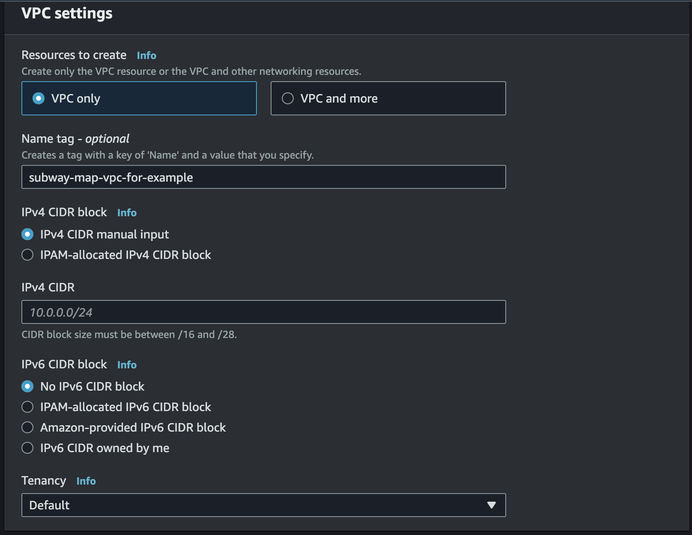
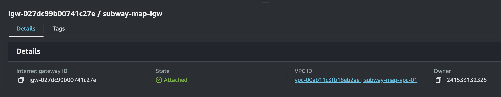
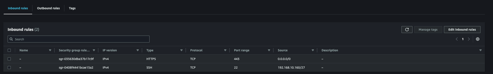
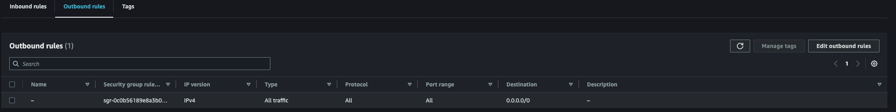
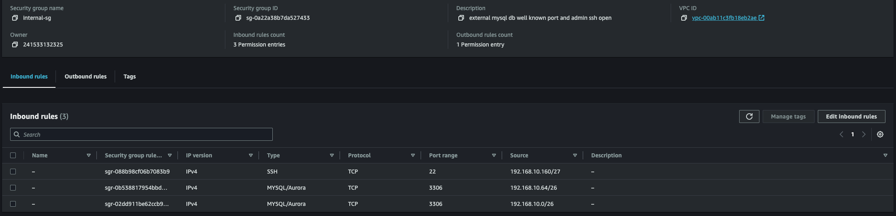
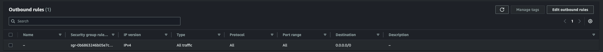

# subwaymap-1week

Properties

:pencil:2024.09.21

:page\_facing\_up: [그럴듯한 서비스 만들기](https://www.inflearn.com/course/%EC%9D%B8%ED%94%84%EB%9D%BC-%EA%B3%B5%EB%B0%A9-%EC%84%9C%EB%B9%84%EC%8A%A4-%EB%A7%8C%EB%93%A4%EA%B8%B0)

:paperclip: 지하철 노선도 미션 진행 1주차

**1주차 커리큘럼**

## 그럴듯한 인프라 만들기


그럴듯한 서비스 만들기 인프런 과정의 미션을 NEXTSTEP 인프라 공방처럼 커리큘럼을 만들어 진행 한 과정입니다.


### 망 구성하기

#### VPC


**요구사항**

* CIDR은 C class(x.x.x.x/24)로 생성 (현업에선 가급적 B class로 생성해주세요)


Default VPC는 B Class로 이루어져 범용적으로 사용이 가능하다. 하지만, 요구사항에 따르면 C Class로 Total IP Amount 갯 수가 적게 설정 하길 원한기 때문에 C Class로 설정한 VPC를 구성 해야한다.

**C Class와 B Class IP 할당 내용**

|   클래스   |        IP 할당 범위        | 사용 가능한 IP 개 수 |      예시      |
| :-----: | :--------------------: | :-----------: | :----------: |
| B Class | 128.0.0.0 \~ 191.0.0.0 | 2^16 (65,536) | 128.12.12.12 |
| C Class | 192.0.0.0 \~ 223.0.0.0 |   2^8 (256)   | 192.168.10.1 |

* [x] CIDR은 C class(x.x.x.x/24)로 생성

#### Subnets


**요구사항**

* 외부망으로 사용할 Subnet : 64개씩 2개 (AZ를 다르게 구성)
  * 외부망은 인터넷 구간과 통신 가능
* 내부망으로 사용할 Subnet : 32개씩 1개
  * 내부망에서만 인터넷 접근 가능
* 관리용으로 사용할 Subnet : 32개씩 1개 (system manager를 사용한다면 별도의 관리망 없이 내부망 2개로 구성, 보안그룹도 상황에 맞게 구성)


|  용도 | 이름                    |        CIDR       |        AZ       |
| :-: | --------------------- | :---------------: | :-------------: |
|  외부 | subway-map-public-a   |  192.168.10.0/26  | ap-northeast-2a |
|  외부 | subway-map-public-c   |  192.168.10.64/26 | ap-northeast-2c |
|  내부 | subway-map-internal-a | 192.168.10.128/27 | ap-northeast-2a |
|  내부 | subway-map-internal-c | 192.168.10.160/27 | ap-northeast-2c |

* [x] 외부망 서브넷1 - 64개
* [x] 외부망 서브넷2 - 64개
* [x] 내부망 서브넷1 - 32개
* [x] 내부망 서브넷2 - 32개

#### Internet Gateway


**요구사항**

* [x] 외부망은 인터넷 구간과 통신 가능

**인터넷 게이트웨이는 퍼블릭 IP 주소를 지닌 인스턴스를 인터넷과 연결하면 인터넷에서 들어오는 요청을 수신할 수 있도록 한다.**


* [x] Internet Gateway attatched VPC

#### Route Tables


**요구사항**

* [x] 외부망은 인터넷 구간과 통신 가능

**VPC 내에서 트래픽의 유입, 유출, 이동을 제어하려면 라우트 테이블(route table)에 저장된 라우트(route)를 이용해야 한다. 라우트는 라우팅 테이블과 연결된 서브넷 내에서 트래픽 유입 및 유출을 결정합니다.**


> allow Any to Internet gateway

* [x] Route table linked internet gateway to public topology

💡 만약 라우팅 테이블에 인터넷망과 연결이 되지 않은 상태에서 서버가 인터넷망과 통신 하려고 한다면?

라우팅 테이블은 VPC 정보만 갖고 있기 때문에 해당 요청을 받더라도 인터넷망으로 보내야 하는지에 대한 정보를 갖고 있지 않다. 그렇기 때문에 해당 요청은 밖으로 나가지 않고 내부에서 라우팅 테이블에 의해 패킷이 드랍 될 것이다. 이러한 정보를 바탕으로 라우팅 테이블에 인터넷망과 연결 할 수 있는 인터넷 게이트웨이를 연결 해주는 작업이 필요하다.

> Specific subnet IPs

* 외부망 전용 Route
  * [x] 0.0.0.0/0: Internet Gateway 연결 (내부 <-> 외부 양방향 통신)
  * [x] 서브넷 연결: admin-subway-map-01, external-subway-map-subnet-01, external-subway-map-subnet-02
* 내부망 전용 Route
  * ❌ 0.0.0.0/0: NAT Gateway (내부 -> 외부 단방향 통신)
  * ❌ 서브넷 연결 : internal-subway-map-subnet-01


**NAT Gateway가 필요한 이유**

외부망에서 내부망으로 접근 할 수 없지만, 내부 망에서 외부망으로 접근 해야 하는 경우에 사용 되며 AWS에서 NAT Gateway를 이용 하면 시간당 0.01$ 의 과금이 발생&#x20;

> "그렇다면 내부망에서 왜 외부망 통신을 해야 할까?"
>
> 1. 내부망에 구축 되어있던 물리적 데이터베이스 서버의 Docker Image를 Hub에서 Pulling 하려고 한다
> 2. OS system update를 진행 하려고 한다.

등 다양한 이유가 존재 하지만 대표적으로 외부에서 접근이 가능한 리소스를 내부망에서 접근해서 사용 해야 하는 경우 NAT Gateway 구성이 필요하다.


#### Security Groups

**External SG**

* [x] 전체 대역 Https 접근 허용
* [x] 관리망 SSH 접근 허용

> Inbound

> Outbound

**Internal SG**

* [x] 외부망 MySQL 접근 허용
* [x] 관리망 SSH 접근 허용

> Inbound

> Outbound

**Admin SG**

* [x] 관리자 로컬 PC만 SSH 접근 가능 하도록 허용

> Inbound

> Outbound

####

### 서버 구성하기

### 아키텍처 구성하기
